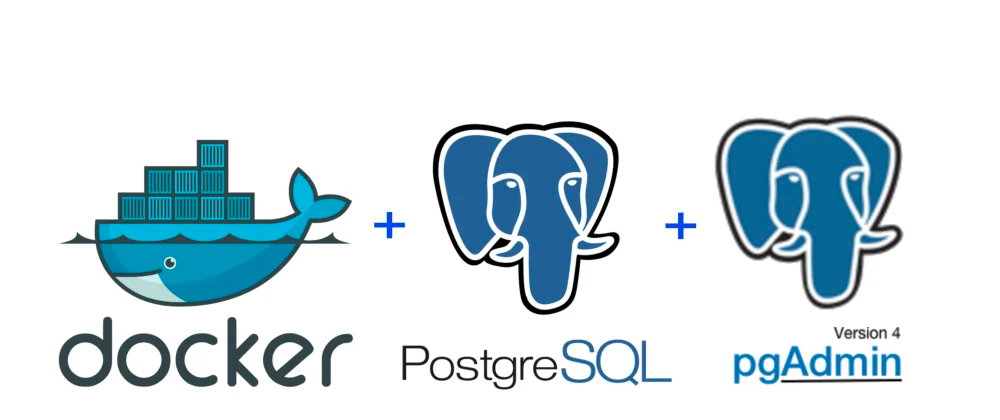
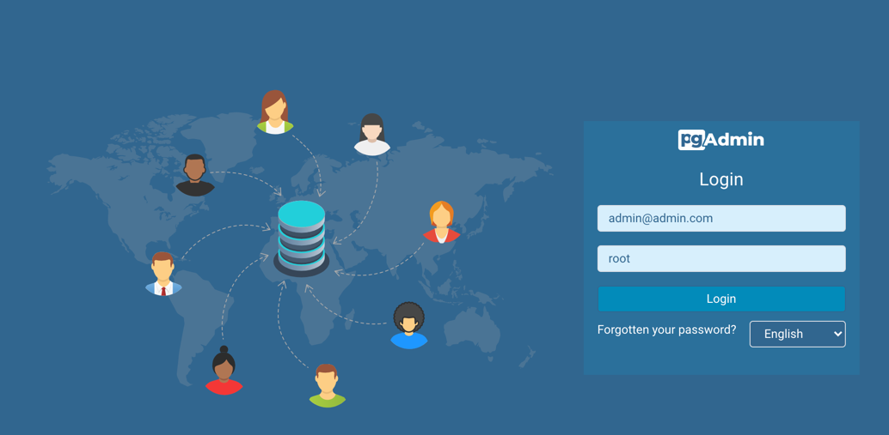
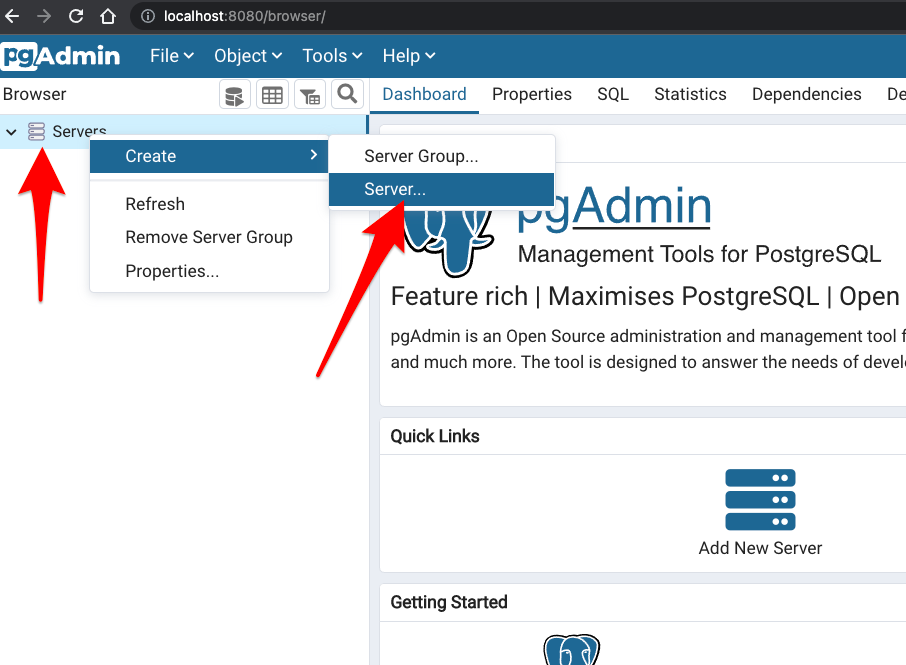
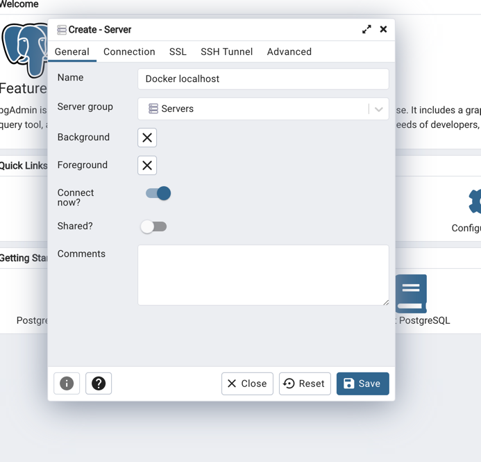
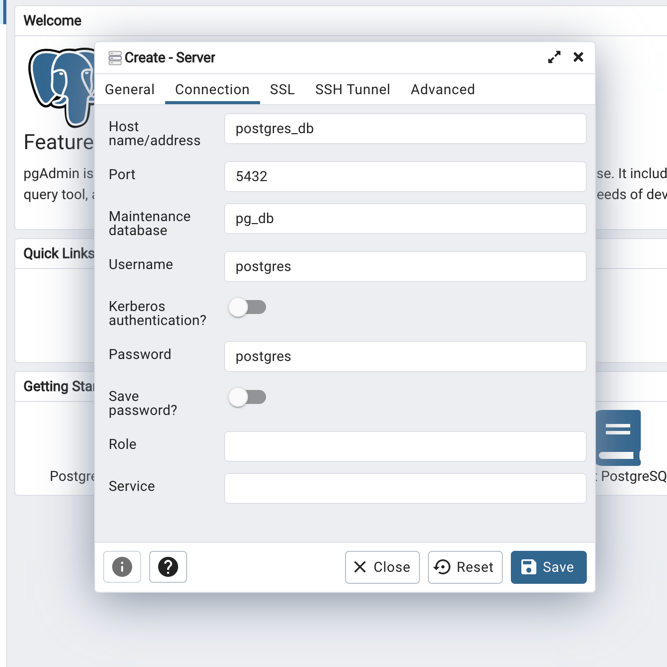
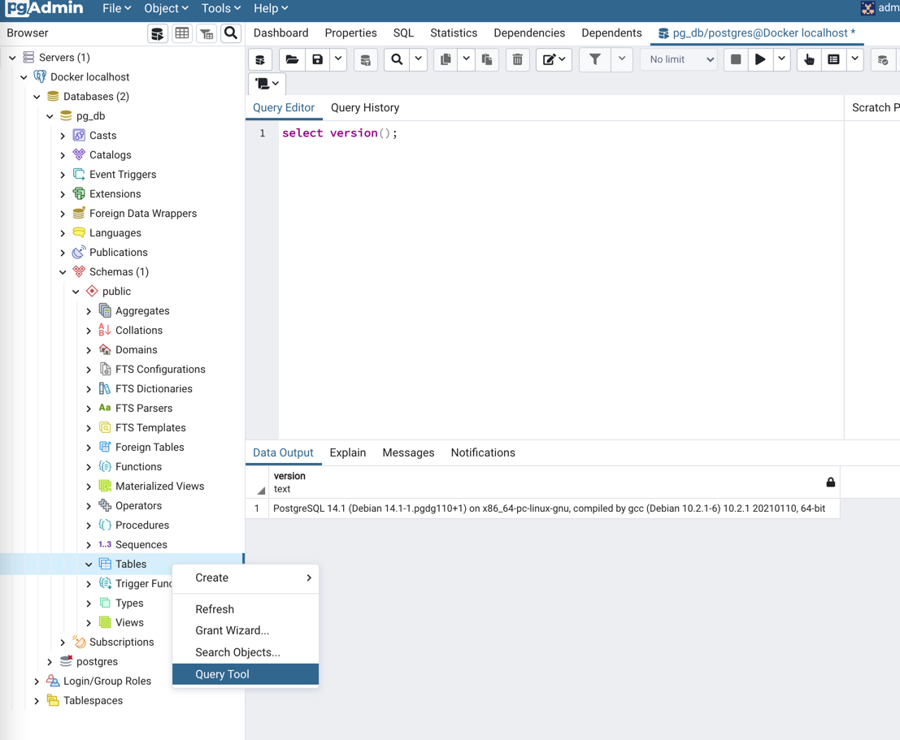

# Postgres и pgAdmin. Запуск из контейнера



[Docker](https://www.docker.com/) — программное обеспечение для автоматизации развёртывания и управления приложениями в средах с поддержкой контейнеризации, контейнеризатор приложений. Позволяет «упаковать» приложение со всем его окружением и зависимостями в контейнер, который может быть развёрнут на любой Linux-системе с поддержкой контрольных групп в ядре, а также предоставляет набор команд для управления этими контейнерами. 

Также Docker имеет пакетный менеджер [Docker Compose](https://docs.docker.com/compose/), позволяющий описывать и запускать многоконтейнерные приложения. Конфигурационные файлы Compose описываются на языке YAML.

## Установка Docker и docker-compose

Для установки Docker перейдите по [ссылке](https://docs.docker.com/get-docker/), выберите свою систему и следуйте инструкциям.

Для установки docker-compose перейдите по [ссылке](https://docs.docker.com/compose/install/), выберите свою систему и следуйте инструкциям.

Проверка успешной установки Docker
```bash
docker run hello-world
```

В выводе будет следующая информация:
> Hello from Docker!
> 
> This message shows that your installation appears to be working correctly.

И ещё несколько информационных строк.


На некоторых системах возникает проблема, с постоянным использованием `sudo` для запуска Docker, для решения предлагаю использовать следующий [гайд](https://github.com/sindresorhus/guides/blob/main/docker-without-sudo.md).
Важно не забыть перелогиниться, как сказано в пункте 2 гайда.

### Некоторые полезные команды:

Список контейнеров:
```bash
docker ps
```
Список контейнеров, включая остановленные:
```bash
docker ps -a
```
Список образов:
```bash
docker image ls
```
Остановка контейнера:
```bash
docker stop <container id>
```
Удаление остановленного контейнера:
```bash
docker rm <container id>
```
Удаление всех остановленных контейнеров:
```bash
docker rm $(docker ps --filter status=exited -q)
```
Список всех запущенных сетей:
```bash
docker network ls
```
Удаление сети:
```bash
docker network rm <network id>
```
Удаление всех неиспользуемых образов (используйте аккуратно!):
```bash
docker image prune
```


## Запуск контейнеров
Для запуска будем использовать [compose-файл](docker-compose.yml).

Из директории, в которой находится `docker-compose.yml` в терминал вводим команду:
```bash
docker-compose up -d
```

Остановка контейнера:
```bash
docker-compose down
```

Для подключения к БД можно использовать как минимум 3 различных варианта подключения, ниже подробнее о таких способах, для работы можно использовать любой наиболее подходящий вам по духу, будь то командная строка, веб-интерфейс или IDE.

## Подключение к БД

### Подключение к БД из pgAdmin

 * В контейнере `pgadmin` используется 2 переменные среды для входа: адрес электронной почты и пароль. 
 * ВАЖНО: эти значения для обучающих примеров, и их никогда не следует использовать в рабочей среде. Измените их соответствующим образом, когда это необходимо.
 * pgAdmin — это веб-приложение, и его порт по умолчанию — 80; мы сопоставляем его с 8080 на нашем локальном хосте, чтобы избежать возможных конфликтов.

email: `admin@admin.com` \
password: `root`

Необходимо открыть pgAdmin, перейдя на `localhost:8080` в веб-браузере. Используйте для входа тот же адрес электронной почты и пароль, которые вы использовали для запуска контейнера.



Щелкните правой кнопкой мыши `Servers` на левой боковой панели и выберите `Create` > `Server`...



В разделе `General` укажите имя сервера.



В разделе `Connection` добавьте то же имя хоста(контейнера), порт, БД, пользователя и пароль, которые вы использовали при запуске контейнера.
Если ничего не изменялось в compose-файле, значения будут следующие: \
Host name/address (имя контейнера): `postgres_db` \
Port: `5432` \
Maintenance database: `pg_db` \
User: `postgres` \
Password: `postgres`



Нажмите Сохранить. 

Теперь у нас есть полнофункциональный графический менеджер SQL, который мы можем использовать для задач администрирования базы данных и выполнения запросов.



### Подключение к БД из DataGrip или DBeaver

 * В контейнере `postgres_db` используется 4 переменные среды для подключения к БД. 
 * ВАЖНО: эти значения для обучающих примеров, и их никогда не следует использовать в рабочей среде. Измените их соответствующим образом, когда это необходимо.

Для подключения из IDE  можно использовать:

Host: `localhost` \
Port: `5432` \
Database: `pg_db` \
User: `postgres` \
Password: `postgres`

### Подключение к БД из cli

Для подключения из cli необходимо войти в запущенный контейнер с помощью команды: 
```bash
docker exec -ti postgres_db psql -d pg_db -U postgres
```

`-ti` - имя контейнера. \
`-U` - имя пользователя. \
`-d` - имя БД.

После чего можем вводить SQL-запросы, например команда:
```postgresql
select version();
```
Вернёт информацию об используемой версии PostgreSQL

А команда:
```postgresql
select * from pg_catalog.pg_tables;
```
Отобразит список всех таблиц, имеющихся в БД.

Для выхода используйте команду:
```postgresql
exit;
```