# Базы данных

## Введение. Что есть база данных и модель данных?

**База данных** — совокупность данных, хранимых в соответствии со схемой данных, манипулирование которыми выполняют в соответствии с правилами средств моделирования данных; совокупность данных, организованных в соответствии с концептуальной структурой, описывающей характеристики этих данных и взаимоотношения между ними, причем такое собрание данных, которое поддерживает одну или более областей применения.

**Модель данных** — инструмент (ни о каких физических данных речи не идет), формальная теория представления и обработки данных в системе управления базами данных, которая включает, по меньшей мере, три аспекта:

* аспект структуры (организация хранения): методы описания типов и логических структур данных в базе данных;
* аспект манипуляции: методы манипулирования данными;
* аспект целостности: методы описания и поддержки целостности базы данных.

В лекциях будет приведено 3 модели данных: иерархическая, сетевая и реляционная.

* Иерархическая модель:
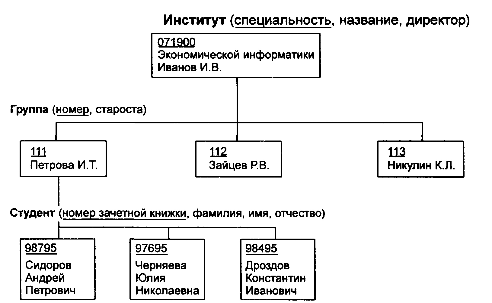

* Сетевая модель:

---

## Тема 1. Реляционная алгебра

### 1. Теоретическая справка

#### 1.0 Основные понятия реляционной модели данных

* *Домен* — это множество допустимых значений;
* *Атрибут* — это наименование домена;
* *Кортеж* — это упорядоченный набор фиксированной длины;
* *Декартово произведение* (множеств A = (a1, a2,...) и B = (b1, b2,...)) — множество пар: A  B = {(a,b): a &#8712; A & b &#8712; B};
* *Отношение*  — математическая структура, которая формально определяет свойства различных объектов и их взаимосвязи;
* *Свойства отношения*: 
    * Нет двух одинаковых кортежей;
    * Порядок кортежей не определен;
    * Порядок атрибутов не определен.
* *Арность отношения*  — количество его элементов (число атрибутов);
* *Заголовок отношения* — список атрибутов;
* *Тело отношения* — множество кортежей, входящих в состав отношения;
* *Составной домен* — домен, представляющий собой расширенное декартово произведение конечного числа простых доменов;
* *Совместимые домены*  — такие домены D1 и D2, что D2 &#8838; D1; 

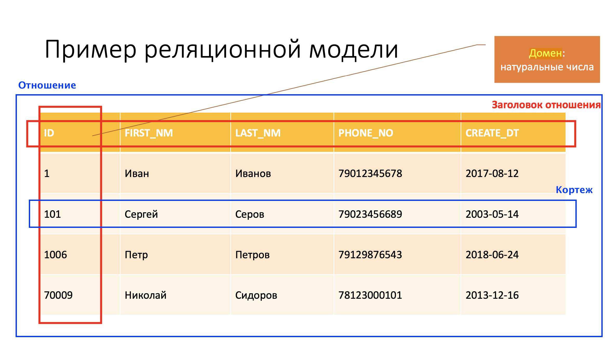

**Упражнение**

Рассказать про структуру приведенного ниже отношения. \
Выделить основные понятия: *отношение, атрибут, домен, кортеж, арность, заголовок отношения, тело отношения*. 

| Rank | Team | Nation | Total Points | Men | Women | Pairs | Ice Dance |
|:----:|:----:|:------:|:------------:|:---:|:-----:|:-----:|:---------:|
| 1    | ROC  | ROC    | 74           | 17  | 20    | 19    | 18        |
| 2    | United States of America  | USA    | 65           | 18  | 13    | 14    | 20        |
| 3    | Japan  | JPN    | 63           | 19  | 18    | 16    | 10        |
| 4    | Canada  | CAN    | 53           | 9  | 16    | 13    | 15        |
| 5    | People's Republic of China  | CHN    | 50           | 12  | 7    | 18    | 13        |

#### 1.1. Операции реляционной алгебры простым языком

В общем случае таблица отношением не является, но для простоты восприятия, помня о всех свойствах отношения, можем полагать, что отношение ~ таблица. К отношениям применимы теоретико-множественные и реляционные операции.

В качестве элементарной единицы отношения используем кортеж (строку), т.е. при пересечении отношений смотрим, какие строки являются общими. Результатом выполнения операций реляционной алгебры является новое отношение. \
Для простоты теоретико-множественные операции будем рассматривать на 2-x отношениях.

 **Примечание.** Теоретико-множественные операции (пересечение, объединение и разность) применимы к совместимым отношениям (множество доменов совпадает или вложено). Кортежи (строки) в новом отношении должны быть уникальны,
т.е. повторения недопустимы. Помним о Union-Compatible ограничении – атрибуты отношений должны совпадать.

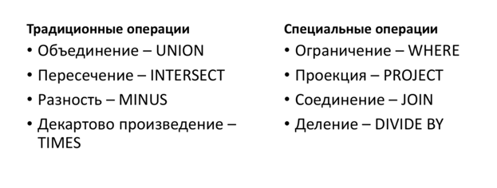

##### 1.1.1 Теоретико-множественные операции

 * **Объединение**: на вход принимает 2 отношения. Позволяет получить новое отношение, содержащее в себе все кортежи из обоих отношений.

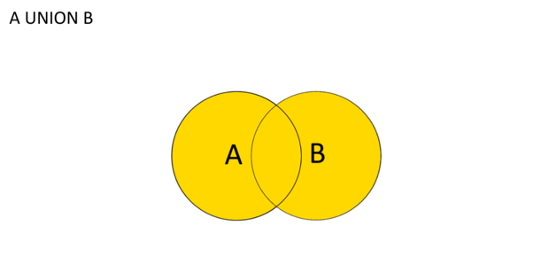

 * **Разность**: на вход принимает 2 отношения. Позволяет получить новое отношение,
содержащее в себе кортежи первого отношения, которые не совпадают с кортежами
второго отношения.

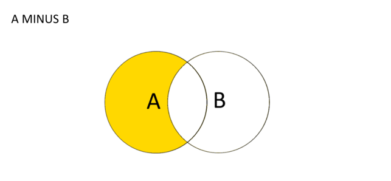

 * **Пересечение**: на вход принимает 2 отношения. Позволяет получить новое отношение,
содержащее в себе кортежи, которые присутствуют как в первом, так и во втором
отношении.

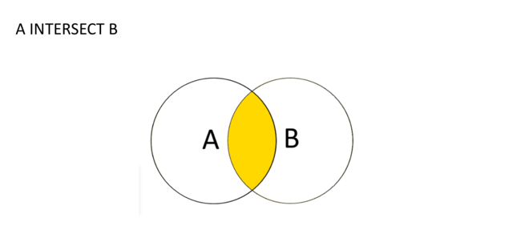

##### 1.1.2 Реляционные операции

 * **Ограничение**: на вход принимает 1 отношение + ограничения. Позволяет выделить в отношении только те кортежи, которые удовлетворяют заданному ограничению. Например, выделить среди кортежей отношения "Друзья" те, где друг является "Сыном Маминой Подруги".

 * **Проекция**: на вход принимает 1 отношение + список атрибутов (столбцов), на которые проецируем. Позволяет "оставить" в кортеже только интересующие нас атрибуты.
**Важно!** После проекции остаются только уникальные кортежи, т.е. результат
проекции – отношение.

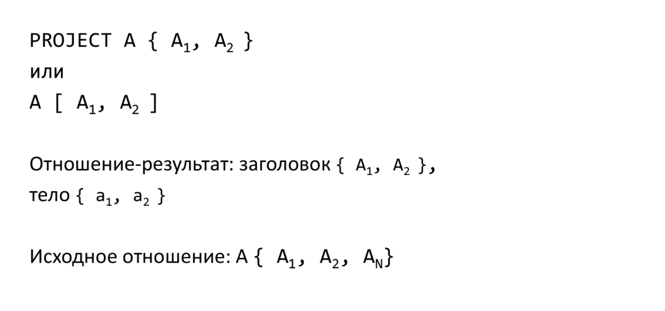

 * **Соединение**: на вход принимает 2 отношения. Позволяет получить новое отношение,
полученное соединением 2 таблиц по некоторому логическому условию {=, ≠, <, >, ≤, ≥}. _Арность_ (количество столбцов-атрибутов) нового отношения будет равна сумме
арностей соединяемых отношений (для естественного соединения по условию равенства
лишний элемент удаляется, поэтому арность n + m − 1).

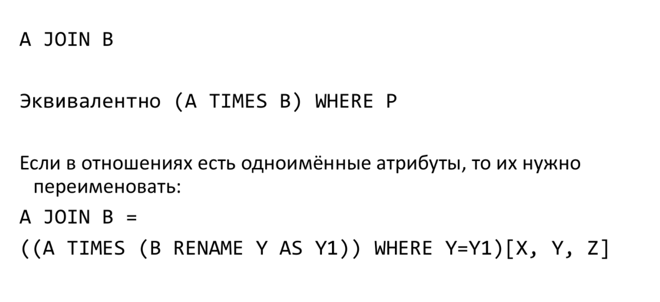

 * **Деление**: принимает на вход 2 отношения (таблицы). В результате получается отношение, содержащее _только те_ **атрибуты** 1-го отношения, которых нет во втором, содержащее вышеупомянутые атрибуты _только тех_ **кортежей** 1-го отношения, которые соответствуют комбинации (объединению) всех кортежей 2-го отношения.

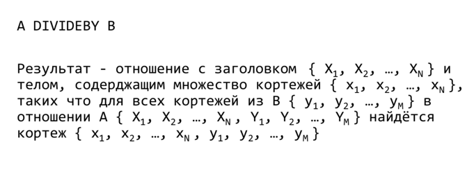
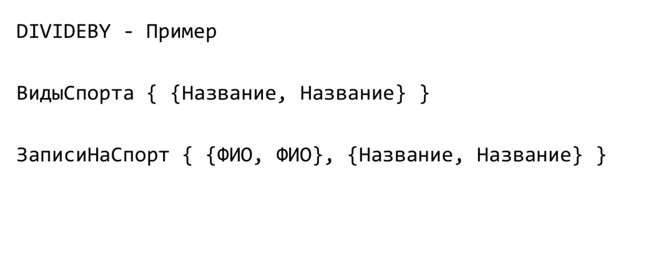

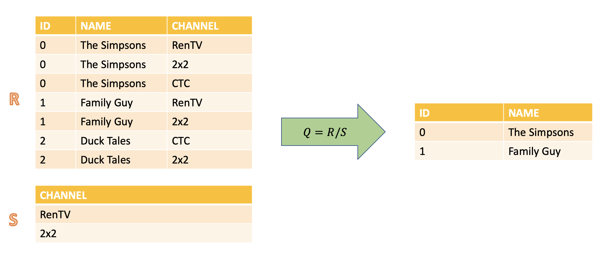

**Замечения:**
1. UNION, INTERSECT и MINUS требуют, чтобы отношения были
совместимыми по типу, т.е. имели идентичные заголовки
2. UNION, INTERSECT, TIMES и JOIN ассоциативны и коммутативны
3. Если отношения A и B не имеют общих атрибутов, то операция A
JOIN B эквивалентна операции A TIMES B. Такое соединение
называют естественным.
4. Другой допустимый синтаксис для синтаксической категории
переименования таков: (терм RENAМE список-
переименований). Здесь каждый из элементов списка
переименований представляет собой выражение имя_атрибута
AS имя_атрибута.
5. Несмотря на большие возможности, предоставляемые
операторами реляционной алгебры, существует несколько
типов запросов, которые нельзя выразить этими средствами.
Для таких случаев необходимо использовать процедурные
расширения реляционных языков.

#### 1.2. Формальная запись реляционных операций

 * Ограничение: _R[AθB] = {r|r ∈ R ∧ (r[A]θr[B])}, θ ∈ {=, ≠, <, >, ≤, ≥}._
 * Огр. константой: _R[Aθα] = (R × _(Bα){(α)})[AθBα], где _(Bα){(α)}_ − безымянное отношение с единственным атрибутом Bα.
 * Проекция: _R[L] = {r[L]|r ∈ R}, L = Aj1 , . . . , Ajp ._
 * Соединение: _R1[R1[Ai]θR2[Bj]]R2 = {r1 × r2|r1 ∈ R1 ∧ r2 ∈ R2 ∧ r1[Ai]θr2[Bj]}._
 * Деление: _R[A ÷ B]S = {r[A]|r ∈ R ∧ S[B] ⊆ gR(r[A])}_, где _gR(x) = {y|(x, y) ∈ R}._

### 2. Практическое задание

#### 2.1. Иллюстрация результатов работы реляционных операций

В табличном виде изобразить несколько отношений, наполнить их данными, применить к этим отношениям операции реляционной алгебры.

### 2.2. Написание запросов

#### 2.2.1. Модель 1

Пусть заданы следующие отношения:

 * изделие (атрибуты: номер, название, масса, цвет): R(#R, NR, WR, C);
 * деталь (атрибуты: номер, название, масса, код материала, из которого деталь изготовлена): P(#P, NP, WP, M);
 * состав изделий (т.е. детали, используемые для изготовления изделия; атрибуты: номер
изделия, номер детали): RP(#R, #P);
 * производитель (атрибуты: номер, название, город, в котором расположен): M(#M, NM, LM);
 * изделия производителя (состав атрибутов: номер производителя, номер изделия): MR(#M, #R);
 * дистрибьютор (состав атрибуты: номер, название, город, в котором расположен): D(#D, ND, LD);
 * изделия, продаваемые дистрибьютором (состав атрибутов: номер дистрибьютора, номер изделия): DR(#D, #R).

На языке реляционной алгебры написать следующие запросы:

1. Найти наименования дистрибьюторов из Караганды.
2. Найти названия всех деталей, входящие в состав изделий с дистрибьюторами только из Караганды.
3. Найти названия всех деталей с кодом материала, равным 103, и массой менее 200 грамм.
4. Найти все детали из железа, которые входят в состав изделий красного цвета, которые производятся только в Москве, с дистрибьюторами только в Тюмени.
5. Найти города дистрибьюторов с изделиями массой свыше 500 грамм и имеющих в составе медь.
6. Найти города производителей только желтых изделий с дистрибьюторами только в Саранске.
7. Найти всех производителей, которые есть в Москве или Санкт-Петербурге.
8. Найти дистрибьюторов, которые поставляют все изделия массой свыше 1200 грамм

#### 2.2.2. Модель 2

Пусть заданы следующие отношения:

 * Продукт (атрибуты: производитель, модель, тип продукта): P(MK, MD, TP);
TP ∈ {'PC', 'Tablet', 'Printer'}
 * Персональный компьютер (атрибут: код, модель, тактовая частота, оперативная
память, объем жесткого диска, цена): PC(#PC, MD, SPD, RAM, HD, PRC);
 * Планшет (атрибуты: код, модель, тактовая частота, оперативная память, объем
жесткого диска, экран, цена): TB(#TB, MD, SPD, RAM, HD, SCR, PRC);
 * Принтер (атрибуты: код, модель, цвет, цена): PR(#PR, MD, CLT, PRC). CLR ∈ {'Y', 'N'}.

На языке реляционной алгебры написать следующие запросы:

1. Найти все кортежи отношения Принтер для цветных принтеров
2. Найти всех производителей принтеров
3. Найти номер модели, частоту и объем жесткого диска для всех ПК стоимостью менее
500 дол.
4. Найти номер модели, объем оперативной памяти и размеры экранов планшетов, цена
которых превышает 1000 дол.
5. Найти номер модели, частоту и объем жесткого диска ПК с оперативной памятью 2ГБ
и ценой менее 600 дол.
6. Найти производителей ПК с частотой не менее 450 МГц
7. Для каждого производителя, выпускающего планшеты c объёмом жесткого диска не
менее 10 ГБ, найти скорости таких планшетов
8. Найдите номера моделей и цены всех имеющихся в продаже продуктов (любого типа)
производителя ’B’
9. Найти производителей, которые выпускают ПК или планшеты с объемом оперативной
памяти не менее 2ГБ
10. Найдите производителей, выпускающих ПК, но не планшеты
11. Найдите производителей, которые выпускают как ПК, так и планшеты
12. Найти производителей, которые выпускают только принтеры, причем цветные
13. Найдите производителей, которые выпускают все планштеты с оперативной памятью 16 ГБ
