## Тема 3. Сложные SQL-запросы

### 1. Теоретическая справка (соединения)

#### 1.1. Структура запроса

**Порядок написания запроса**

```postgresql
SELECT
  [ALL | DISTINCT [ON (expression [, ...] )] ]
  [* | expression [AS output_name] [, ...] ]
[FROM from_item [, ...] ]
[WHERE condition]
[GROUP BY grouping_element [, ...]]
[HAVING condition]
[ORDER BY expression [ASC | DESC | USING operator] [NULLS {FIRST | LAST}]
     [, ...]]
[LIMIT {count | ALL}]
[OFFSET start [ROW | ROWS]]
[FETCH {FIRST | NEXT} [count] {ROW | ROWS} ONLY]
```

#### 1.2. Операции соединения таблиц (JOIN)

**Рецепт набора результатов соединения:**
 * Какие столбцы войдут в набор результатов?
   * Указываются в инструкции `SELECT`
 * Какие ряды исходных таблиц войдут в набор результатов и в каких сочетаниях?
   * Зависит от вида соединения (вид `JOIN`-а)
   * Зависит от условия соединения (логическое выражение)

**Виды соединений:**
 * `[INNER] JOIN`
 * `OUTER JOIN`
    * `LEFT [OUTER] JOIN`
    * `RIGHT [OUTER] JOIN`
    * `FULL [OUTER] JOIN`
 * `CROSS JOIN`

#### 1.2.1. INNER JOIN

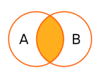

 * Соединяет 2 таблицы
 * Симметричный (порядок неважен)
 * Логический алгоритм:
   * Каждая строка одной таблицы сопоставляется с каждой строкой второй таблицы
   * Для полученной соединённой строки проверяется условие соединения
   * Если условие истинно, в набор результатов добавляется соединённая строка

Пример:

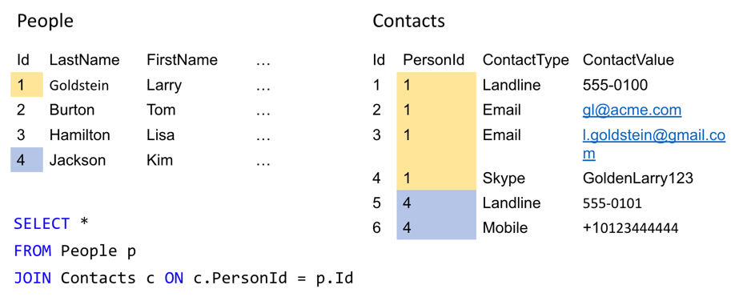

Результат:

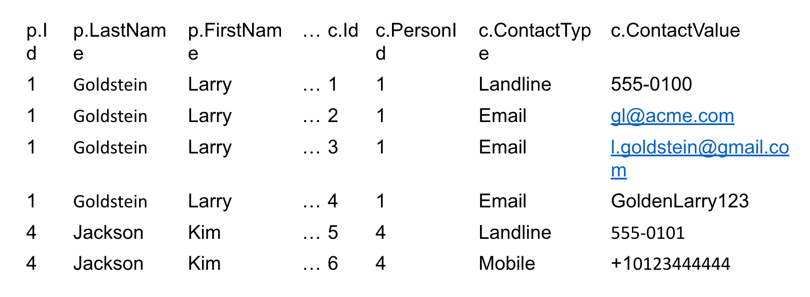

#### 1.2.2. OUTER JOIN

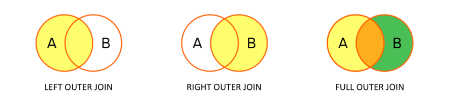

* Соединяет 2 таблицы
* В набор результатов входят все ряды либо одной, либо обеих таблиц

Пример `LEFT OUTER JOIN`:

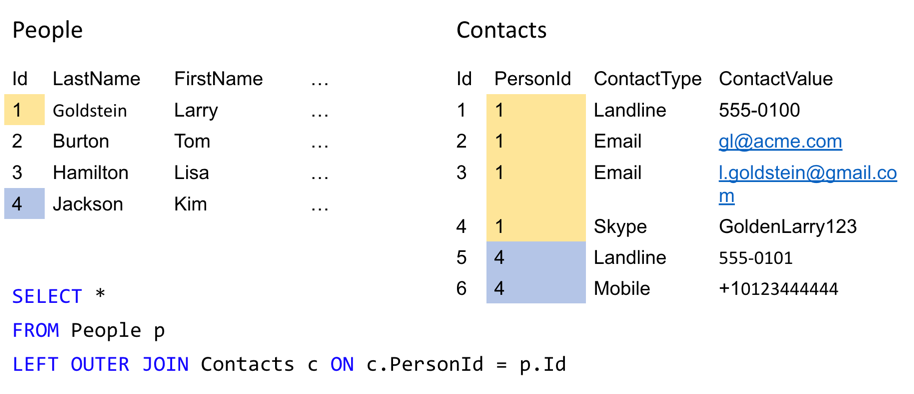

Результат:

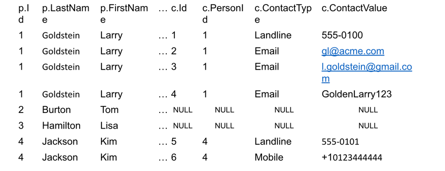

Пример `RIGHT OUTER JOIN`:

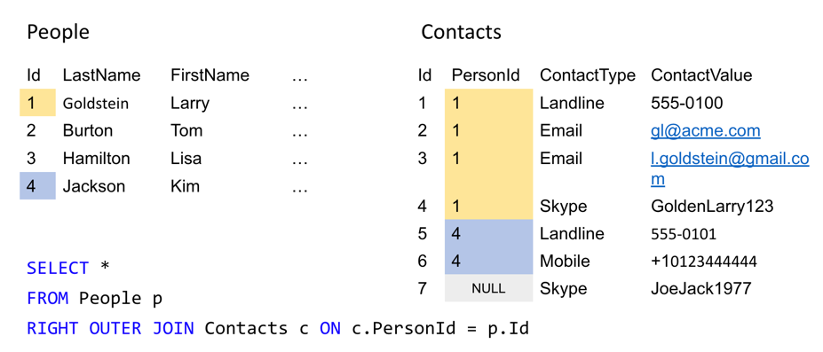
Результат:

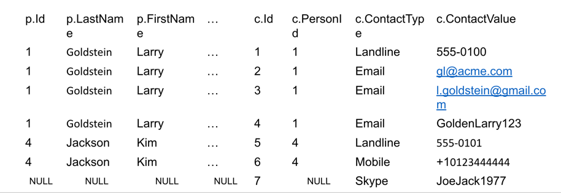

Пример `FULL OUTER JOIN`:

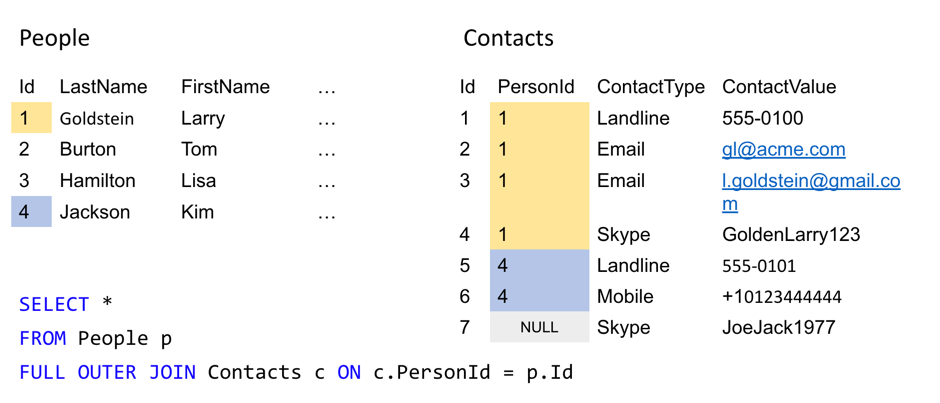
Результат:

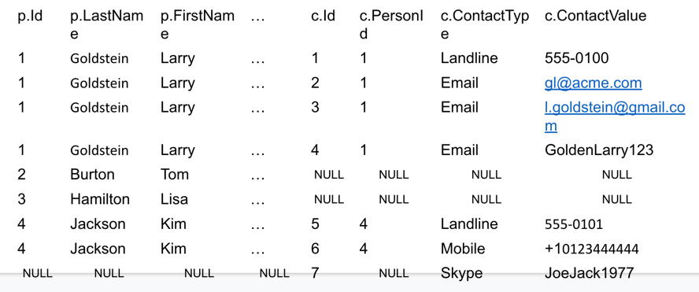

> В случае, если join_condition входят столбцы с одинаковыми именами, можно использовать сокращённый синтаксис с `USING`.

Пример аналогичных join_condition:

```postgresql
ON left_table.a = right_table.a AND left_table.b = right_table.b

USING (a, b)
```

Ещё более компактный вариант указания join_condition – указание `NATURAL` перед join_type.
```postgresql
SELECT select_list 
FROM T1 NATURAL JOIN T2;
```

Принцип работы `NATURAL`:
 * Аналогичен `USING` с указанием всех одноимённых столбцов
 * Если одноимённых столбцов нет, то аналогичен `ON TRUE`


### 2. Практическое задание (соединения)

1. Создать схему topic_3:

```postgresql
CREATE SCHEMA topic_3;
```

2. Создать в этой схеме таблицу `department` с полями `department_nm` и `location_txt`
3. Запустить операции вставки, полученные от семинариста
4. Вывести все значения из таблицы `department`
5. Вывести всех сотрудников, работающих в Москве
6. Найти всех сотрудников, город работы которых нам не известен
7. Рассчитать максимальную зарплату по городу
8. Подсчитать число сотрудников в каждом городе
9. Найти все города с минимальной зарплатой свыше `500`
10. Вывести список всех сотрудников, отсортированных по городу и по возрастанию зарплаты
11. Вывести города, отсортировав по уменьшению средней зарплаты
12. Для каждого города подсчитать количество сотрудников, максимальную и минимальную зарплату, а также среднее значение зарплаты
13. Вывести города и количество сотрудников в них, если средняя зарплата по городу превышает `100`
14. Записать в таблицу `department` новый отдел на ваш выбор. Для нового отдела воспользоваться агрегирующими функциями по зарплате. Посмотреть на полученные результаты и объяснить их.
15. Получить максимально полную сводку по полям: Имя сотрудника, Наименование отдела, Город отдела и Сумма зарплаты.
16. Представьте, что в таблице `department` - `N` строк, а в `salary` - `M` строк. Какие минимальное и максимальное число строк можно получить в результате применения к ним:
 * `CROSS JOIN`
 * `INNER JOIN`
 * `LEFT JOIN`
 * `FULL JOIN`
17. Верно ли, что любой вид `JOIN`-а может быть приведен к `INNER JOIN` при должном старании автора запроса? 
Приведите примеры таких вырождений для `CROSS JOIN`-а и любого из `OUTER JOIN`-ов.

---

### 3. Теоретическая справка (подзапросы)

#### 3.1 Подзапросы

**Подзапрос** — запрос, содержащийся в другом SQL-запросе. Запрос, содержащий другой подзапрос, называется *содержащим выражением*.

* Подзапрос всегда заключен в круглые скобки и обычно выполняется до содержащего выражения.
* Подзапросы могут вкладываться друг в друга.
* В `SELECT’e` подзапросы можно использовать во всех разделах, кроме `GROUP BY`.

**Классификация подзапросов:**
1. По взаимодействию с содержащим выражением:
    * Связанные (т.е. ссылающиеся на столбцы основного запроса):
        * Для написания таких запросов полезно использование алиасов. (`SELECT … AS T`)
        * Для случаев, когда в основном запросе и в подзапросе используется одна и та же таблица, использование алиасов обязательно!
        * Выполняются для каждой строки содержащего выражения.
    * Несвязанные (т.е. полностью самодостаточные и не зависящие от основного запроса) — выполняются перед выполнением содержащего выражения.
2. По результату выполнения:
    * Скалярные (1 столбец и 1 строка)
    * Нескалярные

**Использование подзапросов:**
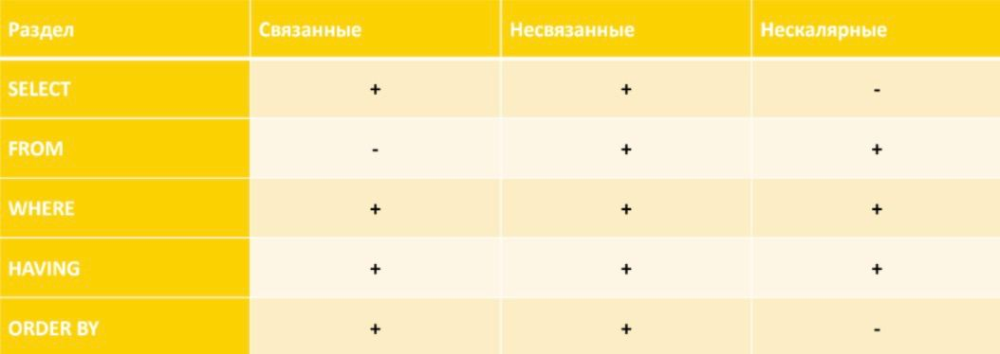

#### 3.2 Предикаты (для подзапросов вида 1 столбец и несколько строк)

* `EXISTS` — Значением условия `EXISTS` является `TRUE` в том и только в том случае, когда мощность таблицы-результата подзапроса больше нуля, иначе значением условия является `FALSE`:
```postgresql
SELECT 
    SupplierName
FROM 
    Suppliers
WHERE 
    EXISTS(
        SELECT 
            ProductName
        FROM 
            Products
        WHERE 
            SupplierId = Suppliers.supplierId
            AND Price < 20
    );
```

* `IN` — Предикат `IN` для подзапросов работает так же, как и для обычных запросов (проверка наличия значения в списке):
```postgresql
SELECT 
    emp_id, 
    fname, 
    lname, 
    title
FROM 
    employee
WHERE 
    emp_id IN(
        SELECT 
            superior_emp_id
        FROM 
            employee
    );
```

* `ALL` — `TRUE`, если результат подзапроса пуст или значение предиката равно TRUE для каждой строки подзапроса; если хотя бы что-то `FALSE`, то вернет `FALSE`, во всех остальных случаях вернет `UNKNOWN`:
```postgresql
SELECT 
    EMP_NO
FROM 
    EMP
WHERE 
    DEPT_NO = 65
    AND EMP_SAL >= ALL(
        SELECT 
            EMP1.EMP_SAL
        FROM 
            EMP AS EMP1
        WHERE 
            EMP.DEPT_NO = EMP1.DEPT_NO
    );
```

* `ANY` — `FALSE`, если результат подзапроса пуст или значение условия равно `FALSE` для каждой строки подзапроса; если хотя бы что-то `TRUE`, то вернет `TRUE`, в остальных случаях вернет `UNKNOWN`:
```postgresql
SELECT 
    EMP_NO
FROM 
    EMP
WHERE 
    DEPT_NO = 65
    AND EMP_SAL > ANY(
        SELECT 
            EMP1.EMP_SAL
        FROM 
            EMP AS EMP1
        WHERE 
            EMP.DEPT_NO = EMP1.DEPT_NO
    );
```

`CREATE TABLE AS` — создаёт таблицу и наполняет её данными, полученными в результате выполнения `SELECT`. Столбцы этой таблицы получают имена и типы данных в соответствии со столбцами результата `SELECT` (хотя имена столбцов можно переопределить, добавив явно список новых имен столбцов).

```sql
CREATE TABLE NEW_TABLE AS
    SELECT 
        *
    FROM 
        OLD_TABLE;
```

`CREATE TABLE AS` напоминает создание представления, но на самом деле есть значительная разница: эта команда создает новую таблицу и выполняет запрос только раз, чтобы наполнить таблицу начальными данными. Последующие изменения в исходных таблицах запроса в новой таблице отражаться не будут. С представлением, напротив, определяющая его команда `SELECT` выполняется при каждой выборке из него.

### 4. Практическое задание (подзапросы)

1. С помощью скалярного подзапроса найти имена преподавателей, которые получили разово минимальную выплату за все время.
2. С помощью скалярного подзапроса найти имена преподавателей, у которых выплата по тому или иному типу была максимальной. Вывести имя преподавателя и тип выплаты, используя case или decode (1 – выплата за семинарские занятия, 2 – выплата за лекционные занятия, 3 – премиальная часть);
3. С помощью подзапроса и предиката `IN` вывести имена преподавателей, тип и сумму выплат по каждому типу за все время работы, при
   условии, что у преподавателя была выплата за лекционные занятия.
4. С помощью `EXISTS` вывести имена преподавателей, тип и сумму выплат по каждому типу за все время работы, при условии, что у
   преподавателя была выплата за лекционные занятия;
5. С помощью аналитической функции `COUNT` найти количество выплат по каждому преподавателю за каждое число; выведите также размер каждой выплаты.
6. С помощью аналитической функции `SUM` найти общий размер выплат по каждому преподавателю за каждое число; выведите также размер каждой выплаты.
7. С помощью аналитической функции `SUM` и сортировки найти суммарные выплаты по каждому преподавателю за каждое число (по нарастанию).
8. С помощью аналитической функции `RANK (DENSE_RANK)` и подзапроса найти имена преподавателей, которые получили разово минимальную выплату за все время. Перед этим добавьте следующую строку в данные:
```postgresql
INSERT INTO topic_3.db_instructor_salary VALUES
('Роздухова Нина', '2019-02-25', 2999, 1);
```
9. С помощью аналитической функции `ROW_NUMBER` и подзапроса найти имя преподавателя, который первый получил самую маленькую выплату. Если таких преподавателей несколько, взять первого по сортировке по имени;
10. С помощью конструкции `DISTINCT ON` найти имя преподавателя, который первый получил самую маленькую выплату. Если таких
    преподавателей несколько, взять первого по сортировке по имени. Можно ли обойтись без конструкции `DISTINCT ON`?

---

### Полезные ссылки
 * [SQLize.online is a free online SQL environment for quickly running, experimenting with and sharing SQL code.](https://sqlize.online/sql/psql14/9cffb8e3d397e93627eb41cd55b10c20/)
