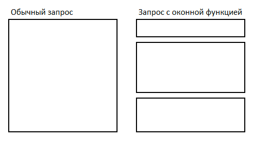
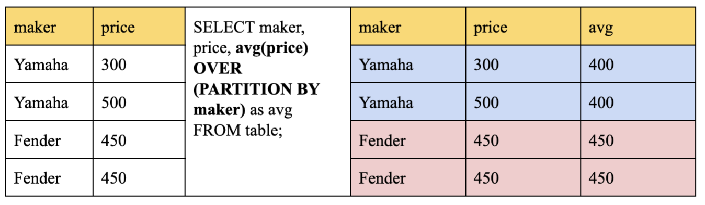
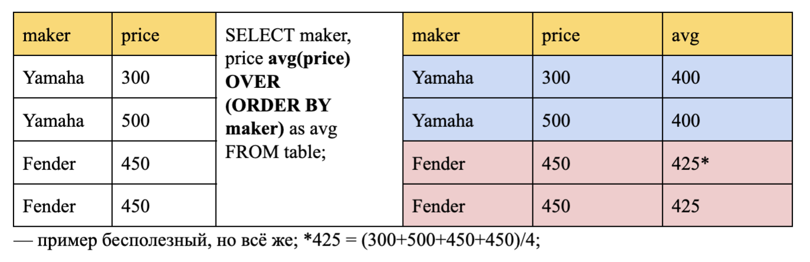
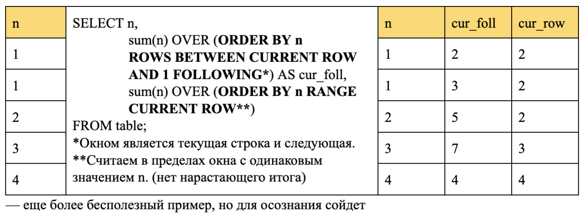
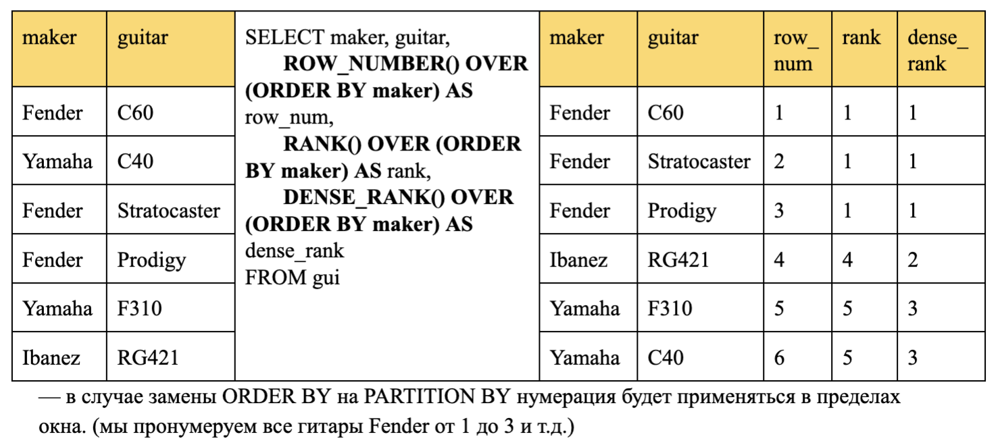
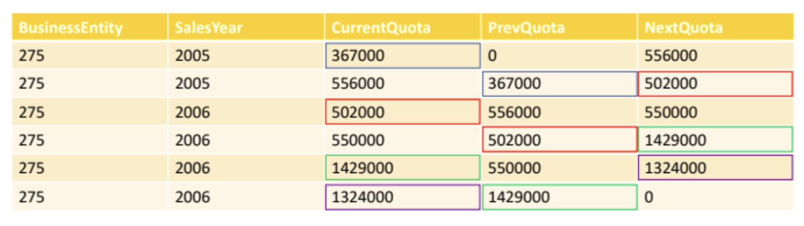

## Тема 6. Оконные функции.

### 1. Теоретическая справка

**Аналитические (оконные) функции:**
* Принимают в качестве аргумента столбец промежуточного результата вычисления и возвращают тоже столбец.
* Местом их использования могут быть только разделы `ORDER BY` и `SELECT`, выполняющие завершающую обработку логического промежуточного результата.
* Действуют подобно агрегатным функциям, но не уменьшают степень детализации.
* Агрегируют данные порциями, количество и размер которых регулируется специальной синтаксической конструкцией.

**Синтаксис:**

```postgresql
function_name(expression) OVER (
    [ <PARTITION BY clause> ]       -- окно
    [ <ORDER BY clause> ]           -- сортировка
    [ <ROWS or RANGE clause> ]      -- границы окна
) AS attr_name
```

При обычном запросе, все множество строк обрабатывается как бы единым «цельным куском», для которого считаются агрегаты.
А при использовании оконных функций, запрос делится на части (окна) и уже для каждой из отдельных частей считаются свои
агрегаты.



Пример, показывающий, как сравнить зарплату каждого сотрудника со средней зарплатой его отдела:

```postgresql
SELECT 
    depname,
    empno,
    salary,
    avg(salary) OVER (PARTITION BY depname)
FROM 
    empsalary;
```

```
 depname   | empno | salary |          avg          
-----------+-------+--------+-----------------------
 develop   |    11 |   5200 | 5020.0000000000000000
 develop   |     7 |   4200 | 5020.0000000000000000
 develop   |     9 |   4500 | 5020.0000000000000000
 develop   |     8 |   6000 | 5020.0000000000000000
 develop   |    10 |   5200 | 5020.0000000000000000
 personnel |     5 |   3500 | 3700.0000000000000000
 personnel |     2 |   3900 | 3700.0000000000000000
 sales     |     3 |   4800 | 4866.6666666666666667
 sales     |     1 |   5000 | 4866.6666666666666667
 sales     |     4 |   4800 | 4866.6666666666666667
(10 rows)
```

Первые три столбца извлекаются непосредственно из таблицы `empsalary`, при этом для каждой строки таблицы есть строка
результата. В четвёртом столбце оказалось среднее значение, вычисленное по всем строкам, имеющим то же
значение `depname`, что и текущая строка. (Фактически среднее вычисляет та же обычная, не оконная функция `avg`, но
предложение `OVER` превращает её в оконную, так что её действие ограничивается рамками окон.)

**Использование `OVER`:**
* `OVER` определяет набор строк, которые будет использовать оконная функция, включая сортировку данных. (“окно”)
* В выражении, которое задает оконную функцию, инструкция `OVER` ограничивает наборы строк с одинаковыми значениями в поле, по которому идет разделение.
* Сама по себе инструкция `OVER()` не ограничена и содержит все строки из результирующего набора.
* Инструкция `OVER` может многократно использоваться в одном `SELECT`, каждая со своим разделением и сортировкой.

**Правила секционирования:**

Внутри `OVER` необходимо указать поле таблицы, по которому будет скользить “окно” и правило, по которому строки будут секционироваться:
1. `PARTITION BY`: — отвечает за критерий секционирования
    * Логически разбивает множество на группы по критериям.
    * Аналитические функции применяются к группам независимо.
    * Если не указать конструкцию секционирования, все множество считается одной группой.



2. `ORDER BY`: — отвечает за сортировку
    * Задает критерий сортировки внутри каждой группы.
    * Агрегатные функции в отсутствие конструкции `ORDER BY` вычисляются по всем строкам группы, и одно и то же значение выдается для каждой строки, т.е. функция используется как итоговая.
    * Если агрегатная функция используется с конструкцией `ORDER BY`, то она вычисляется по текущей строке и всем строкам до неё, т.е. функция используется как оконная. (вычисляется нарастающий итог)



3. `ROWS | RANGE`: — дополнительные ограничения на диапазон строк окна (обязательно присутствие `ORDER BY`):
    * ROWS (по строкам) — позволяет вручную определять границы окна, для которого подсчитывается значение; умеет работать с PRECEDING/FOLLOWING.
    * `RANGE` (по значениям из `ORDER BY`, формируется суб-окно)— достаточно близко к предыдущему, но все же не то (профессиональное мнение Александра Фаритовича: “Понятия не имею, когда это можно использовать”); Но использование ‘RANGE CURRENT ROW’ после ORDER BY позволяет избавиться от нарастающего итога; не умеет работать с PRECEDING/FOLLOWING.
    * По умолчанию рассматривает от `UNBOUNDED PRECEDING` до `CURRENT ROW`. (`UNBOUNDED PRECEDING/FOLLOWING` — рассматриваем вплоть до конца/начала окна.)
    * Строки выбираем в рамках окна, но при необходимости обращения к предыдущим/последующим строкам, можем вручную прописать так, чтобы может выходило за пределы окна.



#### 1.0. Классификация оконных функций

**Классификация оконных функций:**
1. *Агрегирующие* (`sum`, `avg`, `min`, `max`, `count`)
2. *Ранжирующие* (`row_number`, `rank`, `dense_rank`)
3. *Смещения* (`lag`, `lead`, `first_value`, `last_value`); функции смещения используются с указанием поля.


**Ранжирующие функции:**
* `row_number()` – нумеруем каждую строку окна последовательно с шагом 1.
* `rank()` – ранжируем каждую строку окна с разрывом в нумерации при равенстве значений.
* `dense_rank()` – ранжируем каждую строку окна без разрывов в нумерации при равенстве значений.



**Функции смещения:**
* `lag(attr, offset (сдвиг), default_value(дефолтное значение в случае, если наша строка окажется первой))` – предыдущее значение со сдвигом.
* `lead(attr, offset, default_value)` – следующее значение со сдвигом.
* `first_value(attr)` – первое значение в окне с первой по текущую строку.
* `last_value(attr)` – последнее значение в окне с первой по текущую строку.

```postgresql
SELECT 
    BusinessEntity, 
    SalesYear, 
    CurrentQuota,
    LAG(CurrentQuota, 1, 0) OVER (ORDER BY SalesYear) AS PrevQuota,
    LEAD(CurrentQuota, 1, 0) OVER (ORDER BY SalesYear) AS NextQuota
FROM 
    SalesPersonQuotaHistory
WHERE 
    BusinessEntityID = 275;
```



#### 1.1. Фильтрация по результатам вычисления оконной функции

Оконные функции разрешается использовать в запросе только в списке `SELECT` и предложении `ORDER BY`. Во всех остальных
предложениях, включая `GROUP BY`, `HAVING` и `WHERE`, они запрещены. Это объясняется тем, что логически они выполняются
после этих предложений, а также после не оконных агрегатных функций, и значит агрегатную функцию можно вызывать в
аргументах оконной, но не наоборот.

Если необходимо отфильтровать или сгруппировать строки после вычисления оконных функций, можно использовать вложенный
запрос. Например:

```postgresql
SELECT 
    depname, 
    empno, 
    salary, 
    enroll_date
FROM (
    SELECT 
        depname,
        empno,
        salary,
        enroll_date,
        rank() OVER (PARTITION BY depname ORDER BY salary DESC, empno) AS pos
    FROM 
        empsalary
) AS ss
WHERE 
    pos < 3;
```

Данный запрос покажет только те строки внутреннего запроса, у которых `rank` (порядковый номер) меньше 3.

#### 1.2. Именованные вызовы оконных функций

Когда в запросе вычисляются несколько оконных функций для одинаково определённых окон, конечно можно написать для каждой
из них отдельное предложение `OVER`, но при этом оно будет дублироваться, что неизбежно будет провоцировать ошибки.
Поэтому лучше определение окна выделить в предложение `WINDOW`, а затем ссылаться на него в `OVER`. Например:

```postgresql
SELECT 
    sum(salary) OVER w, 
    avg(salary) OVER w
FROM 
    empsalary
WINDOW 
    w AS (PARTITION BY depname ORDER BY salary DESC);
```

Подробнее об оконных функциях можно почитать по ссылкам в последней секции этого документа.

### 2. Практическое задание

1. Создать схему `topic_6`
2. Создать объекты в соответствии со скриптом:

```postgresql
DROP SCHEMA IF EXISTS topic_6 CASCADE;
CREATE SCHEMA topic_6;

DROP TABLE IF EXISTS topic_6.participant;
CREATE TABLE topic_6.participant
(
    participant_id         INT PRIMARY KEY,
    participant_nm         VARCHAR(200),
    participant_birth_dt   DATE,
    participant_country_nm VARCHAR(200)
);

DROP TABLE IF EXISTS topic_6.competition;
CREATE TABLE topic_6.competition
(
    competition_id           INT PRIMARY KEY,
    competition_nm           VARCHAR(200),
    held_dt                  DATE,
    competition_country_nm   VARCHAR(100),
    result_sorting_type_code VARCHAR(10) CHECK (result_sorting_type_code IN ('ASC', 'DESC'))
);

DROP TABLE IF EXISTS topic_6.competition_result;
CREATE TABLE topic_6.competition_result
(
    competition_id         INT REFERENCES topic_6.competition (competition_id),
    participant_id         INT REFERENCES topic_6.participant (participant_id),
    participant_result_amt NUMERIC(20, 2)
);
```

3. Осуществить вставку данных в таблицы по скрипту, полученному от семинариста. Поле `result_sorting_type_code`
   определяет, сортировку какого типа необходимо использовать для ранжирования результатов участников в соревновании от
   худшего к лучшему
4. Для каждого соревнования получить топ-1 результат
5. Для каждого соревнования вывести призовые места
6. Для каждого непризового места вывести отклонение от лучшего результата
7. Для каждого соревнования вывести всех участников, которые младше победителя
8. Для каждого соревнования по каждому участнику вывести результат участника, результат предыдущего участника,
   следующего участника, а также разницу между ними
9. Для каждого соревнования получить количество уникальных участников соревнования, не используя `GROUP BY`
10. Для каждого соревнования вывести статистику: указать, кто из участников был призером в формате "Занял место X", "Не
    занял призового места"
11. Создать таблицу со статистикой по всем соревнованиям: вывести каждого участника, дату его рождения, его результат,
    лучший результат по соревнованию, имя участника с лучшим результатом, отклонение результата участника от 1 места,
    средний резльутат по соревнованию, отклонение результата участника от среднего, минимальный результат по
    соревнованию, имя участника с минимальным результатом

---

### Полезные ссылки
 * [Рамки окна можно определять и другими способами. Вызовы оконных функций](https://postgrespro.ru/docs/postgresql/14/sql-expressions#SYNTAX-WINDOW-FUNCTIONS)  
 * [Оконные функции](https://postgrespro.ru/docs/postgresql/14/functions-window)  
 * [Обработка оконных функций](https://postgrespro.ru/docs/postgresql/14/queries-table-expressions#QUERIES-WINDOW)  
 * [Справка SELECT](https://postgrespro.ru/docs/postgresql/14/sql-select)
