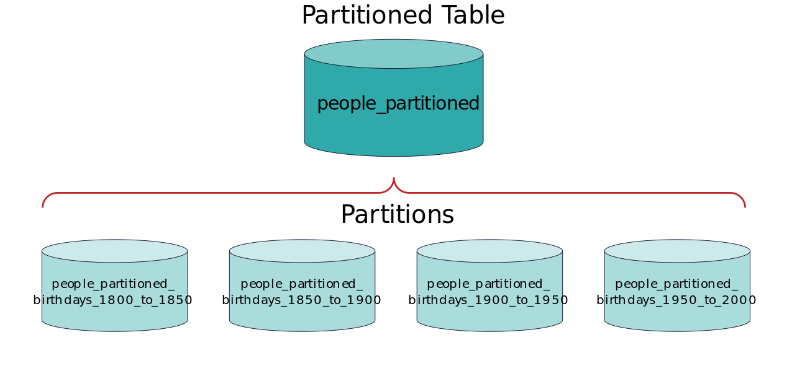
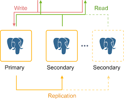

## Тема 11. OLAP.

### 1. Масштабирование Postgres

#### 1.1. Partitioning (партицирование/секционирование)

#### 1.1.1. Общие сведения

Часто возникает проблема: одна из таблиц в базе данных сильно выросла и время выполнения запросов к этой таблице увеличилось. 
Одним из вариантов решения такой проблемы в PostgreSQL является партицирование. Партиции могут содержать разное количество 
строк, а значит и размер на диске будет разным. Таблица партицируется построчно. **Пример:**
```postgresql
CREATE TABLE people_partitioned (
    person_id       SERIAL        PRIMARY KEY,
    first_name      VARCHAR(128)  NOT NULL,
    last_name       VARCHAR(128)  NOT NULL,
    birthday        DATE          NOT NULL,
    ...
) PARTITION BY RANGE (birthday);


CREATE TABLE people_partitioned_birthdays_1800_to_1850 
    PARTITION OF people_partitioned
    FOR VALUES FROM ('1800-01-01') TO ('1849-12-31');

CREATE TABLE people_partitioned_birthdays_1850_to_1900
    PARTITION OF people_partitioned
    FOR VALUES FROM ('1850-01-01') TO ('1899-12-31');

CREATE TABLE people_partitioned_birthdays_1900_to_1950
    PARTITION OF people_partitioned
    FOR VALUES FROM ('1900-01-01') TO ('1949-12-31');

CREATE TABLE people_partitioned_birthdays_1950_to_2000
    PARTITION OF people_partitioned
    FOR VALUES FROM ('1950-01-01') TO ('1999-12-31');
```


Таблицу, которую партицируют, называют **мастер-таблицей**. Партиция имеет связь с мастер-таблицей и представляет собой обычную таблицу, то есть к ней можно обращаться точно так же, как к самой обычной таблице: 
`SELECT`, `INSERT` (если не нарушает ограничений, накладываемых на партицию), `UPDATE`, `DELETE`.

**Какие проблемы может решить партицирование?**
 * ускорение выборки данных;
 * ускорение вставки данных;
 * упрощение удаления старых данных;
 * упрощение обслуживания таблицы.

*Следует помнить, что партицирование — не панацея*

**В каких случаях партицирование не поможет либо никак не повлияет?**
 * время создания бэкапа;
 * время восстановления из бэкапа;
 * место на диске.

*В первых двух случаях время практически не изменится, так как выполняется полный перебор данных. В последнем случае: был 1 млрд строк, после партицирования имеем тот же 1 млрд. То есть занимаемое место на диске будет практически тем же.*

**Некоторые ограничения и возможные проблемы по итогам партицирования**
 * партицируемая таблица должна быть достаточно большого размера; согласно документации, рекомендуется партицировать в случае, если таблица превосходит размер памяти;
 * на партицируемую таблицу нельзя ссылаться через FOREIGN KEYS (можно, начиная с PostgreSQL 12); при этом обратное (партицируемая таблица ссылается на другие) допустимо;
 * в некоторых случаях партицирование может ухудшить производительность на операциях чтения и записи;
 * в идеале запрос будет выполняться против одной партиции, но в худшем случае — затронет все партиции и, в зависимости от настроек PostgreSQL, увеличит время выполнения запроса, как в предыдущем пункте.


#### 1.1.2. Виды партицирования

##### 1.1.2.1. по диапазонам

Таблица секционируется по «диапазонам», определённым по ключевому столбцу или набору столбцов, и не пересекающимся друг 
с другом (см. пример выше).

##### 1.1.2.2. по списку
Таблица секционируется с помощью списка, явно указывающего, какие значения ключа должны относиться к каждой секции.
```postgresql
CREATE TABLE traffic_violations_p_list( 
    seq_id         TEXT,
    violation_type TEXT,
    ...
)
PARTITION BY LIST (violation_type);


CREATE TABLE traffic_violations_p_list_warning
    PARTITION OF traffic_violations_p_list
    FOR VALUES IN ('Warning');

CREATE TABLE traffic_violations_p_list_sero
    PARTITION OF traffic_violations_p_list
    FOR VALUES IN ('SERO');

CREATE TABLE traffic_violations_p_list_Citation
    PARTITION OF traffic_violations_p_list
    FOR VALUES IN ('Citation');

CREATE TABLE traffic_violations_p_list_ESERO
    PARTITION OF traffic_violations_p_list
    FOR VALUES IN ('ESERO');

CREATE TABLE traffic_violations_p_list_default
    PARTITION OF traffic_violations_p_list DEFAULT;  
```

*Postgres не создает "партицию по умолчанию" автоматически.
Подумайте какие подводные камни влечет за собой наличие "партицию по умолчанию".*

##### 1.1.2.3. по хешу
Таблица секционируется по определённым модулям и остаткам, которые указываются для каждой секции. Каждая секция содержит строки, для которых хеш-значение ключа разбиения, делённое на модуль, равняется заданному остатку.
```postgresql
CREATE TABLE traffic_violations_p_hash( 
    seqid     TEXT, 
    councils  SMALLINT,
    ...
)
PARTITION BY HASH (councils);


CREATE TABLE traffic_violations_p_hash_p1
    PARTITION OF traffic_violations_p_hash
    FOR VALUES WITH (MODULUS 5, REMAINDER 0);

CREATE TABLE traffic_violations_p_hash_p2
    PARTITION OF traffic_violations_p_hash
    FOR VALUES WITH (MODULUS 5, REMAINDER 1);

CREATE TABLE traffic_violations_p_hash_p3
    PARTITION OF traffic_violations_p_hash
    FOR VALUES WITH (MODULUS 5, REMAINDER 2);

CREATE TABLE traffic_violations_p_hash_p4
    PARTITION OF traffic_violations_p_hash
    FOR VALUES WITH (MODULUS 5, REMAINDER 3);

CREATE TABLE traffic_violations_p_hash_p5
    PARTITION OF traffic_violations_p_hash
    FOR VALUES WITH (MODULUS 5, REMAINDER 4);
```

##### 1.1.2.4. Замечания
 * Описанные выше виды партицирования обощающе называют **декларативное партицирование**.

 * Комбинирование видов партицирования или многоколоночное партицирование на уровне одной таблицы **невозможно**. С другой стороны, партицию можно уже партицировать по другому условию, т.к. партиция также является таблицей. Таким образом реализуется вложенное партицирование.
```postgresql
-- такое невозможно
CREATE TABLE measurement (
    city_id         INT NOT NULL,
    logdate         DATE NOT NULL,
    peaktemp        INT,
    unitsales       INT
) PARTITION 
    BY RANGE (logdate),
    BY RANGE (unitsales);
```

 * Хотя все секции должны иметь те же столбцы, что и секционированная родительская таблица, в каждой секции независимо от других могут быть определены свои индексы, ограничения и значения по умолчанию.

 * Все строки, вставляемые в секционированную таблицу, перенаправляются в соответствующие секции в зависимости от значений столбцов ключа разбиения. Если при изменении значений ключа разбиения в строке она перестаёт удовлетворять ограничениям исходной секции, эта строка перемещается в другую секцию.

 * Преобразовать обычную таблицу в секционированную и наоборот **нельзя**.

#### 1.1.3. Партицирование через наследование
Хотя встроенное декларативное секционирование полезно во многих часто возникающих ситуациях, бывают обстоятельства, требующие более гибкого подхода. В этом случае секционирование можно реализовать, применив механизм наследования таблиц, что даст ряд возможностей, неподдерживаемых при декларативном секционировании, например:
 * При декларативном секционировании все секции должны иметь в точности тот же набор столбцов, что и секционируемая таблица, тогда как обычное наследование таблиц допускает наличие в дочерних таблицах дополнительных столбцов, отсутствующих в родителе.
 * Механизм наследования таблиц поддерживает множественное наследование.
 * С декларативным секционированием поддерживается только разбиение по спискам, по диапазонам и по хешу, тогда как с наследованием таблиц данные можно разделять по любому критерию, выбранному пользователем.

**Пример**:
```postgresql
CREATE TABLE measurement(
    city_id    INT NOT NULL,
    logdate    DATE NOT NULL,
    peaktemp   INT,
    unitsales  INT
);


CREATE TABLE measurement_y2006m02(
    CHECK(logdate >= DATE '2006-02-01' AND logdate < DATE '2006-03-01')
) INHERITS (measurement);

CREATE TABLE measurement_y2006m03(
    CHECK(logdate >= DATE '2006-03-01' AND logdate < DATE '2006-04-01')
) INHERITS (measurement);

...

CREATE TABLE measurement_y2007m11(
    CHECK(logdate >= DATE '2007-11-01' AND logdate < DATE '2007-12-01')
) INHERITS (measurement);

CREATE TABLE measurement_y2007m12(
    CHECK(logdate >= DATE '2007-12-01' AND logdate < DATE '2008-01-01')
) INHERITS (measurement);

CREATE TABLE measurement_y2008m01(
    CHECK(logdate >= DATE '2008-01-01' AND logdate < DATE '2008-02-01')
) INHERITS (measurement);

...
    
CREATE TABLE measurement_city_id1(
    CHECK(city_id = 1)
) INHERITS (measurement);
```

Описанное выше это лишь малая часть того, что можно делать с партициями. Для большей информации стоит читать [документацию](https://www.postgresql.org/docs/current/ddl-partitioning.html).

#### 1.2. Репликация

Репликация (англ. replication) — механизм синхронизации содержимого нескольких копий объекта (например, содержимого базы данных). Репликация — это процесс, под которым понимается копирование данных из одного источника на другой (или на множество других) и наоборот.

**Когда может быть полезна репликация?**
 * **Отказоустойчивость**. Если у вас несколько реплик и один сервер вышел из строя, приложение/сервис/банк/всемирная финансовая инфраструктура/Google/whatever не обвалится с грохотом, а продолжит работать.
 * **Производительность**. Если один сервис будет будет обрабатывать 1000 запросов в секунду или 3 по 1000 — есть разница.

Обычно при репликации говорят о **master** и **slave**. 

В режиме master-slave репликации есть один master-сервер, 
обрабатывающий запросы на изменения данных, и несколько slave-серверов, обрабатывающих запросы на чтение. 


В случае выхода мастера из строя, один из слейвов становится мастером. В режиме master-master все сервера равноценны и
могут обрабатывать любые запросы. Но она сложнее и если один из серверов "умирает", вы можете получить повреждение данных (неконсистентность).


Про настраивание master-slave/master-master репликации для разных СУБД можно легко найти в сети.

#### 1.3. Недостатки 

Партицирование купирует проблему работы с большими данными, но не решает ее полностью. Например, данных может быть настолько много, что
они не умещаются на одну машину. Или запросов на запись/чтение данных может быть очень много и сами запросы могут быть очень трудоемкими,
а вертикальное масштабирование имеет свои границы (расширение оперативной памяти, более вместительные диски, более мощный процессор).

Postgres разрабатывался с оглядки на сценарии частых небольших ставок данных и множества точечных чтений (несколько строк из таблиц). 
Такой сценарий использования называется **OLTP** (**O**n**L**ine **T**ransactional **P**rocessing). 

С другой стороны, могут возникнуть задачи построения отчетности за большой период с агрегациями и соединениями десятков, 
сотен и даже тысяч таблиц. Такие сценарии использования называются **OLAP** (**O**n**L**ine **A**nalytical **P**rocessing).
Для них существуют свои хранилища.

---

### 2. OLAP хранилища

Стандарты де-факто в индустрии ныне:
 * Greenplum
 * ClickHouse
 * Vertica (проприетарная, не рассматриваем)

#### 2.1. MPP системы

MPP (massive parallel processing) – массивно-параллельная архитектура. Главная особенность такой архитектуры состоит в 
том, что память физически разделена. Грубо говоря, данные бъются по кусочкам, хранятся и обрабатываются на разных машинах, 
при необходимости обмениваются между собой данными.


Greenplum и ClickHouse это MPP–системы.

---

### 3. Greenplum


 * [Официальный сайт](https://greenplum.org/)
 * [Исходники](https://github.com/greenplum-db/gpdb)
 * [Документация](https://gpdb.docs.pivotal.io/6-9/admin_guide/intro/partI.html)
 * [Краткий референс](https://github.com/syuja/GreenPlumSetup/tree/master/tutorial)
 * [Туториал по сборке кластера локально](https://github.com/bbotev01/gpdb5)

---

### 4. Clickhouse


 * [Официальный сайт](https://clickhouse.com/)
 * [Исходники](https://github.com/ClickHouse/ClickHouse)
 * [Документация](https://clickhouse.com/docs/en/quick-start)
 * [Пописать запросы онлайн](https://clickhouse.com/blog/clickhouse-fiddle-sql-playground)
 * [Краткий референс](https://webdevblog.ru/osnovy-clickhouse-dlya-veb-razrabotchika/)
 * [Туториал по сборке кластера локально](https://github.com/jneo8/clickhouse-setup)
