## Семинар 2. Соединения, ключи

### Теоретическая справка

### 2.1 DDL, DML

**Операторы определения данных (Data Defenition Language):**

1. `CREATE` – создание объектов БД
```sql
CREATE [TEMPORARY] TABLE [IF NOT EXISTS] tbl_name(
    col_name_1   datatype_1,
    col_name_2   datatype_2,
    ...
    col_name_N   datatype_N
);
```

2. `ALTER` – модификация объектов БД
```sql
ALTER TABLE table_name ADD column_name datatype;
ALTER TABLE table_name DROP column_name;
ALTER TABLE table_name RENAME column_name TO new_column_name;
ALTER TABLE table_name ALTER column_name TYPE datatype;
...
```

3. `DROP` – удаление объектов БД 
```sql
DROP TABLE [IF EXISTS] table_name;
```

4. `TRUNCATE` – удаление содержимого объекта БД (данные удаляются целым куском, нельзя удалять по условию)
```sql
TRUNCATE TABLE table_name;
```

**Операторы манипуляции данными (Data Manipulation Language):**

1. `SELECT` – выбирает данные, удовлетворяющие заданным условиям
2. `INSERT` – добавляет новые данные
```sql
INSERT INTO table_name [(comma_separated_column_names)] VALUES (comma_separated_values);
```

3. `UPDATE` – изменяет (обновляет) существующие данные
```sql
UPDATE table_name
    SET update_assignment_comma_list
WHERE conditional_experssion;
```

4. `DELETE` – удаляет существующие данные (данные удаляются построчно – можно задавать условие, "откатывать" удаление)
```sql
DELETE
    FROM table_name
[WHERE conditional_expression];
```

#### 2.2 Операции соединения таблиц (JOIN)
					
Операции соединения делятся на 3 группы:
					
* `CROSS JOIN` - декартово произведение 2 таблиц
* `INNER JOIN` - соединение 2 таблиц по условию. В результирующую выборку попадут только те записи, которые удовлетворяют условию соединения
* `OUTER JOIN` - соединение 2 таблиц по условию. В результирующую выборку могут попасть записи, которые не удовлетворяют условию соединения: 
    * `LEFT (OUTER) JOIN` - все строки "левой" таблицы попадают в итоговую выборку
    * `RIGHT (OUTER) JOIN` - все строки "правой" таблицы попадают в итоговую выборку 
    * `FULL (OUTER) JOIN` - все строки обеих таблиц попадают в итоговую выборку

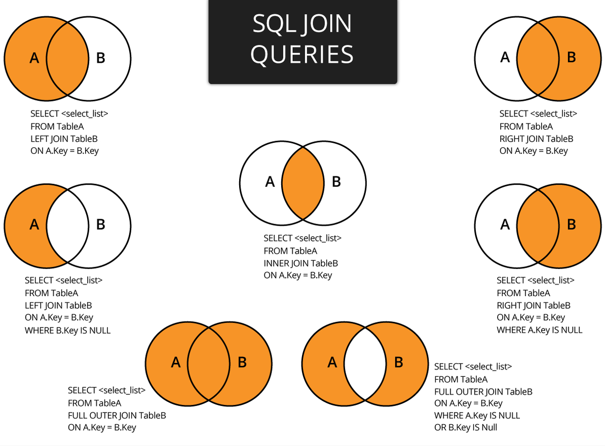

#### INNER JOIN

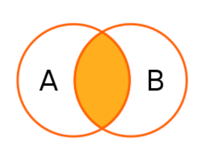

 * Соединяет 2 таблицы
 * Симметричный (порядок неважен)
 * Логический алгоритм:
   * Каждая строка одной таблицы сопоставляется с каждой строкой второй таблицы
   * Для полученной соединённой строки проверяется условие соединения
   * Если условие истинно, в набор результатов добавляется соединённая строка

Пример:

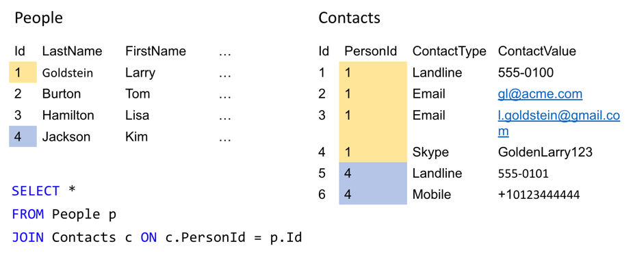

Результат:

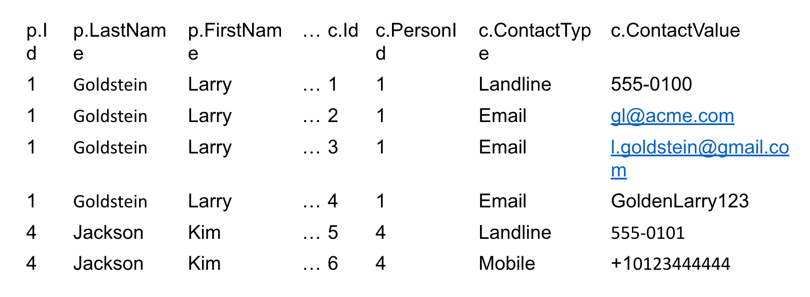

#### OUTER JOIN

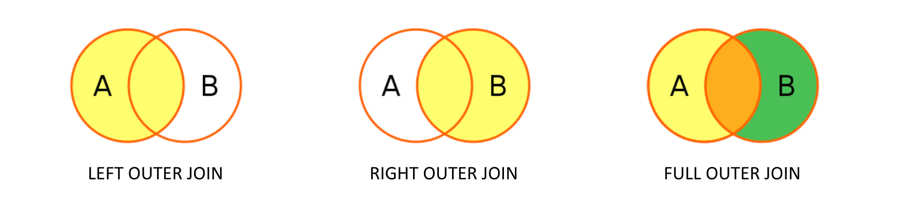

* Соединяет 2 таблицы
* В набор результатов входят все ряды либо одной, либо обеих таблиц

Пример `LEFT OUTER JOIN`:

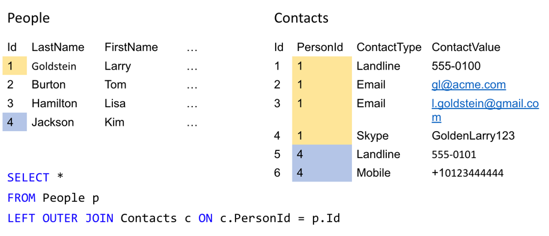

Результат:

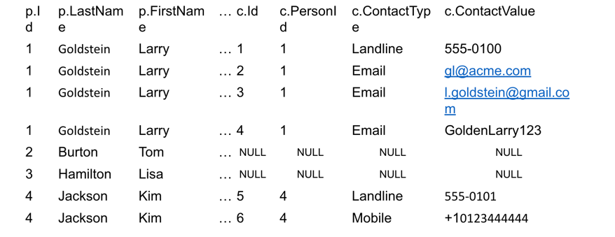

Пример `RIGHT OUTER JOIN`:

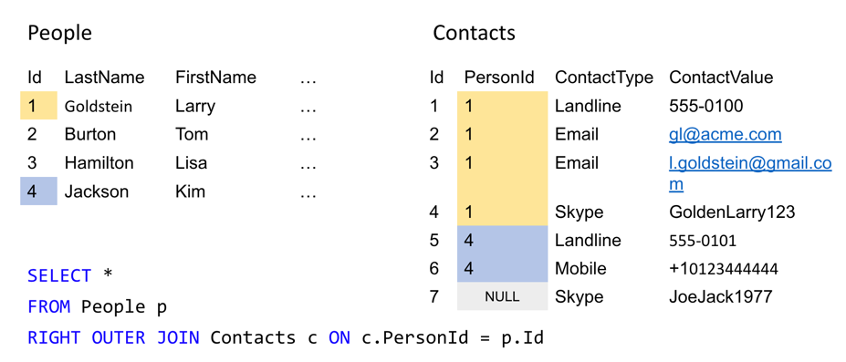
Результат:

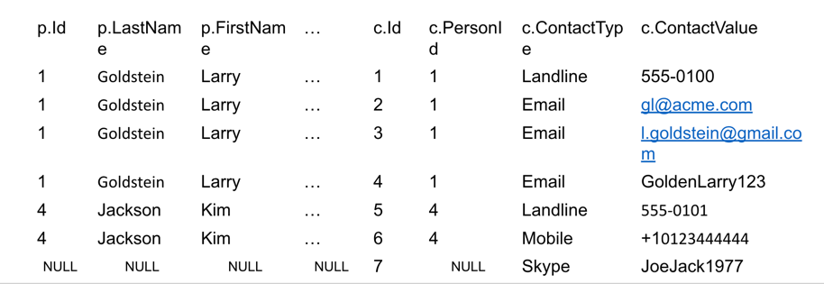

Пример `FULL OUTER JOIN`:

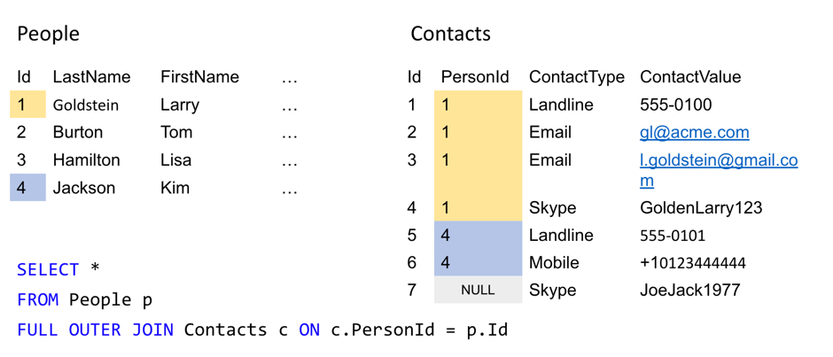
Результат:

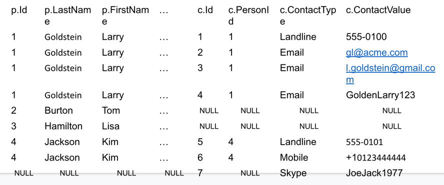

> В случае, если join_condition входят столбцы с одинаковыми именами, можно использовать сокращённый синтаксис с `USING`.

Пример аналогичных join_condition:

```postgresql
ON left_table.a = right_table.a AND left_table.b = right_table.b

USING (a, b)
```

Ещё более компактный вариант указания join_condition – указание `NATURAL` перед join_type.
```postgresql
SELECT select_list 
FROM T1 NATURAL JOIN T2;
```

Принцип работы `NATURAL`:
 * Аналогичен `USING` с указанием всех одноимённых столбцов
 * Если одноимённых столбцов нет, то аналогичен `ON TRUE`

### 2.3 Ключи

**Потенциальный ключ** – подмножество атрибутов отношения, удовлетворяющее требованиям уникальности и минимальности:
* *Уникальность*: нет и <ins>не может быть</ins> двух кортежей данного отношения, в которых значения этого подмножества атрибутов совпадают;
* *Минимальность*: в составе потенциального ключа отсутствует меньшее подмножество атрибутов, удовлетворяющее условию уникальности;
* Типы:
    * *простой* (состоит ровно из одного атрибута)
    * *составной* (состоит из двух и более атрибутов)


Пример нескольких потенциальных составных ключей:  
```sql
CREATE TABLE flight_schedule (
  departure timestampt,
  gate text,
  pilot text

  UNIQUE(departure, gate),
  UNIQUE(departure, pilot)
);
```

**Первичный ключ** *(Primary key, PK)* — любой из потенциальных ключей, выбранный в качестве основного; выбирают в качестве первичного такой ключ, который занимает меньше места при хранении и который не утратит свою уникальность со временем. (потенциальный ключ существует всегда, даже если включает в себя все атрибуты отношения) **Альтернативными ключами** называются потенциальные ключи, не выбранные в качестве первичного.

Типы:
* *естественный* (основанный на уже существующем поле)
* *интеллектуальный* (основанный на естественном ключе путем добавления дополнительного поля)

**Суррогатный ключ** — это дополнительное служебное поле, которое добавляется к уже имеющимся информационным полям таблицы, единственное предназначение которого – служить первичным ключом. (значение генерируется искусственно).

Пусть R<sub>1</sub> и R<sub>2</sub> – две переменные отношения, не обязательно различные. **Внешним ключом FK (Foreign key)** в R<sub>2</sub> является подмножество атрибутов переменной R2 такое, что выполняются следующие требования:
* В переменной отношения R<sub>1</sub> имеется потенциальный ключ PK такой, что PK и FK совпадают с точностью до переименования атрибутов (FK из R<sub>2</sub> является PK из R<sub>1</sub>)
* В любой момент времени каждое значение FK в текущем значении R<sub>2</sub> идентично значению PK в некотором кортеже в текущем значении R<sub>1</sub>. Иными словами, в любой момент времени множество всех значений FK в R<sub>2</sub> является подмножеством значений PK в R<sub>1</sub>.

* *Родительское (главное/целевое) отношение* — отношение R<sub>1</sub>, содержащее потенциальный ключ.
* *Дочернее (подчиненное) отношение* — отношение R<sub>2</sub>, содержащее в себе ссылку на сущность, в которой находятся нужные нам атрибуты. (содержащее в себе внешний ключ)

#### Создание ключей

`PRIMARY KEY`
```postgresql
CREATE TABLE PERSON (
    ID         INTEGER      PRIMARY KEY,
    LAST_NAME  VARCHAR(255) NOT NULL,
    FIRST_NAME VARCHAR(255) NOT NULL,
    AGE        INTEGER
);

ALTER TABLE PERSON ADD PRIMARY KEY (ID);

------------------------------------------

CREATE TABLE PERSON (
    ID         INTEGER,
    LAST_NAME  VARCHAR(255),
    FIRST_NAME VARCHAR(255) NOT NULL,
    AGE        INTEGER,
    CONSTRAINT PK_Person PRIMARY KEY (ID, LAST_NAME)
);

ALTER TABLE PERSON
ADD CONSTRAINT PK_Person PRIMARY KEY (ID, LAST_NAME);

ALTER TABLE PERSON
DROP CONSTRAINT PK_Person;
```

`FOREIGN KEY`
```postgresql
CREATE TABLE ORDER (
    ORDER_ID     INTEGER,
    ORDER_NUMBER INTEGER NOT NULL,
    PERSON_ID    INTEGER,
    
    PRIMARY KEY (ORDER_ID),
    CONSTRAINT FK_PersonOrder FOREIGN KEY (PERSON_ID) REFERENCES PERSON(PERSON_ID)
);

ALTER TABLE ORDER ADD CONSTRAINT FK_PersonOrder
FOREIGN KEY (PERSON_ID) REFERENCES PERSON(PERSON_ID);

ALTER TABLE ORDER DROP CONSTRAINT FK_PersonOrder;

------------------------------------------

CREATE TABLE ORDER (
    ORDER_ID     INTEGER PRIMARY KEY,
    ORDER_NUMBER INTEGER NOT NULL,
    PERSON_ID    INTEGER REFERENCES PERSON(PERSON_ID)
);

ALTER TABLE ORDER
ADD FOREIGN KEY (PERSON_ID) REFERENCES PERSON(PERSON_ID);
```

### Практическая часть
  
Продолжаем работать с данными о фильмах.  

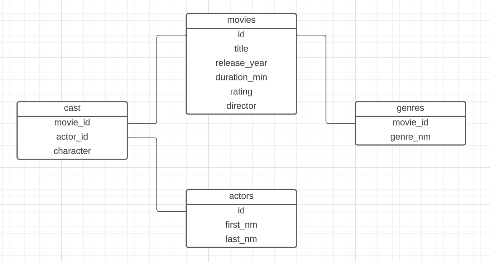

1. Создать схему sem_2:  

2. Создать следующие таблицы. Какие первичные и внешние ключи нужны здесь? Создайте их.
Колонку id заведите типа serial ([документация](https://postgrespro.ru/docs/postgresql/9.6/datatype-numeric)). Как называется такой вид ключа?  

movies  
id (идентификатор фильма)  
title (название фильма)  
release_year (год выпуска)  
duration_min (длительность в мин)  
rating (рейтинг)  
director (режиссёр)  
    

actors  
id (идентификатор актёра)  
first_nm (имя актёра)  
last_nm (фамилия актёра)  
    
  
cast  
movie_id (идентификатор фильма)  
actor_id (идентификатор актёра)  
character_nm (персонаж)  
    
    
genres  
movie_id (идентификатор фильма)  
genre_nm (жанр)  
  

3. Заполнить таблицу movies 3 тестовыми строками.


4. Добавить в таблицу movies новое поле `comment`.


5. Написать запрос для обновления поля с комментарием. 
Для каждой строки необходимо указать свой комментарий. 
Подумайте, как это сделать одной операций `UPDATE`, а не пятью разными запросами.


6. Удалить одну из строк таблицы на выбор.

7. Очистить таблицу, используя оператор группы DDL.

8. Снова заполните таблицу и обратите внимание на идентификаторы. Снова очистите полностью.

9. Удалить из таблицы столбец с комментарием.

10. Запустить операции вставки из отдельного файла

11. Найдите все фильмы жанра Crime. Вывести название фильма, год выпуска и рейтинг
	
12. Найдите ID актёров, по которым нет информации о фильмах, в которых они снимались

13. Как зовут актёра, игравшего 'Harry Potter'?

14. Выведите все фильмы 90х жанров Drama и Romance

15. Для каждого жанра найдите кол-во фильмов и средний рейтинг
Отсортировать по убыванию среднего рейтинга, при равенстве по убыванию кол-ва фильмов
	
16. Для каждого актёра выведите кол-во фильмов, в которых он сыграл (может быть 0).
Отсортировать по убыванию кол-ва фильмов

17. Найдите все фильмы, в которых играл Jake Gyllenhaal. Выведите название фильма,
год выпуска и длительность. Отсортируйте по увеличению длительности фильма

18. Выведите все фильмы с актёром, который играл 'Captain Jack Sparrow'
	
19. Для каждого фильма выведите его жанры через запятую в виде строки 
(например, с помощью STRING_AGG)
Если для фильма не указан жанр, вывести -.

20. Найдите всех актёров, которых играли вместе с Leonardo DiCaprio.
Опционально: вывести фильмы, в которых они играли вместе. 
