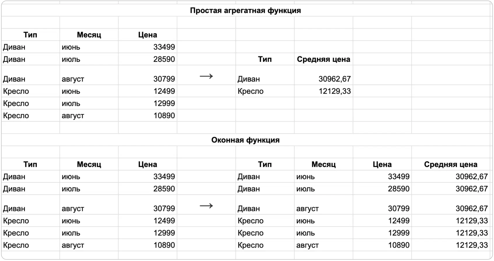
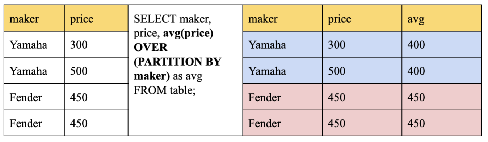
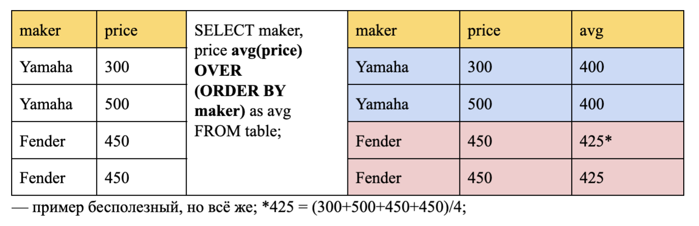
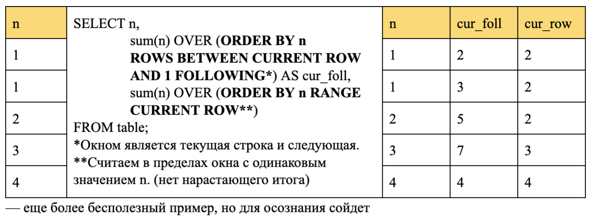
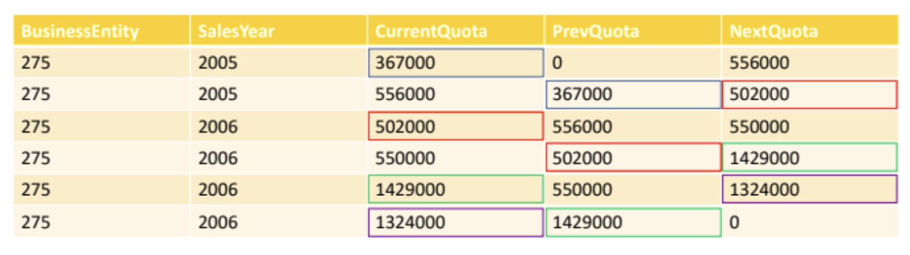
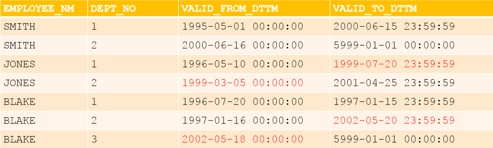
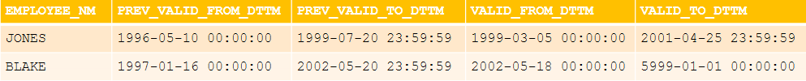

# Тема 5. Оконные функции

### Теоретическая справка
* Принимают в качестве аргумента столбец промежуточного результата вычисления и возвращают тоже столбец.
* Местом их использования могут быть только разделы ORDER BY и SELECT, выполняющие завершающую обработку логического промежуточного результата.
* Действуют подобно агрегатным функциям, но не уменьшают степень детализации.
* Агрегируют данные порциями, количество и размер которых регулируется специальной синтаксической конструкцией.



### Синтаксис

``` sql
function_name(expression) OVER (
    [ <PARTITION BY clause> ]       -- окно
    [ <ORDER BY clause> ]           -- сортировка
    [ <ROWS or RANGE clause> ]      -- границы окна
) AS attr_name
```

Пример использования для ранжирования сотрудников по зарплатам внутри одного отдела:
``` sql
SELECT depname
     , empno
     , salary
     , rank() OVER (PARTITION BY depname ORDER BY salary DESC)
  FROM empsalary;
```
``` sql
depname  | empno | salary | rank
-----------+-------+--------+------
 develop   |     8 |   6000 |    1
 develop   |    10 |   5200 |    2
 develop   |    11 |   5200 |    2
 develop   |     9 |   4500 |    4
 develop   |     7 |   4200 |    5
 personnel |     2 |   3900 |    1
 personnel |     5 |   3500 |    2
 sales     |     1 |   5000 |    1
 sales     |     4 |   4800 |    2
 sales     |     3 |   4800 |    2
(10 rows)
```
Как показано здесь, функция rank выдаёт порядковый номер в разделе текущей строки для каждого уникального значения, по которому выполняет сортировку предложение ORDER BY. У функции rank нет параметров, так как её поведение полностью определяется предложением OVER.

### Использование OVER:

* OVER определяет набор строк, которые будет использовать оконная функция, включая сортировку данных. (“окно”)
* В выражении, которое задает оконную функцию, инструкция OVER ограничивает наборы строк с одинаковыми значениями в поле, по которому идет разделение.
* Сама по себе инструкция OVER() не ограничена и содержит все строки из результирующего набора.
* Инструкция OVER может многократно использоваться в одном SELECT, каждая со своим разделением и сортировкой.

### Правила секционирования:

Внутри `OVER` необходимо указать поле таблицы, по которому будет скользить “окно” и правило, по которому строки будут секционироваться:


1. `PARTITION BY`: — отвечает за критерий секционирования

*  Логически разбивает множество на группы по критериям.
* Аналитические функции применяются к группам независимо.
* Если не указать конструкцию секционирования, все множество считается одной группой.



2. `ORDER BY`: — отвечает за сортировку

* Задает критерий сортировки внутри каждой группы.
* Агрегатные функции в отсутствие конструкции ORDER BY вычисляются по всем строкам группы, и одно и то же значение выдается для каждой строки, т.е. функция используется как итоговая.
* Если агрегатная функция используется с конструкцией ORDER BY, то она вычисляется по текущей строке и всем строкам до неё, т.е. функция используется как оконная. (вычисляется нарастающий итог)



3. `ROWS | RANGE`: — дополнительные ограничения на диапазон строк окна (обязательно присутствие ORDER BY):

* `ROWS (по строкам)` — позволяет вручную определять границы окна, для которого подсчитывается значение; умеет работать с PRECEDING/FOLLOWING.

* `RANGE` (по значениям из `ORDER BY`, формируется суб-окно)— достаточно близко к предыдущему, но все же не то. Но использование ‘RANGE CURRENT ROW’ после `ORDER BY` позволяет избавиться от нарастающего итога; не умеет работать с PRECEDING/FOLLOWING.
* По умолчанию рассматривает от `UNBOUNDED PRECEDING` до `CURRENT ROW`. (`UNBOUNDED PRECEDING/FOLLOWING` — рассматриваем вплоть до конца/начала окна.)
* Строки выбираем в рамках окна, но при необходимости обращения к предыдущим/последующим строкам, можем вручную прописать так, чтобы может выходило за пределы окна.



### Типы оконных функций

* Агрегирующие (sum, avg, min, max, count)

* Ранжирующие (row_number, rank, dense_rank)

* Смещения (lag, lead, first_value, last_value); функции смещения используются с указанием поля.

### Ранжирующие функции:


* `row_number()` – нумеруем каждую строку окна последовательно с шагом 1.

* `rank()` – ранжируем каждую строку окна с разрывом в нумерации при равенстве значений.

* `dense_rank()` – ранжируем каждую строку окна без разрывов в нумерации при равенстве значений.


### Функции смещения:


* `lag(attr, offset (сдвиг), default_value(дефолтное значение в случае, если наша строка окажется первой))` – предыдущее значение со сдвигом.

* `lead(attr, offset, default_value)` – следующее значение со сдвигом.

* `first_value(attr)` – первое значение в окне с первой по текущую строку.

* `last_value(attr)` – последнее значение в окне с первой по текущую строку.

```sql
SELECT BusinessEntity
     , SalesYear
     , CurrentQuota
     , LAG(CurrentQuota, 1, 0) OVER (ORDER BY SalesYear) AS PrevQuota
     , LEAD(CurrentQuota, 1, 0) OVER (ORDER BY SalesYear) AS NextQuota
  FROM SalesPersonQuotaHistory
 WHERE BusinessEntityID = 275;
```



### Фильтрация по результатам вычисления оконной функции
Если вам нужно отфильтровать или сгруппировать строки после вычисления оконных функций, вы можете использовать вложенный запрос. Например: 
``` sql
SELECT depname, empno, salary, enroll_date
FROM
  (SELECT depname, empno, salary, enroll_date,
    rank() OVER (PARTITION BY depname ORDER BY salary DESC, empno) AS pos
   FROM empsalary
  ) AS ss
WHERE pos < 3;
```
Данный запрос покажет только те строки внутреннего запроса, у которых rank (порядковый номер) меньше 3.

### Поиск пересечений в версионности



В таблице присутствуют 2 пересечения:
1. Сотрудник ‘JONES’ работал в двух отделах в период с ‘1999-03-05’ по ‘1999-07-20’
2. Сотрудник ‘BLAKE’ работал в двух отделах в период с ‘2002-05-18’ по ‘2002-05-20’

Использование аналитических функций:
* Разбить данные на группы по ключу таблицы: `EMPLOYEE_NM`
* Отсортировать данные в группах по дате начала действия
интервала: `VALID_FROM_DTTM`
* Проверить, не начинается ли период действия текущей записи
раньше, чем заканчивается предыдущий интервал

```sql
select employee_nm
     , prev_valid_from_dttm
     , prev_valid_to_dttm
     , valid_from_dttm
     , valid_to_dttm
  from (select employee_nm
             , lag(valid_from_dttm)
               over(partition by employee_nm
                        order by valid_from_dttm) as prev_valid_from_dttm
              , lag(valid_to_dttm)
                over(partition by employee_nm
                         order by valid_from_dttm) as prev_valid_to_dttm,
              , valid_from_dttm
              , valid_to_dttm
           from emp_dept) t
 where valid_from_dttm <= prev_valid_to_dttm;
```


Можно решить эту задачу без аналитический функций простым
соединением версионных таблиц. Условия использования такого решения:
* В качестве соединяемых таблиц будет выступать одна и та же таблица
* Наличие возможности отличить любые две строки таблицы
* Нет строк с одинаковым ключом и периодом действия


### Именование оконных функций
Когда в запросе вычисляются несколько оконных функций для одинаково определённых окон, конечно можно написать для каждой из них отдельное предложение OVER, но при этом оно будет дублироваться, что неизбежно будет провоцировать ошибки. Поэтому лучше определение окна выделить в предложение WINDOW, а затем ссылаться на него в OVER. Например:
``` sql
SELECT sum(salary) OVER w
     , avg(salary) OVER w
  FROM empsalary
  WINDOW w AS (PARTITION BY depname ORDER BY salary DESC);
```


### Практическое задание

### 1. Оконные функции

1. Создать таблицу и заполнить ее данными согласно [скрипту](sem_5_inserts.sql).

2. Подсчитайте количество продуктов в каждой группе и выведите это в отдельном столбце для каждого продукта

3. Выведите все товары и среднюю цену товара в каждой из групп в отдельном столбце. Ответ округлите до целого

4. Найдите цену следующего продукта (в порядке сортировки по цене) в группе, чтобы оценить изменения цен в рамках каждой группы продуктов.

5. Выведите для каждого товара разность его цены с предыдущим в одной товарной категории.

6. Найдите самый дешевый продукт в каждой группе и сопоставьте его цену с ценами других продуктов.

7. Определите процент отклонения цены каждого продукта от максимальной цены в своей группе.

8. Выведите номер товара в порядке возрастания цены в каждой группе. (т.е. нумерация отдельная для каждой группы)

9. Повторите предыдущий шаг, но товары с одинаковой ценой должны иметь одинаковый порядковый номер.

10. Для каждого продукта укажите, есть ли в группе продукт с более высокой ценой.

11. Вычислите накопительную сумму цен продуктов в каждой группе.

12. Рассчитайте долю каждого продукта от суммарной цены группы и сравните с долей предыдущего продукта в группе.

13. Рассчитайте скользящее среднее цен для каждого продукта с учетом трех предыдущих и текущей строки в рамках своей группы.


### Полезные ссылки
* [Оконные функции](https://postgrespro.ru/docs/postgresql/14/functions-window)
* [Агрегатные функции](https://postgrespro.ru/docs/postgresql/14/functions-aggregate)
* [Вызовы оконных функций](https://postgrespro.ru/docs/postgresql/14/sql-expressions#SYNTAX-WINDOW-FUNCTIONS)
