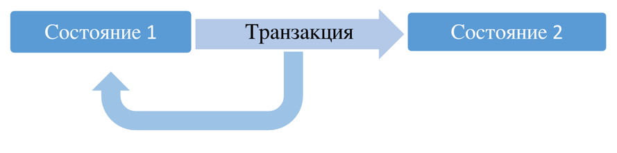

# Семинар 6. Транзации
### Теоретическая справка

**Транзакция** – это объект, группирующий последовательность операций, которые должны быть выполнены как единое целое.
Обеспечивает переход БД из одного целостного состояния в другое.



В качестве примера транзакции рассмотрим последовательность операций по приему заказа в коммерческой компании. Для
приема заказа от клиента приложение ввода заказов должно:

* выполнить запрос к таблице товаров и проверить наличие товара на складе;
* добавить заказ к таблице счетов;
* обновить таблицу товаров, вычтя заказанное количество товаров из количества товара, имеющегося в наличии;
* обновить таблицу продаж, добавив стоимость заказа к объему продаж служащего, принявшего заказ;
* обновить таблицу офисов, добавив стоимость заказа к объему продаж офиса, в котором работает данный служащий.

Транзакции обеспечивают целостность БД в условиях:

* Параллельной обработки данных
* Физических отказов диска
* Аварийного сбоя электропитания
* И других

Транзакции обладают 4 характеристиками, удовлетворяющими парадигме ACID:

1. Atomic – атомарные;
2. Consistent – согласованные;
3. Isolated – изолированные;
4. Durable – долговечные, устойчивые.

#### <ins>A</ins>CID – Атомарность транзакций (Atomicity)

* Транзакция должна представлять собой атомарную (неделимую) единицу работы;
* Должны быть выполнены либо все операции, входящие в транзакцию, либо ни одна из них;
* Следовательно, в случае невозможности выполнить все операции, все внесённые изменения должны быть отменены:
    * Commit – совершение транзакции
    * Rollback – отмена транзакции

#### A<ins>C</ins>ID – Согласованность транзакций (Consistency)

* По завершению транзакции все данные должны остаться в согласованном состоянии
* При выполнении транзакции необходимо выполнить все правила реляционной СУБД:
    * Проверки выполнения ограничений (домены, индексы уникальности, внешние ключи, проверки, правила и т.д.)
    * Обновление индексов;
    * Выполнение триггеров
    * И другие

#### AC<ins>I</ins>D – Изоляция транзакций (Isolation)

* Изменения в данных, выполняемые в пределах транзакции, должны быть изолированы от всех изменений, выполняемых в других
  транзакциях, до тех пор, пока транзакция не совершена;
* Выделяют различные уровни изоляции – для достижения компромисса между степенью распараллеливания работы с БД и
  строгостью выполнения принципа непротиворечивости:
    * Чем выше уровень изоляции, тем выше степень непротиворечивости данных;
    * Чем выше уровень изоляции, тем ниже степень распараллеливания и тем ниже степень доступности данных.

Стандартная классификация проблем с уровнями изоляции:

* P1: dirty read – «грязное» чтение
* P2: non-repeatable read – невоспроизводимое чтение
* P3: phantom read – фантомное чтение

**P1 (dirty read, «грязное» чтение)**

1. Транзакция Т1 вносит изменения в ряд таблицы.
2. Т2 читает этот ряд после внесения изменений Т1, но до совершения Т1.
3. Если Т1 будет отменена, то данные, считанные Т2, будут некорректными.

```sql
-- T1
UPDATE Users
SET AGE = 21
WHERE Id = 1;

ROLLBACK;
```

```sql
-- T2
SELECT Age
FROM Users
WHERE Id = 1;
```

**P2 (non-repeatable read, невоспроизводимое чтение)**

1. Транзакция Т1 читает ряд.
2. Транзакция Т2 после этого вносит изменения в этот ряд или удаляет его.
3. Если Т1 после этого считает этот же ряд снова, то получит новый результат по сравнению с первым считыванием.

```sql
-- T1
SELECT *
FROM Users
WHERE Id = 1;
```

```sql
-- T2
UPDATE Users
SET AGE = 21
WHERE Id = 1;

COMMIT;
```

**P3 (phantom, фантомное чтение)**

1. Транзакция Т1 читает набор рядов N, удовлетворяющих некоторому условию.
2. После этого Т2 выполняет SQL запросы, создающие новые ряды, удовлетворяющие этому условию.
3. Если Т1 повторит запрос с тем же условием, то получит другой набор рядов.

```sql
-- T1
SELECT *
FROM Users
WHERE Age BETWEEN 10 AND 30;
```

```sql
-- T2
INSERT INTO Users (Name, Age)
VALUES (‘Bob’, 27);

COMMIT;
```

#### ACI<ins>D</ins> – Долговечность, устойчивость (прочность) транзакций (Durability)

* Если транзакия была совершена, её результат должен сохраниться в системе, несмотря на сбой системы;
* Если транзакиция не была совершена, её результат может быть полностью отменён вслед за сбоем системы.

#### 1.2. Transaction Control Language

```sql
BEGIN TRANSACTION transaction_mode [, ...]
   ISOLATION LEVEL { SERIALIZABLE | REPEATABLE READ | READ COMMITTED | READ UNCOMMITTED }
   READ WRITE | READ ONLY
   [NOT] DEFERRABLE

BEGIN / START
   COMMIT
   ROLLBACK

SAVEPOINT name
   ROLLBACK TO SAVEPOINT name
   RELEASE SAVEPOINT name
```

**Границы транзакций**

```sql
BEGIN;
INSERT ...;
UPDATE ...;
DELETE ...;
COMMIT;

BEGIN;
INSERT ...;
UPDATE ...;
DELETE ...;
ROLLBACK;
```

#### 1.3. Уровни изолированности транзакций ANSI SQL

В идеальном мире параллельные транзакции изолированны (идеально уживаются друг с другом в базе), но в реальном мире
такое невозможно. Характеристика соответствия базы свойству изолированности называется уровнем изолированности. Выделяют
4 уровня изолированности:


* **READ UNCOMMITTED**: помогает бороться с потерянными обновлениями при изменениях одного и того же блока данных
  несколькими транзакциями.
* **READ COMMITTED**: помогает бороться с чтением "грязных" данных, измененных впоследствии откатившейся транзакцией
* **REPEATABLE READ**: помогает бороться с изменением в данных при повторном чтении одного и того же блока данных в
  рамках одной транзакции
* **SERIALIZABLE**: аналогично **REPEATABLE READ**, но применимо к `INSERT`, а не `UPDATE`

---


# 2. Пример создания простой БД в привязке к другим языкам программирования
### Теоретическая справка 


### Взаимодействие из-под Python

[Python DB API 2.0](https://www.python.org/dev/peps/pep-0249/) - стандарт интерфейсов для пакетов, работающих с БД. "Набор правил", которым подчиняются отдельные модули, реализующие работу с конкретными базами данных.
Для PostgreSQL наиболее популярный адаптер – [psycopg2](http://initd.org/psycopg/).  
[Статья на хабр с примером создания трекера задач](https://habr.com/ru/articles/772488/).

### Курсоры

**Курсор** – специальный объект, выполняющий запрос и получающий его результат.

Вместо того чтобы сразу выполнять весь запрос, есть возможность настроить **курсор**, инкапсулирующий запрос, и затем получать результат запроса по нескольку строк за раз. Одна из причин так делать заключается в том, чтобы избежать переполнения памяти, когда результат содержит большое количество строк.

В PL/pgSQL:
```sql
name [ [ NO ] SCROLL ] CURSOR [ ( arguments ) ] FOR query;
```

```sql
DECLARE
    curs1 refcursor;
    curs2 CURSOR FOR SELECT * FROM tenk1;
    curs3 CURSOR (key integer) FOR SELECT * FROM tenk1 WHERE unique1 = key;
```
# 3. Практическое задание

1. Создать схему topic_6:

```sql
CREATE SCHEMA topic_6;
```

2. Создать таблицу:

```sql
CREATE TABLE topic_6.test_table (
    my_id         SERIAL,
    my_text_field TEXT
);
```

3. Открыть новую транзакцию в явном виде. Запустить операцию вставки

```sql
INSERT INTO topic_6.test_table (my_text_field) VALUES (’test_value1’);
```

Не завершая транзакцию, проверить, что данные в таблицу вставились. Обратить внимание на значение в поле `my_id`.

4. В новой консоли написать запрос на получение всех строк таблицы, созданной в п.2. Объясните, почему так вышло.
   Закоммитьте изменения в консоли 1.

5. В обеих консолях откройте новые транзакции.

* Напишите в первой консоли апдейт к единственной строке таблицы. Проверьте, что первая транзакция видит изменения.
* Во второй консоли запустите операцию апдейта к той же строке. Подумайте, что произошло и почему?
* Сохраните изменения в первой консоли. Что произошло со второй консолью?
* Сохраните изменения во второй консоли.

6. Повторите предыдущее упражнение с использованием уровня repeatable read. Что произошло при попытке закоммитить
   изменения первой открытой транзакцией? Откатите обе транзакции.

7. Для получения дефолтного значения уровня изолированности транзакций в вашем постгрес воспользуйтесь командой:

```sql
SHOW default_transaction_isolation;
```

Объясните разницу в поведении транзакций в задачах 6 и 7, воспользовавшись новым знанием.

8. Повторите задачу 5, используя оператор вставки данных, а не обновления, по аналогии с п.3. Посмотрите на значение в
   поле `my_id` после вставки второй транзакцией.

9. В обеих консолях откройте новые транзакции уровня serializable

* Первой транзакцией считайте данные из таблицы.
* Второй транзакцией осуществите вставку в таблицу новых данных. И сразу же примените изменения.
* Снова считайте данные первой транзакцией. Что произошло?
* Попробуйте добавить в таблицу данные с использованием первой транзакции. Что произошло? Откатите изменения.

10. Откройте новую транзакцию в любой консоли, уровень изолированности не имеет значения.

* Добавьте в таблицу несколько строк.
* Создайте точку останова (savepoint) и посмотрите на значения в таблице.
* Снова добавьте в таблицу несколько строк, создайте точку останова и посмотрите на строки в таблице.
* Добавьте в таблицу еще одну строк и посмотрите на таблицу.
* Откатитесь ко второй точке останова и посмотрите на данные.
* Откатитесь к первой точке останова и посмотрите на данные.
* Откатите всю транзакцию.
