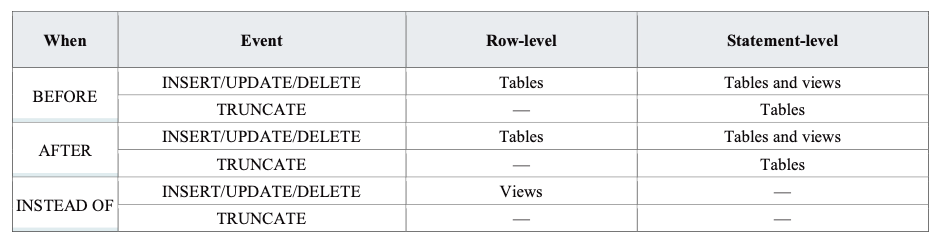

# Семинар 7
## Содержание:

1. [Теоретико-множественные операции](#SET)
2. [VIEW - Представления](#VIEW)
3. [CHECK OPTION](#CHECK_OPTION)
4. [Функции. Процедуры. Триггеры](#TRIGGER)

<a name="SET"></a>

## Теоретико-множественные операции

-  Напоминание + примеры на postgresql

### Операции реляционной алгебры простым языком

В общем случае таблица отношением не является, но для простоты восприятия, помня о всех свойствах отношения, можем полагать, что отношение ~ таблица. К отношениям применимы теоретико-множественные и реляционные операции.

В качестве элементарной единицы отношения используем кортеж (строку), т.е. при пересечении отношений смотрим, какие строки являются общими. Результатом выполнения операций реляционной алгебры является новое отношение. \
Для простоты теоретико-множественные операции будем рассматривать на 2-x отношениях.

 **Примечание.** Теоретико-множественные операции (пересечение, объединение и разность) применимы к совместимым отношениям (множество доменов совпадает или вложено). Кортежи (строки) в новом отношении должны быть уникальны,
т.е. повторения недопустимы. Помним о Union-Compatible ограничении – атрибуты отношений должны совпадать.


##### 1. Теоретико-множественные операции

 * **Объединение**: на вход принимает 2 отношения. Позволяет получить новое отношение, содержащее в себе все кортежи из обоих отношений.


 * **Разность**: на вход принимает 2 отношения. Позволяет получить новое отношение,
содержащее в себе кортежи первого отношения, которые не совпадают с кортежами
второго отношения.


 * **Пересечение**: на вход принимает 2 отношения. Позволяет получить новое отношение,
содержащее в себе кортежи, которые присутствуют как в первом, так и во втором
отношении.


#### Рассмотрим, как эти операции применять на практике с использованием postgresql:

Создадим две таблицы

```postgresql
-- таблица работников
CREATE TABLE employee (
  employee_id INTEGER,
  name TEXT NOT NULL
);

-- insert
INSERT INTO employee
VALUES (0001, 'Clark'),
(0002, 'Dave'),
(0003, 'Ava');

-- таблица покупателей
CREATE TABLE customer (
  customer_id INTEGER,
  name TEXT NOT NULL
);

INSERT INTO customer
VALUES (1, 'Max'),
(2, 'John'),
(3, 'Ava');
```

Результат:

```postgresql
-- работники
SELECT *
FROM employee;
/*
 employee_id | name  
-------------+-------
           1 | Clark
           2 | Dave
           3 | Ava
*/

-- покупатели
SELECT *
FROM customer;
/*
 customer_id | name 
-------------+------
           1 | Max
           2 | John
           3 | Ava
*/
```
- Один из работников одновременно является клиентом:
```postgresql
3 | 'Ava'
```


- A UNION B - объединение
```postgresql
SELECT *
FROM employee
UNION
SELECT *
FROM customer;
/*
 employee_id | name  
-------------+-------
           3 | Ava
           1 | Clark
           2 | John
           2 | Dave
           1 | Max
*/
```

- A INTERSECT B - пересечение
```postgresql

SELECT *
FROM employee
INTERSECT
SELECT *
FROM customer;
/*
 employee_id | name 
-------------+------
           3 | Ava
*/
```

- A EXCEPT B - разность
```postgresql
SELECT *
FROM employee
EXCEPT
SELECT *
FROM customer;
/*
 employee_id | name  
-------------+-------
           2 | Dave
           1 | Clark
*/

```

#### Упражнение: как получить только те строки таблиц, которые присутствуют ровно в одной из таблиц (но не в обеих)?

Реляционные операции - ограничение, проекция, соединение и 

##### 2 Реляционные операции

 * **Ограничение**: на вход принимает 1 отношение + ограничения. Позволяет выделить в отношении только те кортежи, которые удовлетворяют заданному ограничению. Например, выделить среди кортежей отношения "Друзья" те, где друг является "Сыном Маминой Подруги".


```postgresql
-- Аналог ограничения в postgres:
SELECT *
FROM customer
WHERE name != 'Dave';
```

 * **Проекция**: на вход принимает 1 отношение + список атрибутов (столбцов), на которые проецируем. Позволяет "оставить" в кортеже только интересующие нас атрибуты.
**Важно!** После проекции остаются только уникальные кортежи, т.е. результат
проекции – отношение.


```postgresql
-- Аналог проекции в postgres (оставляем только атрибут name):
SELECT name
FROM customer;
```

 * **Соединение**: на вход принимает 2 отношения. Позволяет получить новое отношение,
полученное соединением 2 таблиц по некоторому логическому условию {=, ≠, <, >, ≤, ≥}. _Арность_ (количество столбцов-атрибутов) нового отношения будет равна сумме
арностей соединяемых отношений (для естественного соединения по условию равенства
лишний элемент удаляется, поэтому арность n + m − 1).


 * **Деление**: принимает на вход 2 отношения (таблицы). В результате получается отношение, содержащее _только те_ **атрибуты** 1-го отношения, которых нет во втором, содержащее вышеупомянутые атрибуты _только тех_ **кортежей** 1-го отношения, которые соответствуют комбинации (объединению) всех кортежей 2-го отношения.


<a name="VIEW"></a>

## Представления (Views).

### 1. Tеоретическая справка.

**Представления (Views):** – это виртуальная таблица, содержимое которой (столбцы и строки) определяется запросом.

**Представление** — это виртуальная (логическая) таблица, представляющая собой  поименованный запрос (синоним к запросу), который будет подставлен как подзапрос при использовании представления. Используется, если необходимо часто делать какой-то запрос со сложной логикой.

* Не является самостоятельной частью набора данных
* Вычисляется динамически на основании данных, хранящихся в реальных таблицах
* Изменение данных в таблицах немедленно отражается в содержимом представлений

Представление можно использовать в следующих целях:
* Для направления, упрощения и настройки восприятия информации в базе данных каждым пользователем.
* В качестве механизма безопасности, позволяющего пользователям обращаться к данным через представления, но не дающего
  им разрешений на непосредственный доступ к базовым таблицам.

**Достоинства:**
* *Безопасность:* можно искусственно ограничивать информацию, к которой у пользователя есть доступ.
* *Простота запросов:* при написании запросов обращаемся к вью, как и к обычной таблице.
* *Защита от изменений:* пользователю не обязательно знать, что структуры / имена таблиц поменялись. Достаточно обновить представление.

**Недостатки:**
* *Производительность:* кажущийся простым запрос с использованием вью на деле может оказаться очень сложным из-за логики, “зашитой” во вью.
* *Управляемость:* вью может быть основана на вью, которая в свою очередь тоже основана на другой вью и т.д.
* *Ограничение на обновление:** не любую вью можно обновить, что не всегда очевидно пользователю.

**Синтаксис:**

```sql
CREATE
[ OR REPLACE ] [ TEMP | TEMPORARY ] [ RECURSIVE ] 
  VIEW name [ ( column_name [, ...] ) ]
  [
WITH (view_option_name [= view_option_value] [, ...]) ]
  AS query
  [
WITH [ CASCADED | LOCAL ] CHECK
OPTION ]
```

* `CREATE VIEW` – создание нового представления.
* `CREATE OR REPLACE VIEW` – создание или замена уже существующего представления.
    * В случае замены в новом представлении должны присутствовать все поля старого представления (имена, порядок, тип данных). Допустимо только добавление новых полей.
* `TEMPORARY | TEMP` – временное представление, будет существовать до конца сессии.
* *view_name* – название представления.
* *column_name* – список полей представления. Если не указан, используются поля запроса.
* *query* – `SELECT` или `VALUES` команды.

[Изменения представления](https://www.postgresql.org/docs/current/sql-alterview.html):

```sql
ALTER VIEW [IF EXISTS] name ALTER [COLUMN] column_name SET DEFAULT
expression
ALTER VIEW [IF EXISTS] name ALTER [COLUMN] column_name DROP DEFAULT
ALTER VIEW [IF EXISTS] name OWNER TO new_owner
ALTER VIEW [IF EXISTS] name RENAME TO new_name
ALTER VIEW [IF EXISTS] name SET SCHEMA new_schema
ALTER VIEW [IF EXISTS] name SET ( view_option_name [=
view_option_value] [, ... ] )
ALTER VIEW [IF EXISTS] name RESET ( view_option_name [, ... ] )
DROP VIEW [IF EXISTS] name [, ...] [ CASCADE | RESTRICT ]
```

Примеры:

1. Создание представления

```sql
-- naming:
-- для удобства добавляем суффикс _v
CREATE VIEW greeting_v AS
SELECT 'Hello World';

CREATE VIEW greeting_v AS
SELECT text 'Hello World' AS hello;


CREATE VIEW comedies_v AS
SELECT 
    *
FROM 
    films
WHERE 
    kind = 'Comedy';
```

Если после создания представления добавить столбцы в таблицу, в представлении их не будет.

Создание представления как результата сложного запроса:

```sql
-- teacher - таблица преподавателей
SELECT last_name AS name, id_org
FROM teacher;

-- Ответ:
/*
name              |id_org|
------------------+------+
Халяпов Александр |     2|
Меркурьева Надежда|     1|
Иванов Иван       |     3|
Роздухова Нина    |     1|
Петров Петр       |     3|
*/

SELECT id_org, name_org
FROM organization;
-- Ответ:
/*
id_org|name_org        |
------+----------------+
     3|Сбер            |
     1|АО Тинькофф Банк|
     2|X5 Retail Group |
*/

-- создадим представление, где для каждого преподавателя
-- видно название соответствующей компании
CREATE OR REPLACE VIEW teacher_org_v
SELECT teacher_name AS name, name_org
FROM
    teacher
JOIN
    organization
USING (id_org);

SELECT *
FROM teacher_org_v;
-- Ответ:
/*
name              |name_org        |
------------------+----------------+
Петров Петр       |Сбер            |
Иванов Иван       |Сбер            |
Роздухова Нина    |АО Тинькофф Банк|
Меркурьева Надежда|АО Тинькофф Банк|
Халяпов Александр |X5 Retail Group |
*/


-- Аналогично с GROUP BY
```
---
**TEMP или TEMPORARY**

Представление создаётся как временное. Удаляется при окончании сессии

```sql
CREATE TEMP VIEW greeting AS
SELECT 'Hello World';
```

**MATERISALISED**
```postgresql
CREATE MATERIALIZED VIEW
CREATE MATERIALIZED VIEW — создать материализованное представление
```

Синтаксис
```postgresql
CREATE MATERIALIZED VIEW [ IF NOT EXISTS ] имя_таблицы
    [ (имя_столбца [, ...] ) ]
    [ WITH ( параметр_хранения [= значение] [, ... ] ) ]
    [ TABLESPACE табл_пространство ]
    AS запрос
    [ WITH [ NO ] DATA ]
```
Описание:

CREATE MATERIALIZED VIEW определяет материализованное представление запроса. Заданный запрос выполняется и наполняет представление в момент вызова команды (если только не указано WITH NO DATA). Обновить представление позже можно, выполнив REFRESH MATERIALIZED VIEW.

Команда CREATE MATERIALIZED VIEW подобна CREATE TABLE AS, за исключением того, что она запоминает запрос, порождающий представление, так что это представление можно позже обновить по требованию. Материализованные представления сходны с таблицами во многом, но не во всём; например, не поддерживаются временные материализованные представления и автоматическая генерация OID.

**RECURSIVE**

Представление создаётся как рекурсивное. Эквивалентные формы:

```sql
CREATE RECURSIVE VIEW [ schema.
] view_name (column_names
) AS
SELECT ...;
```

```sql
CREATE VIEW [ schema.
] view_name AS
WITH RECURSIVE view_name (column_names) AS (SELECT ...)
SELECT column_names
FROM view_name;
```

Рекурсивное представление – пример:

```sql
CREATE RECURSIVE VIEW public.nums_1_100 (n) AS
VALUES (1)
UNION ALL
SELECT
    n + 1
FROM 
    nums_1_100
WHERE 
    n < 100;
```

**Типы представлений:**
1. *горизонтальное* — ограничение данных по строкам:
```sql
CREATE VIEW V_IT_EMPLOYEE AS
SELECT 
    *
FROM 
    EMPLOYEE
WHERE 
    DEPARTMENT_NM = ‘IT’;
```

2. *вертикальное* — ограничение данных по столбцам:
```sql
CREATE VIEW V_EMP AS
SELECT 
    EMP_NM, 
    DEPARTMENT_NM
FROM 
    EMPLOYEE;
```

**Обновляемые представления**

Представление называется *обновляемым*, если к нему применимы операции `UPDATE` и `DELETE` для изменения данных в таблицах, на которых построено это представление.

**Требования:**

* Ровно 1 источник в предложении `FROM`, являющийся таблицей или обновляемым представлением
* Запрос не должен содержать `WITH`, `DISTINCT`, `GROUP BY`, `HAVING`, `LIMIT` или `OFFSET`
* Запрос не должен содержать операторов `UNION`, `INTERSECT` или `EXCEPT`
* select-list запроса не должен содержать агрегатных, оконных, а также функций, возвращающих множества.

```postgresql
WITH [ CASCADED | LOCAL ] CHECK
OPTION
```

Задаёт поведение обновляемым представлениям: проверки, не позволяющие записывать данные, невидимые через представление

* `LOCAL` – проверки выполняются только на самом представлении
* `CASCADED` – проверки выполняются и на самом представлении, и на источнике, и так далее по цепочке обращений

Обновляемые представления – пример 1:

```postgresql
CREATE VIEW universal_comedies AS
SELECT 
    *
FROM 
    comedies
WHERE 
    classification = 'U'
WITH LOCAL CHECK OPTION;
```

Попытка вставить или отредактировать ряд с classification <> 'U' приведёт к ошибке. \
Но при этом вставка или редактирование ряда с kind <> 'Comedy' будет успешной.

Обновляемые представления – пример 2:

```postgresql
CREATE VIEW universal_comedies AS
SELECT 
    *
FROM 
    comedies
WHERE 
    classification = 'U'
WITH CASCADED CHECK OPTION;
```

Попытка вставить или отредактировать ряд с classification <> 'U' или kind <> 'Comedy' приведёт к ошибке.

Столбцы в обновляемом представлении могут быть как обновляемые, так и не обновляемые.

Обновляемые представления – пример 3:

```postgresql
CREATE VIEW comedies AS
SELECT 
    f.*,
    country_code_to_name(f.country_code) AS country,
    (SELECT avg(r.rating) FROM user_ratings r WHERE r.film_id = f.id) AS avg_rating
FROM 
    films f
WHERE 
    f.kind = 'Comedy';
```

Все столбцы таблицы `films` – обновляемые. Столбцы `country` и `avg_rating` – `readonly`.

Если представление не удаётся сделать обновляемым, но в этом есть потребность – используйте `INSTEAD OF` триггер.

Это такая функция, которая будет обрабатывать операции модификации данных – рассмотрим позже.

> Примечание!
>
> Активное использование представлений — это ключевой аспект хорошего проектирования баз данных SQL. Представления позволяют вам скрыть внутреннее устройство ваших таблиц, которые могут меняться по мере развития приложения, за надёжными интерфейсами.
>
> Представления можно использовать практически везде, где можно использовать обычные таблицы. И довольно часто представления создаются на базе других представлений.

## 2. Практическое задание (Views)

Даны две таблицы, с организациями и преподавателями, которые ведут лекции и семинары в МФТИ. Требуется создать эти
таблицы и различные view, связанные с ними.

```sql
CREATE SCHEMA sem_7;

DROP TABLE IF EXISTS sem_7.organization;
CREATE TABLE sem_7.organization AS
SELECT
    1 AS id_org,
    'АО Тинькофф Банк' AS name_org
UNION
SELECT
    2,
    'X5 Retail Group'
UNION
SELECT
    3,
    'Сбер';

CREATE TABLE sem_7.teacher (id_teach, last_name, first_name, birth_date, salary_amt, id_org) AS
SELECT
    1, 'Роздухова', 'Нина', '1992-04-15', 15000.00, 1
UNION
SELECT
    2, 'Меркурьева', 'Надежда', '1995-03-12', 25000.00, 1
UNION
SELECT
    3, 'Халяпов', 'Александр', '1994-09-30', 17000.00, 2
UNION
SELECT
    4, 'Иванов', 'Иван', NULL, 100000.00, 3
UNION
SELECT
    5, 'Петров', 'Петр', NULL, 3000.00, 3;

```

Задание:

1. Создать view – полную копию таблицы teacher;
2. Создать view – копию таблицы teacher, за исключением строк, у которых нет связи с организацией;
3. Создать view с полным списком преподавателей. Вместо id организации выводить ее название. Не включать в представление
   зарплату преподавателя;
4. Создать view с полным списком преподавателей аналогично пункту (3). Фамилию и имя преподавателя объединить в одно
   поле. Поля назвать соответственно русским названиям – «Фамилия Имя», «Дата рождения», «Название организации»;
5. Написать вставку записи (на своё усмотрение) во view из пункта (1). Проверить, что новая запись появилась в исходной
   таблице;
6. Написать удаление записи, вставленной в пункте (5), через view из пункта (1). Проверить, что запись удалилась из
   исходной таблицы;
7. Обновить дату рождения и у преподавателя id_teach = 4 (на любую) через view из пункта (1);
8. Обновить id_org у преподавателя с id_teach = 4 на NULL через view из пункта (2). Проверить, что преподаватель пропал
   view из пункта (2);
9. Пересоздать view и пункта (2) с условием [with local check option]. Попробовать проделать те же манипуляции, что в
   пункте (8) на преподавателе id_teach = 5.

---

### Полезные ссылки

 * [Возврат данных из изменённых строк](https://postgrespro.ru/docs/postgresql/14/dml-returning)
 * [Представления](https://postgrespro.ru/docs/postgresql/14/sql-createview)


<a name="CHECK_OPTION"></a>

## PostgreSQL и CHECK OPTION

[оригинал на английском](https://www.postgresqltutorial.com/postgresql-views/postgresql-views-with-check-option/)

Краткое описание: в этом руководстве вы узнаете, как создать обновляемое представление, используя WITH CHECK OPTION.
CHECK OPTION позволяет гарантировать, что изменения в базовых таблицах с помощью представления удовлетворяют условию, определяющему представление.
(Т.е. изменятся только строки, которые могли находиться в представлении).

Напоминание:
Представление (View) - это сохранённый именованый запроc. Простой View может быть обновляемым (т.е. через такой View можно обновлять исходные таблицы).

Используйте WITH CHECK OPTION, чтобы убедиться, что любое изменение данных через View, соответствует условиям из определения View (запроса, порождающего представление).

Как правило, вы указываете параметр WITH CHECK при создании представления с помощью инструкции CREATE VIEW:
```postgresql
CREATE VIEW view_name AS query
WITH CHECK OPTION;
```


### Область проверки (Scope of check)
В PostgreSQL вы можете указать область проверки условий:

```postgresql
LOCAL
```
```postgresql
CASCADED
```

LOCAL ограничивает применение опции проверки только текущим представлением. Она не применяет проверку к представлениям, на которых основано текущее представление.

CASCADED проверяет все представления, на которых основано текущее.

Синтаксис создания представления WITH LOCAL CHECK OPTION:

```postgresql
CREATE VIEW view_name AS
query
WITH LOCAL CHECK OPTION;
```

```postgresql
CREATE VIEW view_name AS
query
WITH CASCADED CHECK OPTION;
```

Используйте ALTER VIEW, чтобы изменить область проверки в существующем представлении.

```postgresql
ALTER VIEW employee_view
SET (check_option = CASCADED);
```

### Примеры

Создадим таблицу сотрудников.
```postgresql
CREATE TABLE employees (
    id SERIAL PRIMARY KEY,
    first_name VARCHAR(50) NOT NULL,
    last_name VARCHAR(50) NOT NULL,
    department_id INT,
    employee_type VARCHAR(20) 
       CHECK (employee_type IN ('FTE', 'Contractor'))
);


INSERT INTO employees (first_name, last_name, department_id, employee_type)
VALUES
    ('John', 'Doe', 1, 'FTE'),
    ('Jane', 'Smith', 2, 'FTE'),
    ('Bob', 'Johnson', 1, 'Contractor'),
    ('Alice', 'Williams', 3, 'FTE'),
    ('Charlie', 'Brown', 2, 'Contractor'),
    ('Eva', 'Jones', 1, 'FTE'),
    ('Frank', 'Miller', 3, 'FTE'),
    ('Grace', 'Davis', 2, 'Contractor'),
    ('Henry', 'Clark', 1, 'FTE'),
    ('Ivy', 'Moore', 3, 'Contractor');
```

Создадим представление, хранящее только сотрудников с type = 'FTE'.
```postgresql
CREATE OR REPLACE VIEW fte_v AS 
SELECT 
  id, 
  first_name, 
  last_name, 
  department_id,
  employee_type
FROM 
  employees 
WHERE 
  employee_type = 'FTE';

SELECT * FROM fte_v;
Output:

 id | first_name | last_name | department_id
----+------------+-----------+---------------
  1 | John       | Doe       |             1
  2 | Jane       | Smith     |             2
  4 | Alice      | Williams  |             3
  6 | Eva        | Jones     |             1
  7 | Frank      | Miller    |             3
  9 | Henry      | Clark     |             1
(6 rows)
```

Теперь добавим нового сотрудника:
```postgresql
INSERT INTO fte_v(first_name, last_name, department_id, employee_type) 
VALUES ('John', 'Smith', 1, 'Contractor');
```
Код успешно выполнен.

Проблема - добавили сотрудника типа 'Contractor' через представление, отвечающее за 'FTE'.

Чтобы быть уверенным, что через VIEW fte_v возможно добавить только 'FTE' сотрудников - используем  WITH CHECK OPTION:

Fourth, replace the fte_v view and add the WITH CHECK OPTION:

```postgresql
CREATE OR REPLACE VIEW fte_v AS 
SELECT 
  id, 
  first_name, 
  last_name, 
  department_id,
  employee_type
FROM 
  employees 
WHERE 
  employee_type = 'FTE'
WITH CHECK OPTION;
```

После указания WITH CHECK OPTION:
INSERT, UPDATE, DELETE будут выполнятся в таблице employee только на строчках, удовлетворяющих условию WHERE из запроса-определения представления.

Например, исполнение следующей инструкции INSERT выдаст ошибку:
```postgresql
INSERT INTO fte_v(first_name, last_name, department_id, employee_type) 
VALUES ('John', 'Snow', 1, 'Contractor');
```
Ошибка:
```javascript
ERROR:  new row violates check option for view "fte"
DETAIL:  Failing row contains (12, John, Snow, 1, Contractor).
```

Причина ошибки в том, что тип сотрудник employee_type = 'Contractor' не удовлетворяет условию из запроса-определения представления:

```postgresql
employee_type = 'FTE';
```

Но при попытке изменить запись с сотрудником типа FTE изменение будет благополучно совершено.
Fifth, change the last name of the employee id 2 to 'Doe':

```postgresql
UPDATE fte_v
SET last_name = 'Doe'
WHERE id = 2;
```

Работает как ожидалось.

### Пример использования WITH LOCAL CHECK OPTION
Создадим fte_v view без использования WITH CHECK OPTION:

```postgresql
CREATE OR REPLACE VIEW fte_v AS 
SELECT 
  id, 
  first_name, 
  last_name, 
  department_id,
  employee_type
FROM 
  employees 
WHERE 
  employee_type = 'FTE';
```

Теперь создадим представление fte_v_1, основанное на fte и оставляющее только сотрудников из отдела 1 (department = 1), с WITH LOCAL CHECK OPTION:

```postgresql
CREATE OR REPLACE VIEW fte_1 
AS 
SELECT 
  id, 
  first_name, 
  last_name, 
  department_id, 
  employee_type 
FROM 
  fte 
WHERE 
  department_id = 1 
WITH LOCAL CHECK OPTION;
```
```postgresql
SELECT * FROM fte_1;
Code language: SQL (Structured Query Language) (sql)
Output:

 id | first_name | last_name | department_id | employee_type
----+------------+-----------+---------------+---------------
  1 | John       | Doe       |             1 | FTE
  6 | Eva        | Jones     |             1 | FTE
  9 | Henry      | Clark     |             1 | FTE
(3 rows)
```
Так как используется WITH LOCAL CHECK OPTION, PostgreSQL проверит только fte_v_1 при изменении данных через это представление (fte_v_1).

Fourth, insert a new row into the employees table via the fte_1 view:
Добавим строку с новым сотрудником через представление fte_1_v:

```postgresql
INSERT INTO fte_1(first_name, last_name, department_id, employee_type)
VALUES ('Miller', 'Jackson', 1, 'Contractor');
```

Успешно выполнено.
Причина в том, что INSERT добавляет новые значения с department = 1, что удовлетворяет условию в представлении fte_1_v:

```postgresql
department_id = 1
```
Запросим информацию из таблицы employees:

```postgresql
SELECT 
  * 
FROM 
  employees 
WHERE 
  first_name = 'Miller' 
  and last_name = 'Jackson';

Output:

 id | first_name | last_name | department_id | employee_type
----+------------+-----------+---------------+---------------
 12 | Miller     | Jackson   |             1 | Contractor
(1 row)
```

### Использование WITH CASCADED CHECK OPTION example
Пересоздадим представление fte_1_v с WITH CASCADED CHECK OPTION:

```postgresql
CREATE OR REPLACE VIEW fte_1_v
AS 
SELECT 
  id, 
  first_name, 
  last_name, 
  department_id, 
  employee_type 
FROM 
  fte 
WHERE 
  department_id = 1 
WITH CASCADED CHECK OPTION;
```

Теперь добавим новую запись в таблицу employee через представление fte_1_v:

```postgresql
INSERT INTO fte_1(first_name, last_name, department_id, employee_type) 
VALUES ('Peter', 'Taylor', 1, 'Contractor');
```

Ошибка:
```postgresql
ERROR:  new row violates check option for view "fte"
DETAIL:  Failing row contains (24, Peter, Taylor, 1, Contractor).
```

WITH CASCADED CHECK OPTION указывает PostgreSQL проверять ограничения на fte_1_v а также для его базового представления fte_v.

Вот почему инструкция INSERT нарушает условие fte_1_v и fte_v.

### Резюмируя:
Используйте WITH CHECK OPTION чтобы наложить ограничения на изменения данных через представления и убедиться, что только соответствующая информация может быть изменена.


<a name="TRIGGER"></a>

## Функции. Процедуры. Триггеры.

### 1. Теоретическая справка

**Хранимый код** – объект базы данных, представляющий собой набор SQL-инструкций (и не только их), который компилируется один раз и
хранится на сервере.

**Зачем нужен хранимый код?**

* скрывают алгоритмы обработки данных;
* расширяют возможности программирования, позволяя реализовывать сложную логику;
* поддерживают функции безопасности и целостности данных, обработку исключений.


PostgreSQL позволяет разрабатывать собственный хранимый код и на языках, отличных от SQL 
([на C также](https://www.postgresql.org/docs/current/xfunc-c.html), но в рамках курса не рассматриваем). 
Эти другие языки в целом обычно называются процедурными языками (PL, Procedural Languages). 
Процедурные языки не встроены в сервер PostgreSQL; они предлагаются загружаемыми модулями:
 * [PL/pgSQL](https://www.postgresql.org/docs/current/plpgsql.html)
 * [PL/Tcl](https://www.postgresql.org/docs/current/pltcl.html)
 * [PL/Perl](https://www.postgresql.org/docs/current/plperl.html)
 * [PL/Python](https://www.postgresql.org/docs/current/plpython.html)

**PL/pgSQL** — язык программирования, используемый для написания хранимого кода для PostgreSQL. С помощью данного
расширения PostgreSQL можно писать выполняемые блоки, функции и особый объект баз данных – триггеры.  

Помимо PL/pgSQL мы также попишем на PL/Python.

### 1.1. Функции.

PostgreSQL предоставляет большое количество функций для встроенных типов данных. 
Например, функция повторения строки:
```postgresql
repeat ( text, integer ) → text
```
(правая стрелочка обозначает результат выполнения функции)
```postgresql
repeat('Pg', 4) → 'PgPgPgPg'
```

Собственные функции определяются на сервере командами `CREATE FUNCTION`. Такая команда обычно выглядит,
например, так:

```postgresql
CREATE FUNCTION somefunc(integer, text) RETURNS integer
AS 'тело функции'
LANGUAGE [SQL|plpgsql|plpython|...];
```

> **Примечание!**
>
> Если рассматривать `CREATE FUNCTION`, тело функции представляет собой просто текстовую строку.
Часто для написания тела функции удобнее заключать эту строку в доллары, а не в обычные апострофы.
Если не применять заключение в доллары, все апострофы или обратные косые черты в теле функции придётся экранировать, дублируя их.

**Строковые константы** в долларах можно вкладывать друг в друга, выбирая на разных уровнях вложенности разные теги. Чаще
всего это используется при написании определений функций. Например:

```postgresql
$function$
BEGIN
    RETURN ($1 ~ $q$[\t\r\n\v\\]$q$);
END;
$function$
```

### 1.1.1. Функции на SQL.

Простейший вариант функций на языке запросов (функции, написанные на SQL). 
Достаточно взглянуть на несколько примеров, чтобы понять что к чему:

```postgresql
-- Пример №1
CREATE FUNCTION add(integer, integer) 
RETURNS integer
AS 'SELECT $1 + $2;'
LANGUAGE SQL;

---- Запрос
SELECT add(1, 3);

--- Ответ
| add |
-------
|  4  |
```

```postgresql
-- Пример №2
CREATE FUNCTION dup(in int, out f1 int, out f2 text)
AS $$
    SELECT $1, CAST($1 AS text) || ' is text'
$$ LANGUAGE SQL;

---- Запрос
SELECT * FROM dup(42);

--- Ответ
| f1   | f2         |
---------------------
|   42 | 42 is text |
```

```postgresql
---- Запрос к таблице

-- Создаём таблицу
CREATE TABLE test_t(a int, b int);

-- Добавляем значения
INSERT INTO test_t(a, b)
VALUES
(3, 10),
(5, 20);

-- Проверяем что значения добавились
SELECT * FROM test_t;

--- Ответ
a|b |
-+--+
3|10|
5|20|
7| 6|

-- Запрос с использованием функции
SELECT add(a, b)
FROM test_t;

--- Ответ
add|
---+
 13|
 25|
 13|
```

#### Возможности:

- DEFAULT значения аргументов
```postgresql
CREATE FUNCTION foo(a int, b int DEFAULT 2, c int DEFAULT 3)
RETURNS int
AS $$
    SELECT a + b + c;
$$ LANGUAGE SQL;

SELECT foo(10, 20, 30);
--- Ответ
foo|
---+
 60|

SELECT foo(10, 20);
--- Ответ
foo|
---+
 33|

SELECT foo(10);
--- Ответ
foo|
---+
 15|
```

- DEFAULT expression
```postgresql
CREATE FUNCTION foo(a int, b int DEFAULT = a * 2)
RETURNS int
AS $$
    SELECT a + b
$$ LANGUAGE SQL;
```

- Функции могут модифицировать таблицы
```postgresql
CREATE FUNCTION tf1(account_no int, debit int)
RETURNS numeric AS $$
    UPDATE bank
    SET balance = balance - debit
    WHERE account_no = tf1.account_no

    SELECT balance
    FROM bank
    WHERE account_no = tf1.account_no
$$ LANGUAGE SQL;
```

### Возврат нескольких значений

Функция, возвращающая запись с несколькими выходными параметрами:
```postgresql
CREATE FUNCTION dup(in int, out f1 int, out f2 text)
    AS $$ SELECT $1, CAST($1 AS text) || ' is text' $$
    LANGUAGE SQL;
SELECT * FROM dup(42);
```

То же самое можно сделать более развёрнуто, явно объявив составной тип:

```postgresql
CREATE TYPE dup_result AS (f1 int, f2 text);

CREATE FUNCTION dup(int) RETURNS dup_result
    AS $$ SELECT $1, CAST($1 AS text) || ' is text' $$
    LANGUAGE SQL;

SELECT * FROM dup(42);
```

Ещё один способ вернуть несколько столбцов — применить функцию TABLE:

```postgresql
CREATE FUNCTION dup(int) RETURNS TABLE(f1 int, f2 text)
    AS $$ SELECT $1, CAST($1 AS text) || ' is text' $$
    LANGUAGE SQL;

SELECT * FROM dup(42);
```
Однако пример с TABLE отличается от предыдущих, так как в нём функция на самом деле возвращает не одну, а набор записей.
  


### Модификаторы:
```postgresql
-- реакция на NULL в аргументах
CALLED ON NULL INPUT - может вызываться на NULL аргументах
RETURNS NULL ON NULL INPUT
STRICT

-- волатильность (более развёрнуто позже):
IMMUTABLE - возвращает одно значение на одинаковых аргументах
STABLE - возвращает одно значение на одинаковых аргументах, но только в пределах одного запроса
VOLATILE - никаких гарантий на повторяемость результата

-- безопасность (устойчивость к утечке данных):
LEAKPROOF - не даёт доступа к данным, кроме как в результате выполнения (в том числе сообщения об ошибках не содержат данных из аргументов)

и т.д. - читайте документацию
```

## 1.1.2. Функции на PL/pgSQL.

Подробнее здесь:
[postgresql - PL/pgSQL structure](https://postgrespro.ru/docs/postgresql/9.6/plpgsql-structure)

### Блоки программы

**PL/pgSQL** это блочно-структурированный язык. Текст тела функции должен быть блоком. Структура блока:

```postgresql
[ <<метка>> ]
[ DECLARE
    объявления ]
BEGIN
    операторы
END [ метка ];
```

Пример:
```postgresql
CREATE FUNCTION add_one (integer) RETURNS INTEGER AS $$
    BEGIN
        RETURN $1 + 1;
    END;
$$ LANGUAGE 'plpgsql';
```

```postgresql
-- с объявлением:
CREATE FUNCTION add_one (integer) RETURNS INTEGER AS $$
    DECLARE
        delta integer = 1;
    BEGIN
        RETURN $1 + delta;
    END;
$$ LANGUAGE 'plpgsql';
```

```postgresql
-- блок с меткой:
CREATE FUNCTION add_one (integer) RETURNS INTEGER AS $$
    <<block1>> -- имя блока
    DECLARE
        delta integer = 1;
    BEGIN
        RETURN $1 + delta;
    END;
$$ LANGUAGE 'plpgsql';
```

Каждое объявление и каждый оператор в блоке должны завершаться символом «;» (точка с запятой).

<details> <summary>Примечания</summary>
Блок, вложенный в другой блок, должен иметь точку с запятой после END, как показано выше. Однако финальный `END`, завершающий тело функции, не
требует точки с запятой.

> Примечание!
>
>Распространённой ошибкой является добавление точки с запятой сразу после `BEGIN`.
Это неправильно и приведёт к синтаксической ошибке.

Метка требуется только тогда, когда нужно идентифицировать блок в операторе `EXIT`, или дополнить имена переменных,
объявленных в этом блоке. Если метка указана после `END`, то она должна совпадать с меткой в начале блока.

Ключевые слова не чувствительны к регистру символов. Как и в обычных SQL-командах, идентификаторы неявно преобразуются к
нижнему регистру, если они не взяты в двойные кавычки.
</details>

### Комментарии

Комментарии в **PL/pgSQL** коде работают так же, как и в обычном SQL. Двойное тире `--` начинает комментарий, который
завершается в конце строки. Блочный комментарий начинается с `/*` и завершается `*/`. Блочные комментарии могут быть
вложенными.

Пример:

```postgresql
CREATE FUNCTION add_ten (integer) RETURNS INTEGER AS $$
    -- Комментарий 1

    /*
     Комментарий 2
     Комментарий 2
     Комментарий 2
    */

    /*
     Комментарий 3
     Комментарий 3
        /*
         Вложенный комментарий 3
         (да, в plpgsql так можно)
        */
    */
    BEGIN
        -- возвращаем результат
        RETURN $1 + 10;
    END;
$$ LANGUAGE 'plpgsql';
```

### Вложение блоков кода

Блоки кода можно вкладывать друг в друга.

Пример:
```postgresql
CREATE FUNCTION add_delta (integer) RETURNS INTEGER AS $$
    DECLARE delta integer = 10;
    BEGIN
        -- вложенный блок 
        BEGIN
            delta = 100;
        END;

        RETURN $1 + delta;
    END;
$$ LANGUAGE 'plpgsql';

SELECT add_delta(5);
-- Ответ
add_delta|
---------+
      105|
```


Любой оператор в выполняемой секции блока может быть вложенным блоком. Вложенные блоки используются для логической
группировки нескольких операторов или локализации области действия переменных для группы операторов.

Во время выполнения
вложенного блока переменные, объявленные в нём, скрывают переменные внешних блоков с такими же именами. Чтобы получить
доступ к внешним переменным, нужно дополнить их имена меткой блока.

Например:

```postgresql
CREATE FUNCTION somefunc() RETURNS integer AS $$
<< outerblock >>
DECLARE
    quantity integer = 30;
BEGIN
    -- Выводится 30
    RAISE NOTICE 'Сейчас quantity = %', quantity;

    -- Вложенный блок
    DECLARE
        quantity integer = 80;
    BEGIN
        -- Выводится 80
        RAISE NOTICE 'Сейчас quantity = %', quantity;

        -- Выводится 50
        RAISE NOTICE 'Во внешнем блоке quantity = %', outerblock.quantity;
    END;

    RAISE NOTICE 'Сейчас quantity = %', quantity;  -- Выводится 50

    RETURN quantity;
END;
$$ LANGUAGE plpgsql;
```
## ОСНОВЫ PL/pgSQL
#### 1. Оператор присваивания:
```postgresql
var := 10

-- или

var = 10
```
#### 2. В блоке DECLARE можно переименовывать переменные:
```postgresql
new_name ALIAS FOR $1;
```
#### 3. Динамическое выполнение запросов:
```postgresql
EXECUTE sql_query [INTO target] [USING expression]
Пример:
EXECUTE 'SELECT count(*) FROM mytable WHERE inserted_by = $1 AND inserted <= $2'
INTO c
USING checked_user, checked_date;
```
 Параметры $1 и $2 в этом случае – это не входные данные функции, а параметры, заданные в блоке USING
 C (который идет после INTO) – таргет, в который будет записан результат выполнения запроса

#### 4. Для имен таблиц и колонок можно (и даже правильнее) использовать функцию format():
```postgresql
EXECUTE format('SELECT count(*) FROM %I '
'WHERE inserted_by = $1 AND inserted <= $2', tabname)
INTO c
USING checked_user, checked_date;
```
Для таких запросов необходимо помнить о NULL значениях и их обработке!
%I == quote_ident – оборачивание в кавычки, при условии их необходимости
%L == quote_nullable – корректная обработка NULL значений

#### 5. Ветвление логики:
```postgresql
IF … THEN … [ELSEIF … THEN … ELSE …] END IF;
CASE выражения, по аналогии с обычным SQL
```
#### 6. Использование циклов:
```postgresql
LOOP
    statements;
END LOOP;
LOOP
    statements;
    EXIT WHEN n > 100; -- прерываем цикл, если выполнено условие
    CONTINUE WHEN n > 50; -- запускаем новую итерацию цикла, если выполнено условие
    more statements;
END LOOP;
```
#### 6.1. Циклы WHILE:
```postgresql
WHILE boolean-expression
    LOOP
        statements;
    END LOOP;
```
#### 6.2. Циклы FOR по целым числам:
```postgresql
-- цикл с заданными начальным и конечным значениями, шагом step в заданном порядке
FOR i IN [REVERSE] start_value .. end_value [BY step]
    LOOP
        statements;
    END LOOP;
```
#### 6.2. Цикл FOR по результатам запроса:
```postgresql
FOR record_type_value IN query
    LOOP
        statements;
    END LOOP;
```
Для обращения к конкретному значению строки использовать «.»:
```
record_type_value.field_nm
```

#### 6.3. Цикл FOR по массиву:
```postgresql
FOREACH i IN ARRAY array_name
    LOOP
        statements;
    END LOOP;
```


И это все?
Конечно, нет
https://www.postgresql.org/docs/13/plpgsql.html
Не забываем про версию вашего postgres
select version();

> Примечание
>
> Существует скрытый «внешний блок», окружающий тело каждой функции на **PL/pgSQL**. Этот блок содержит объявления
параметров функции (если они есть), а также некоторые специальные переменные, такие как `FOUND`.
Этот блок имеет метку, совпадающую с именем функции, таким образом, параметры и специальные переменные могут быть
дополнены именем функции.

<details> <summary>Примечание про транзакции</summary>
Важно не путать использование `BEGIN/END` для группировки операторов в **PL/pgSQL** с одноимёнными SQL-командами для
управления транзакциями. `BEGIN/END` в **PL/pgSQL** служат только для группировки предложений; они не начинают и не
заканчивают транзакции. Про управление транзакциями в **PL/pgSQL** можно почитать в документации[^4]. Кроме того, блок с
предложением `EXCEPTION` по сути создаёт вложенную транзакцию, которую можно отменить, не затрагивая внешнюю транзакцию.
Подробнее обработка ошибок описана в документации.
</details>

### 1.1.3. Функции на PL/Python.

Есть возможность реализовывать функции и на других языках.

Например, на PL/Python.

<details> <summary>Как устроены функции на PL/Python</summary>

Прежде чем что-то использовать, это надо установить.
если вы используете контейнер c `postgres` поверх `apline` скачайте пакеты:
```bash
apk add --no-cache --virtual .plpython3-deps --repository http://nl.alpinelinux.org/alpine/edge/testing \
    postgresql-plpython3 \
    && ln -s /usr/lib/postgresql/plpython3.so /usr/local/lib/postgresql/plpython3.so \
    && ln -s /usr/share/postgresql/extension/plpython3u.control /usr/local/share/postgresql/extension/plpython3u.control \
    && ln -s /usr/share/postgresql/extension/plpython3u--1.0.sql /usr/local/share/postgresql/extension/plpython3u--1.0.sql \
    && ln -s /usr/share/postgresql/extension/plpython3u--unpackaged--1.0.sql /usr/local/share/postgresql/extension/plpython3u--unpackaged--1.0.sql
```

После необходимо установить `PL/Python` в определённую базу данных, выполните команду:
```postgresql
CREATE EXTENSION plpython3u; -- будем использовать Python3
```

Функции на `PL/Python` объявляются стандартным образом с помощью команды `CREATE FUNCTION`:
```postgresql
CREATE FUNCTION funcname (argument-list)
  RETURNS return-type
AS $$
  # Тело функции на PL/Python
$$ LANGUAGE plpython3u;
```

Тело функции содержит просто скрипт на языке Python. Когда вызывается функция, её аргументы передаются в виде элементов списка args; именованные аргументы также передаются скрипту Python как обычные переменные. С применением именованных аргументов скрипт обычно лучше читается. Результат из кода Python возвращается обычным способом, командой `return` или `yield` (в случае функции, возвращающей множество). Если возвращаемое значение не определено, Python возвращает `None`. Исполнитель PL/Python преобразует `None` языка Python в значение `NULL` языка SQL.

Например, функцию, возвращающее большее из двух целых чисел, можно определить так:
```postgresql
CREATE FUNCTION pymax (a integer, b integer)
  RETURNS integer
AS $$
  if a > b:
    return a
  return b
$$ LANGUAGE plpython3u;
```

Значения аргументов задаются в глобальных переменных. Согласно правилам видимости в Python, тонким следствием этого является то, что переменной аргумента нельзя присвоить внутри функции выражение, включающее имя самой этой переменной, если только эта переменная не объявлена глобальной в текущем блоке. Например, следующий код не будет работать:
```postgresql
CREATE FUNCTION pystrip(x text)
  RETURNS text
AS $$
  x = x.strip()  # ошибка
  return x
$$ LANGUAGE plpython3u;
```

так как присвоение x значения делает x локальной переменной для всего блока, и при этом x в правой части присваивания оказывается ещё не определённой локальной переменной x, а не параметром функции PL/Python. Добавив оператор `global`, это можно исправить:
```postgresql
CREATE FUNCTION pystrip(x text)
  RETURNS text
AS $$
  global x
  x = x.strip()  # теперь всё в порядке
  return x
$$ LANGUAGE plpython3u;
```

Полезные ссылки по PL/Python:
 * [Про типы и их взаимную конвертацию](https://postgrespro.ru/docs/postgresql/9.6/plpython-data)
 * [Анонимные блоки кода](https://postgrespro.ru/docs/postgresql/9.6/plpython-do)
 * [Обращение к данным базы данных](https://postgrespro.ru/docs/postgresql/9.6/plpython-database)
 * [Вспомогательные функции](https://postgrespro.ru/docs/postgresql/9.6/plpython-util)

</details>

### 1.2. Function Volatility Categories

```
-- волатильность коротко:
IMMUTABLE - возвращает одно значение на одинаковых аргументах
STABLE - возвращает одно значение на одинаковых аргументах, но только в пределах одного запроса
VOLATILE - никаких гарантий на повторяемость результата
```

<details> <summary>Подробности</summary>
Каждая функция имеет свою степень/категорию волатильности: `VOLATILE`, `STABLE`, `IMMUTABLE`. 
`VOLATILE` значение по умолчанию в `CREATE FUNCTION` в команде. Степень волатильности является контрактом
для оптимизатора про поведение функции:

 * `VOLATILE` функция не дает никаких гарантий о своем поведении: поведение может быть недетерминированно при одинаковых аргументах, модифицировать внутренне состояние базы данных, ... . Оптимизатор не делает никаких предположений касаемо поведения такой функции. Запросы, использующие `VOLATILE` функции будут пересчитывать значение функции на каждой применяемой строке таблицы.

 * `STABLE` функция дает гарантию, что не модифицирует внутреннее состояние базы и гарантирует детерминированное поведение на одних и тех же аргументах **в рамках одного запроса**. Поэтому данная степень волатильности позволяет оптимизировать множественные вызовы путем кеширования. В частности, такие функции можно использовать для поиска по индексу (для `VOLATILE` такое запрещено).

 * `IMMUTABLE` функция дает те же гарантии что и `STABLE`, но снимает ограничение на рамки одного запроса. Поэтому оптимизатор может предварительно "прогреть кэш" на константных аргументах.

Для лучшей эксплуатации оптимизатора следует использовать ту допустимую категорию, которая дает больше гарантий о своем поведении.

Функции модифицирующие состояние БД должны быть обозначены как `VOLATILE`. Функции типа `random()`, `currval()`, `timeofday()` должны быть также обозначены `VOLATILE`.

</details>


### 1.3. Процедуры.

__Процедура__ — объект базы данных, подобный функции, но имеющий следующие отличия:
 * Процедуры определяются командой `CREATE PROCEDURE`, а не `CREATE FUNCTION`. 
 * Процедуры, в отличие от функций, не возвращают значение; поэтому в `CREATE PROCEDURE` отсутствует предложение `RETURNS`. Однако процедуры могут выдавать данные в вызывающий код через выходные параметры. 
 * Функции вызываются как часть запроса или команды DML, а процедуры вызываются отдельно командой `CALL`. 
 * Процедура, в отличие от функции, может фиксировать или откатывать транзакции во время её выполнения (а затем автоматически начинать новую транзакцию), если вызывающая команда `CALL` находится не в явном блоке транзакции. 
 * Некоторые атрибуты функций (например, `STRICT`) неприменимы к процедурам. Эти атрибуты влияют на вызов функций в запросах и не имеют отношения к процедурам.

**Пример**:

```postgresql
CREATE PROCEDURE insert_data(a integer, b integer)
LANGUAGE SQL -- можно также использовать процедурные языки
AS $$
  INSERT INTO tbl VALUES (a);
  INSERT INTO tbl VALUES (b);
$$;
```

```postgresql
CALL insert_data(1, 2);
```

### 1.4. Триггеры.

**Триггер** — хранимая процедура особого типа, которую пользователь не вызывает непосредственно, а исполнение которой
обусловлено действием по модификации данных: добавлением `INSERT`, удалением `DELETE` строки в заданной таблице, или
изменением UPDATE данных в определённом столбце заданной таблицы реляционной базы данных.

Могут выполняться до / вместо / после основного действия и для всей строки / всего выражения модификации данных.



**Алгоритм создания триггера:**

1. Создание хранимой функции, которая возвращает специальный тип `TRIGGER`
2. Создание непосредственно триггера, который запускает функцию из п.1

**Функции для триггеров:**

* Не принимают ничего на вход
* Возвращают тип `trigger`
* Могут использовать специальные атрибуты вида `TG_variable`

**Специальные переменные для использования в триггерах:**

* `NEW` – переменная типа `RECORD`, содержащая новую строку `UPDATE` / `INSERT` операций. `NULL` для `DELETE`
* `OLD` – переменная типа `RECORD`, содержащая старую строку `UPDATE` / `DELETE` операций. `NULL` для `INSERT`
* `TG_WHEN` – переменная типа `TEXT`, указывающая на время срабатывания триггера: `BEFORE`, `AFTER`, `INSTEAD OF`
* `TG_LEVEL` – переменная типа `TEXT`, соответствующая типу триггера по уровню срабатывания: `ROW`, `STATEMENT`
* `TG_OP` – переменная типа `TEXT`, соответствующая типу операции, на которую был вызван триггер: `INSERT`, `DELETE`
  , `UPDATE`, `TRUNCATE`
* `TG_TABLE_NAME` – переменная типа `NAME`, соответствующая таблице, которая вызвала срабатывание триггера
* `TG_TABLE_SCHEMA` – переменная типа `NAME`, соответствующая схеме, в которой хранится таблица, которая вызвала
  срабатывание триггера

**Синтаксис создания триггера:**

```postgresql
CREATE [ CONSTRAINT ] TRIGGER name { BEFORE | AFTER | INSTEAD OF } { event [ OR ... ] } 
    ON table_name
    [ FOR [ EACH ] { ROW | STATEMENT } ]
    [ WHEN ( condition ) ]
    EXECUTE { FUNCTION | PROCEDURE } function_name ( arguments )

where event can be one of:
    
    INSERT
    UPDATE [ OF column_name [, ... ] ] DELETE
    TRUNCATE
```

**Пример:**

```postgresql
CREATE TRIGGER log_update
    AFTER UPDATE ON accounts
    FOR EACH ROW
    WHEN (OLD.* IS DISTINCT FROM NEW.*)
    EXECUTE FUNCTION log_account_update();
```

Триггеры создаются вне схем, в привязке к конкретной таблице базы данных. Удаляются тоже с указанием таблицы, на которую
триггер создавался:

```postgresql
DROP TRIGGER [ IF EXISTS ] name ON table_name [ CASCADE | RESTRICT ]
```

---

### 2. Практическое задание (функции)

1. Требуется написать функцию, которая будет выводить на экран фразу «Hello, World!».
2. Требуется написать функцию, которая будет переворачивать строку, получаемую на вход;
3. Требуется написать функцию, которая будет рассчитывать факториал заданного числа;
4. Требуется написать функцию, которая будет прибавлять к дате в формате `YYYY-MM-DD` n дней;
5. Требуется написать код, который создаст копии всех имеющихся таблиц вашей БД какой-либо схемы, например, добавив к
   ним суффикс `copy`.

---

### 3. Практическое задание (триггеры)

Пусть дана таблица `employee`, в которой содержится информация о сотрудниках и их зарплате, а также информация о том, кто
и когда в последний раз менял запись (создайте и наполните ее самостоятельно):

1. Требуется создать триггер, который при любом добавлении или изменении строки в таблице сохраняет в этой строке
   информацию о текущем пользователе и отметку времени. Кроме того, он требует, чтобы было указано имя сотрудника и
   зарплата задавалась положительным числом.
2. Создать триггер, который будет записывать все изменения таблицы `employee` в отдельную таблицу логов. Информация,
   которая должна быть отражена в таблице логов:
    * какая операция была совершена;
    * время операции;
    * пользователь, который совершил операцию;
    * значения новых полей.

---
### Полезные ссылки

* Оператор DO и анонимные блоки (?)  - не поддерживается в SQL

* [Структура PL/pgSQL](https://postgrespro.ru/docs/postgresql/14/plpgsql-structure)
* [Создание функций](https://postgrespro.ru/docs/postgresql/14/sql-createfunction)
* [Строковые константы, заключённые в доллары](https://postgrespro.ru/docs/postgresql/14/sql-syntax-lexical#SQL-SYNTAX-DOLLAR-QUOTING)
* [Управление транзакциями](https://postgrespro.ru/docs/postgresql/14/plpgsql-transactions)
* [Обработка ошибок](https://postgrespro.ru/docs/postgresql/14/plpgsql-control-structures#PLPGSQL-ERROR-TRAPPING)
* [Обзор механизма работы триггеров](https://postgrespro.ru/docs/postgresql/14/trigger-definition)