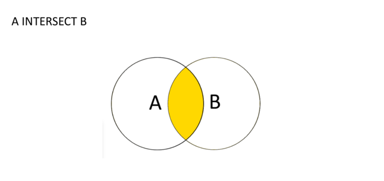
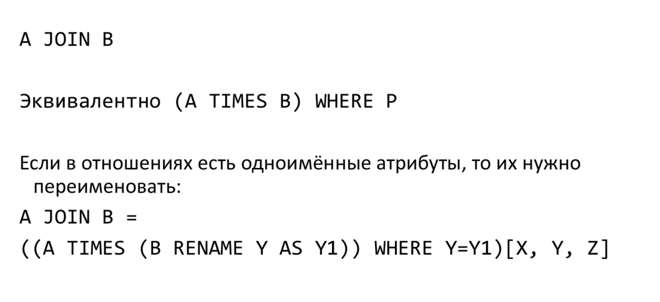

## Теоретико-множественные операции

-  Напоминание + примеры на postgresql

### Операции реляционной алгебры простым языком

В общем случае таблица отношением не является, но для простоты восприятия, помня о всех свойствах отношения, можем полагать, что отношение ~ таблица. К отношениям применимы теоретико-множественные и реляционные операции.

В качестве элементарной единицы отношения используем кортеж (строку), т.е. при пересечении отношений смотрим, какие строки являются общими. Результатом выполнения операций реляционной алгебры является новое отношение. \
Для простоты теоретико-множественные операции будем рассматривать на 2-x отношениях.

 **Примечание.** Теоретико-множественные операции (пересечение, объединение и разность) применимы к совместимым отношениям (множество доменов совпадает или вложено). Кортежи (строки) в новом отношении должны быть уникальны,
т.е. повторения недопустимы. Помним о Union-Compatible ограничении – атрибуты отношений должны совпадать.


##### 1. Теоретико-множественные операции

 * **Объединение**: на вход принимает 2 отношения. Позволяет получить новое отношение, содержащее в себе все кортежи из обоих отношений.


 * **Разность**: на вход принимает 2 отношения. Позволяет получить новое отношение,
содержащее в себе кортежи первого отношения, которые не совпадают с кортежами
второго отношения.


 * **Пересечение**: на вход принимает 2 отношения. Позволяет получить новое отношение,
содержащее в себе кортежи, которые присутствуют как в первом, так и во втором
отношении.



#### Рассмотрим, как эти операции применять на практике с использованием postgresql:

Создадим две таблицы

```postgresql
-- таблица работников
CREATE TABLE employee (
  employee_id INTEGER,
  name TEXT NOT NULL
);

-- insert
INSERT INTO employee
VALUES (0001, 'Clark'),
(0002, 'Dave'),
(0003, 'Ava');

-- таблица покупателей
CREATE TABLE customer (
  customer_id INTEGER,
  name TEXT NOT NULL
);

INSERT INTO customer
VALUES (1, 'Max'),
(2, 'John'),
(3, 'Ava');
```

Результат:

```postgresql
-- работники
SELECT *
FROM employee;
/*
 employee_id | name  
-------------+-------
           1 | Clark
           2 | Dave
           3 | Ava
*/

-- покупатели
SELECT *
FROM customer;
/*
 customer_id | name 
-------------+------
           1 | Max
           2 | John
           3 | Ava
*/
```
- Один из работников одновременно является клиентом:
```postgresql
3 | 'Ava'
```


- A UNION B - объединение
```postgresql
SELECT *
FROM employee
UNION
SELECT *
FROM customer;
/*
 employee_id | name  
-------------+-------
           3 | Ava
           1 | Clark
           2 | John
           2 | Dave
           1 | Max
*/
```

- A INTERSECT B - пересечение
```postgresql

SELECT *
FROM employee
INTERSECT
SELECT *
FROM customer;
/*
 employee_id | name 
-------------+------
           3 | Ava
*/
```

- A EXCEPT B - разность
```postgresql
SELECT *
FROM employee
EXCEPT
SELECT *
FROM customer;
/*
 employee_id | name  
-------------+-------
           2 | Dave
           1 | Clark
*/

```

#### Упражнение: как получить только те строки таблиц, которые присутствуют ровно в одной из таблиц (но не в обеих)?

Реляционные операции - ограничение, проекция, соединение и 

##### 2 Реляционные операции

 * **Ограничение**: на вход принимает 1 отношение + ограничения. Позволяет выделить в отношении только те кортежи, которые удовлетворяют заданному ограничению. Например, выделить среди кортежей отношения "Друзья" те, где друг является "Сыном Маминой Подруги".


```postgresql
-- Аналог ограничения в postgres:
SELECT *
FROM customer
WHERE name != 'Dave';
```

 * **Проекция**: на вход принимает 1 отношение + список атрибутов (столбцов), на которые проецируем. Позволяет "оставить" в кортеже только интересующие нас атрибуты.
**Важно!** После проекции остаются только уникальные кортежи, т.е. результат
проекции – отношение.


```postgresql
-- Аналог проекции в postgres (оставляем только атрибут name):
SELECT name
FROM customer;
```

 * **Соединение**: на вход принимает 2 отношения. Позволяет получить новое отношение,
полученное соединением 2 таблиц по некоторому логическому условию {=, ≠, <, >, ≤, ≥}. _Арность_ (количество столбцов-атрибутов) нового отношения будет равна сумме
арностей соединяемых отношений (для естественного соединения по условию равенства
лишний элемент удаляется, поэтому арность n + m − 1).



 * **Деление**: принимает на вход 2 отношения (таблицы). В результате получается отношение, содержащее _только те_ **атрибуты** 1-го отношения, которых нет во втором, содержащее вышеупомянутые атрибуты _только тех_ **кортежей** 1-го отношения, которые соответствуют комбинации (объединению) всех кортежей 2-го отношения.


