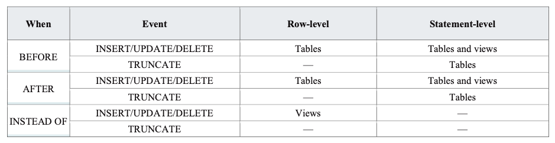

## Функции. Процедуры. Триггеры.

### 1. Теоретическая справка

**Хранимый код** – объект базы данных, представляющий собой набор SQL-инструкций (и не только их), который компилируется один раз и
хранится на сервере.

**Зачем нужен хранимый код?**

* скрывают алгоритмы обработки данных;
* расширяют возможности программирования, позволяя реализовывать сложную логику;
* поддерживают функции безопасности и целостности данных, обработку исключений.


PostgreSQL позволяет разрабатывать собственный хранимый код и на языках, отличных от SQL 
([на C также](https://www.postgresql.org/docs/current/xfunc-c.html), но в рамках курса не рассматриваем). 
Эти другие языки в целом обычно называются процедурными языками (PL, Procedural Languages). 
Процедурные языки не встроены в сервер PostgreSQL; они предлагаются загружаемыми модулями:
 * [PL/pgSQL](https://www.postgresql.org/docs/current/plpgsql.html)
 * [PL/Tcl](https://www.postgresql.org/docs/current/pltcl.html)
 * [PL/Perl](https://www.postgresql.org/docs/current/plperl.html)
 * [PL/Python](https://www.postgresql.org/docs/current/plpython.html)

**PL/pgSQL** — язык программирования, используемый для написания хранимого кода для PostgreSQL. С помощью данного
расширения PostgreSQL можно писать выполняемые блоки, функции и особый объект баз данных – триггеры.  

Помимо PL/pgSQL мы также попишем на PL/Python.

### 1.1. Функции.

PostgreSQL предоставляет большое количество функций для встроенных типов данных. 
Например, функция повторения строки:
```postgresql
repeat ( text, integer ) → text
```
(правая стрелочка обозначает результат выполнения функции)
```postgresql
repeat('Pg', 4) → 'PgPgPgPg'
```

Собственные функции определяются на сервере командами `CREATE FUNCTION`. Такая команда обычно выглядит,
например, так:

```postgresql
CREATE FUNCTION somefunc(integer, text) RETURNS integer
AS 'тело функции'
LANGUAGE [SQL|plpgsql|plpython|...];
```

> **Примечание!**
>
> Если рассматривать `CREATE FUNCTION`, тело функции представляет собой просто текстовую строку.
Часто для написания тела функции удобнее заключать эту строку в доллары, а не в обычные апострофы.
Если не применять заключение в доллары, все апострофы или обратные косые черты в теле функции придётся экранировать, дублируя их.

**Строковые константы** в долларах можно вкладывать друг в друга, выбирая на разных уровнях вложенности разные теги. Чаще
всего это используется при написании определений функций. Например:

```postgresql
$function$
BEGIN
    RETURN ($1 ~ $q$[\t\r\n\v\\]$q$);
END;
$function$
```

### 1.1.1. Функции на SQL.

Простейший вариант функций на языке запросов (функции, написанные на SQL). 
Достаточно взглянуть на несколько примеров, чтобы понять что к чему:

```postgresql
-- Пример №1
CREATE FUNCTION add(integer, integer) 
RETURNS integer
AS 'SELECT $1 + $2;'
LANGUAGE SQL;

---- Запрос
SELECT add(1, 3);

--- Ответ
| add |
-------
|  4  |
```

```postgresql
-- Пример №2
CREATE FUNCTION dup(in int, out f1 int, out f2 text)
AS $$
    SELECT $1, CAST($1 AS text) || ' is text'
$$ LANGUAGE SQL;

---- Запрос
SELECT * FROM dup(42);

--- Ответ
| f1   | f2         |
---------------------
|   42 | 42 is text |
```

```postgresql
---- Запрос к таблице

-- Создаём таблицу
CREATE TABLE test_t(a int, b int);

-- Добавляем значения
INSERT INTO test_t(a, b)
VALUES
(3, 10),
(5, 20);

-- Проверяем что значения добавились
SELECT * FROM test_t;

--- Ответ
a|b |
-+--+
3|10|
5|20|
7| 6|

-- Запрос с использованием функции
SELECT add(a, b)
FROM test_t;

--- Ответ
add|
---+
 13|
 25|
 13|
```

#### Возможности:

- DEFAULT значения аргументов
```postgresql
CREATE FUNCTION foo(a int, b int DEFAULT 2, c int DEFAULT 3)
RETURNS int
AS $$
    SELECT a + b + c;
$$ LANGUAGE SQL;

SELECT foo(10, 20, 30);
--- Ответ
foo|
---+
 60|

SELECT foo(10, 20);
--- Ответ
foo|
---+
 33|

SELECT foo(10);
--- Ответ
foo|
---+
 15|
```

- DEFAULT expression
```postgresql
CREATE FUNCTION foo(a int, b int DEFAULT = a * 2)
RETURNS int
AS $$
    SELECT a + b
$$ LANGUAGE SQL;
```

- Функции могут модифицировать таблицы
```postgresql
CREATE FUNCTION tf1(account_no int, debit int)
RETURNS numeric AS $$
    UPDATE bank
    SET balance = balance - debit
    WHERE account_no = tf1.account_no

    SELECT balance
    FROM bank
    WHERE account_no = tf1.account_no
$$ LANGUAGE SQL;
```

### Возврат нескольких значений

Функция, возвращающая запись с несколькими выходными параметрами:
```postgresql
CREATE FUNCTION dup(in int, out f1 int, out f2 text)
    AS $$ SELECT $1, CAST($1 AS text) || ' is text' $$
    LANGUAGE SQL;
SELECT * FROM dup(42);
```

То же самое можно сделать более развёрнуто, явно объявив составной тип:

```postgresql
CREATE TYPE dup_result AS (f1 int, f2 text);

CREATE FUNCTION dup(int) RETURNS dup_result
    AS $$ SELECT $1, CAST($1 AS text) || ' is text' $$
    LANGUAGE SQL;

SELECT * FROM dup(42);
```

Ещё один способ вернуть несколько столбцов — применить функцию TABLE:

```postgresql
CREATE FUNCTION dup(int) RETURNS TABLE(f1 int, f2 text)
    AS $$ SELECT $1, CAST($1 AS text) || ' is text' $$
    LANGUAGE SQL;

SELECT * FROM dup(42);
```
Однако пример с TABLE отличается от предыдущих, так как в нём функция на самом деле возвращает не одну, а набор записей.
  


### Модификаторы:
```postgresql
-- реакция на NULL в аргументах
CALLED ON NULL INPUT - может вызываться на NULL аргументах
RETURNS NULL ON NULL INPUT
STRICT

-- волатильность (более развёрнуто позже):
IMMUTABLE - возвращает одно значение на одинаковых аргументах
STABLE - возвращает одно значение на одинаковых аргументах, но только в пределах одного запроса
VOLATILE - никаких гарантий на повторяемость результата

-- безопасность (устойчивость к утечке данных):
LEAKPROOF - не даёт доступа к данным, кроме как в результате выполнения (в том числе сообщения об ошибках не содержат данных из аргументов)

и т.д. - читайте документацию
```

## 1.1.2. Функции на PL/pgSQL.

Подробнее здесь:
[postgresql - PL/pgSQL structure](https://postgrespro.ru/docs/postgresql/9.6/plpgsql-structure)

### Блоки программы

**PL/pgSQL** это блочно-структурированный язык. Текст тела функции должен быть блоком. Структура блока:

```postgresql
[ <<метка>> ]
[ DECLARE
    объявления ]
BEGIN
    операторы
END [ метка ];
```

Пример:
```postgresql
CREATE FUNCTION add_one (integer) RETURNS INTEGER AS $$
    BEGIN
        RETURN $1 + 1;
    END;
$$ LANGUAGE 'plpgsql';
```

```postgresql
-- с объявлением:
CREATE FUNCTION add_one (integer) RETURNS INTEGER AS $$
    DECLARE
        delta integer = 1;
    BEGIN
        RETURN $1 + delta;
    END;
$$ LANGUAGE 'plpgsql';
```

```postgresql
-- блок с меткой:
CREATE FUNCTION add_one (integer) RETURNS INTEGER AS $$
    <<block1>> -- имя блока
    DECLARE
        delta integer = 1;
    BEGIN
        RETURN $1 + delta;
    END;
$$ LANGUAGE 'plpgsql';
```

Каждое объявление и каждый оператор в блоке должны завершаться символом «;» (точка с запятой).

<details> <summary>Примечания</summary>
Блок, вложенный в другой блок, должен иметь точку с запятой после END, как показано выше. Однако финальный `END`, завершающий тело функции, не
требует точки с запятой.

> Примечание!
>
>Распространённой ошибкой является добавление точки с запятой сразу после `BEGIN`.
Это неправильно и приведёт к синтаксической ошибке.

Метка требуется только тогда, когда нужно идентифицировать блок в операторе `EXIT`, или дополнить имена переменных,
объявленных в этом блоке. Если метка указана после `END`, то она должна совпадать с меткой в начале блока.

Ключевые слова не чувствительны к регистру символов. Как и в обычных SQL-командах, идентификаторы неявно преобразуются к
нижнему регистру, если они не взяты в двойные кавычки.
</details>

### Комментарии

Комментарии в **PL/pgSQL** коде работают так же, как и в обычном SQL. Двойное тире `--` начинает комментарий, который
завершается в конце строки. Блочный комментарий начинается с `/*` и завершается `*/`. Блочные комментарии могут быть
вложенными.

Пример:

```postgresql
CREATE FUNCTION add_ten (integer) RETURNS INTEGER AS $$
    -- Комментарий 1

    /*
     Комментарий 2
     Комментарий 2
     Комментарий 2
    */

    /*
     Комментарий 3
     Комментарий 3
        /*
         Вложенный комментарий 3
         (да, в plpgsql так можно)
        */
    */
    BEGIN
        -- возвращаем результат
        RETURN $1 + 10;
    END;
$$ LANGUAGE 'plpgsql';
```

### Вложение блоков кода

Блоки кода можно вкладывать друг в друга.

Пример:
```postgresql
CREATE FUNCTION add_delta (integer) RETURNS INTEGER AS $$
    DECLARE delta integer = 10;
    BEGIN
        -- вложенный блок 
        BEGIN
            delta = 100;
        END;

        RETURN $1 + delta;
    END;
$$ LANGUAGE 'plpgsql';

SELECT add_delta(5);
-- Ответ
add_delta|
---------+
      105|
```


Любой оператор в выполняемой секции блока может быть вложенным блоком. Вложенные блоки используются для логической
группировки нескольких операторов или локализации области действия переменных для группы операторов.

Во время выполнения
вложенного блока переменные, объявленные в нём, скрывают переменные внешних блоков с такими же именами. Чтобы получить
доступ к внешним переменным, нужно дополнить их имена меткой блока.

Например:

```postgresql
CREATE FUNCTION somefunc() RETURNS integer AS $$
<< outerblock >>
DECLARE
    quantity integer = 30;
BEGIN
    -- Выводится 30
    RAISE NOTICE 'Сейчас quantity = %', quantity;

    -- Вложенный блок
    DECLARE
        quantity integer = 80;
    BEGIN
        -- Выводится 80
        RAISE NOTICE 'Сейчас quantity = %', quantity;

        -- Выводится 50
        RAISE NOTICE 'Во внешнем блоке quantity = %', outerblock.quantity;
    END;

    RAISE NOTICE 'Сейчас quantity = %', quantity;  -- Выводится 50

    RETURN quantity;
END;
$$ LANGUAGE plpgsql;
```
## ОСНОВЫ PL/pgSQL
#### 1. Оператор присваивания:
```postgresql
var := 10

-- или

var = 10
```
#### 2. В блоке DECLARE можно переименовывать переменные:
```postgresql
new_name ALIAS FOR $1;
```
#### 3. Динамическое выполнение запросов:
```postgresql
EXECUTE sql_query [INTO target] [USING expression]
Пример:
EXECUTE 'SELECT count(*) FROM mytable WHERE inserted_by = $1 AND inserted <= $2'
INTO c
USING checked_user, checked_date;
```
 Параметры $1 и $2 в этом случае – это не входные данные функции, а параметры, заданные в блоке USING
 C (который идет после INTO) – таргет, в который будет записан результат выполнения запроса

#### 4. Для имен таблиц и колонок можно (и даже правильнее) использовать функцию format():
```postgresql
EXECUTE format('SELECT count(*) FROM %I '
'WHERE inserted_by = $1 AND inserted <= $2', tabname)
INTO c
USING checked_user, checked_date;
```
Для таких запросов необходимо помнить о NULL значениях и их обработке!
%I == quote_ident – оборачивание в кавычки, при условии их необходимости
%L == quote_nullable – корректная обработка NULL значений

#### 5. Ветвление логики:
```postgresql
IF … THEN … [ELSEIF … THEN … ELSE …] END IF;
CASE выражения, по аналогии с обычным SQL
```
#### 6. Использование циклов:
```postgresql
LOOP
    statements;
END LOOP;
LOOP
    statements;
    EXIT WHEN n > 100; -- прерываем цикл, если выполнено условие
    CONTINUE WHEN n > 50; -- запускаем новую итерацию цикла, если выполнено условие
    more statements;
END LOOP;
```
#### 6.1. Циклы WHILE:
```postgresql
WHILE boolean-expression
    LOOP
        statements;
    END LOOP;
```
#### 6.2. Циклы FOR по целым числам:
```postgresql
-- цикл с заданными начальным и конечным значениями, шагом step в заданном порядке
FOR i IN [REVERSE] start_value .. end_value [BY step]
    LOOP
        statements;
    END LOOP;
```
#### 6.2. Цикл FOR по результатам запроса:
```postgresql
FOR record_type_value IN query
    LOOP
        statements;
    END LOOP;
```
Для обращения к конкретному значению строки использовать «.»:
```
record_type_value.field_nm
```

#### 6.3. Цикл FOR по массиву:
```postgresql
FOREACH i IN ARRAY array_name
    LOOP
        statements;
    END LOOP;
```


И это все?
Конечно, нет
https://www.postgresql.org/docs/13/plpgsql.html
Не забываем про версию вашего postgres
select version();

> Примечание
>
> Существует скрытый «внешний блок», окружающий тело каждой функции на **PL/pgSQL**. Этот блок содержит объявления
параметров функции (если они есть), а также некоторые специальные переменные, такие как `FOUND`.
Этот блок имеет метку, совпадающую с именем функции, таким образом, параметры и специальные переменные могут быть
дополнены именем функции.

<details> <summary>Примечание про транзакции</summary>
Важно не путать использование `BEGIN/END` для группировки операторов в **PL/pgSQL** с одноимёнными SQL-командами для
управления транзакциями. `BEGIN/END` в **PL/pgSQL** служат только для группировки предложений; они не начинают и не
заканчивают транзакции. Про управление транзакциями в **PL/pgSQL** можно почитать в документации[^4]. Кроме того, блок с
предложением `EXCEPTION` по сути создаёт вложенную транзакцию, которую можно отменить, не затрагивая внешнюю транзакцию.
Подробнее обработка ошибок описана в документации.
</details>

### 1.1.3. Функции на PL/Python.

Есть возможность реализовывать функции и на других языках.

Например, на PL/Python.

<details> <summary>Как устроены функции на PL/Python</summary>

Прежде чем что-то использовать, это надо установить.
если вы используете контейнер c `postgres` поверх `apline` скачайте пакеты:
```bash
apk add --no-cache --virtual .plpython3-deps --repository http://nl.alpinelinux.org/alpine/edge/testing \
    postgresql-plpython3 \
    && ln -s /usr/lib/postgresql/plpython3.so /usr/local/lib/postgresql/plpython3.so \
    && ln -s /usr/share/postgresql/extension/plpython3u.control /usr/local/share/postgresql/extension/plpython3u.control \
    && ln -s /usr/share/postgresql/extension/plpython3u--1.0.sql /usr/local/share/postgresql/extension/plpython3u--1.0.sql \
    && ln -s /usr/share/postgresql/extension/plpython3u--unpackaged--1.0.sql /usr/local/share/postgresql/extension/plpython3u--unpackaged--1.0.sql
```

После необходимо установить `PL/Python` в определённую базу данных, выполните команду:
```postgresql
CREATE EXTENSION plpython3u; -- будем использовать Python3
```

Функции на `PL/Python` объявляются стандартным образом с помощью команды `CREATE FUNCTION`:
```postgresql
CREATE FUNCTION funcname (argument-list)
  RETURNS return-type
AS $$
  # Тело функции на PL/Python
$$ LANGUAGE plpython3u;
```

Тело функции содержит просто скрипт на языке Python. Когда вызывается функция, её аргументы передаются в виде элементов списка args; именованные аргументы также передаются скрипту Python как обычные переменные. С применением именованных аргументов скрипт обычно лучше читается. Результат из кода Python возвращается обычным способом, командой `return` или `yield` (в случае функции, возвращающей множество). Если возвращаемое значение не определено, Python возвращает `None`. Исполнитель PL/Python преобразует `None` языка Python в значение `NULL` языка SQL.

Например, функцию, возвращающее большее из двух целых чисел, можно определить так:
```postgresql
CREATE FUNCTION pymax (a integer, b integer)
  RETURNS integer
AS $$
  if a > b:
    return a
  return b
$$ LANGUAGE plpython3u;
```

Значения аргументов задаются в глобальных переменных. Согласно правилам видимости в Python, тонким следствием этого является то, что переменной аргумента нельзя присвоить внутри функции выражение, включающее имя самой этой переменной, если только эта переменная не объявлена глобальной в текущем блоке. Например, следующий код не будет работать:
```postgresql
CREATE FUNCTION pystrip(x text)
  RETURNS text
AS $$
  x = x.strip()  # ошибка
  return x
$$ LANGUAGE plpython3u;
```

так как присвоение x значения делает x локальной переменной для всего блока, и при этом x в правой части присваивания оказывается ещё не определённой локальной переменной x, а не параметром функции PL/Python. Добавив оператор `global`, это можно исправить:
```postgresql
CREATE FUNCTION pystrip(x text)
  RETURNS text
AS $$
  global x
  x = x.strip()  # теперь всё в порядке
  return x
$$ LANGUAGE plpython3u;
```

Полезные ссылки по PL/Python:
 * [Про типы и их взаимную конвертацию](https://postgrespro.ru/docs/postgresql/9.6/plpython-data)
 * [Анонимные блоки кода](https://postgrespro.ru/docs/postgresql/9.6/plpython-do)
 * [Обращение к данным базы данных](https://postgrespro.ru/docs/postgresql/9.6/plpython-database)
 * [Вспомогательные функции](https://postgrespro.ru/docs/postgresql/9.6/plpython-util)

</details>

### 1.2. Function Volatility Categories

```
-- волатильность коротко:
IMMUTABLE - возвращает одно значение на одинаковых аргументах
STABLE - возвращает одно значение на одинаковых аргументах, но только в пределах одного запроса
VOLATILE - никаких гарантий на повторяемость результата
```

<details> <summary>Подробности</summary>
Каждая функция имеет свою степень/категорию волатильности: `VOLATILE`, `STABLE`, `IMMUTABLE`. 
`VOLATILE` значение по умолчанию в `CREATE FUNCTION` в команде. Степень волатильности является контрактом
для оптимизатора про поведение функции:

 * `VOLATILE` функция не дает никаких гарантий о своем поведении: поведение может быть недетерминированно при одинаковых аргументах, модифицировать внутренне состояние базы данных, ... . Оптимизатор не делает никаких предположений касаемо поведения такой функции. Запросы, использующие `VOLATILE` функции будут пересчитывать значение функции на каждой применяемой строке таблицы.

 * `STABLE` функция дает гарантию, что не модифицирует внутреннее состояние базы и гарантирует детерминированное поведение на одних и тех же аргументах **в рамках одного запроса**. Поэтому данная степень волатильности позволяет оптимизировать множественные вызовы путем кеширования. В частности, такие функции можно использовать для поиска по индексу (для `VOLATILE` такое запрещено).

 * `IMMUTABLE` функция дает те же гарантии что и `STABLE`, но снимает ограничение на рамки одного запроса. Поэтому оптимизатор может предварительно "прогреть кэш" на константных аргументах.

Для лучшей эксплуатации оптимизатора следует использовать ту допустимую категорию, которая дает больше гарантий о своем поведении.

Функции модифицирующие состояние БД должны быть обозначены как `VOLATILE`. Функции типа `random()`, `currval()`, `timeofday()` должны быть также обозначены `VOLATILE`.

</details>


### 1.3. Процедуры.

__Процедура__ — объект базы данных, подобный функции, но имеющий следующие отличия:
 * Процедуры определяются командой `CREATE PROCEDURE`, а не `CREATE FUNCTION`. 
 * Процедуры, в отличие от функций, не возвращают значение; поэтому в `CREATE PROCEDURE` отсутствует предложение `RETURNS`. Однако процедуры могут выдавать данные в вызывающий код через выходные параметры. 
 * Функции вызываются как часть запроса или команды DML, а процедуры вызываются отдельно командой `CALL`. 
 * Процедура, в отличие от функции, может фиксировать или откатывать транзакции во время её выполнения (а затем автоматически начинать новую транзакцию), если вызывающая команда `CALL` находится не в явном блоке транзакции. 
 * Некоторые атрибуты функций (например, `STRICT`) неприменимы к процедурам. Эти атрибуты влияют на вызов функций в запросах и не имеют отношения к процедурам.

**Пример**:

```postgresql
CREATE PROCEDURE insert_data(a integer, b integer)
LANGUAGE SQL -- можно также использовать процедурные языки
AS $$
  INSERT INTO tbl VALUES (a);
  INSERT INTO tbl VALUES (b);
$$;
```

```postgresql
CALL insert_data(1, 2);
```

### 1.4. Триггеры.

**Триггер** — хранимая процедура особого типа, которую пользователь не вызывает непосредственно, а исполнение которой
обусловлено действием по модификации данных: добавлением `INSERT`, удалением `DELETE` строки в заданной таблице, или
изменением UPDATE данных в определённом столбце заданной таблицы реляционной базы данных.

Могут выполняться до / вместо / после основного действия и для всей строки / всего выражения модификации данных.



**Алгоритм создания триггера:**

1. Создание хранимой функции, которая возвращает специальный тип `TRIGGER`
2. Создание непосредственно триггера, который запускает функцию из п.1

**Функции для триггеров:**

* Не принимают ничего на вход
* Возвращают тип `trigger`
* Могут использовать специальные атрибуты вида `TG_variable`

**Специальные переменные для использования в триггерах:**

* `NEW` – переменная типа `RECORD`, содержащая новую строку `UPDATE` / `INSERT` операций. `NULL` для `DELETE`
* `OLD` – переменная типа `RECORD`, содержащая старую строку `UPDATE` / `DELETE` операций. `NULL` для `INSERT`
* `TG_WHEN` – переменная типа `TEXT`, указывающая на время срабатывания триггера: `BEFORE`, `AFTER`, `INSTEAD OF`
* `TG_LEVEL` – переменная типа `TEXT`, соответствующая типу триггера по уровню срабатывания: `ROW`, `STATEMENT`
* `TG_OP` – переменная типа `TEXT`, соответствующая типу операции, на которую был вызван триггер: `INSERT`, `DELETE`
  , `UPDATE`, `TRUNCATE`
* `TG_TABLE_NAME` – переменная типа `NAME`, соответствующая таблице, которая вызвала срабатывание триггера
* `TG_TABLE_SCHEMA` – переменная типа `NAME`, соответствующая схеме, в которой хранится таблица, которая вызвала
  срабатывание триггера

**Синтаксис создания триггера:**

```postgresql
CREATE [ CONSTRAINT ] TRIGGER name { BEFORE | AFTER | INSTEAD OF } { event [ OR ... ] } 
    ON table_name
    [ FOR [ EACH ] { ROW | STATEMENT } ]
    [ WHEN ( condition ) ]
    EXECUTE { FUNCTION | PROCEDURE } function_name ( arguments )

where event can be one of:
    
    INSERT
    UPDATE [ OF column_name [, ... ] ] DELETE
    TRUNCATE
```

**Пример:**

```postgresql
CREATE TRIGGER log_update
    AFTER UPDATE ON accounts
    FOR EACH ROW
    WHEN (OLD.* IS DISTINCT FROM NEW.*)
    EXECUTE FUNCTION log_account_update();
```

Триггеры создаются вне схем, в привязке к конкретной таблице базы данных. Удаляются тоже с указанием таблицы, на которую
триггер создавался:

```postgresql
DROP TRIGGER [ IF EXISTS ] name ON table_name [ CASCADE | RESTRICT ]
```

---

### 2. Практическое задание (функции)

1. Требуется написать функцию, которая будет выводить на экран фразу «Hello, World!».
2. Требуется написать функцию, которая будет переворачивать строку, получаемую на вход;
3. Требуется написать функцию, которая будет рассчитывать факториал заданного числа;
4. Требуется написать функцию, которая будет прибавлять к дате в формате `YYYY-MM-DD` n дней;
5. Требуется написать код, который создаст копии всех имеющихся таблиц вашей БД какой-либо схемы, например, добавив к
   ним суффикс `copy`.

---

### 3. Практическое задание (триггеры)

Пусть дана таблица `employee`, в которой содержится информация о сотрудниках и их зарплате, а также информация о том, кто
и когда в последний раз менял запись (создайте и наполните ее самостоятельно):

1. Требуется создать триггер, который при любом добавлении или изменении строки в таблице сохраняет в этой строке
   информацию о текущем пользователе и отметку времени. Кроме того, он требует, чтобы было указано имя сотрудника и
   зарплата задавалась положительным числом.
2. Создать триггер, который будет записывать все изменения таблицы `employee` в отдельную таблицу логов. Информация,
   которая должна быть отражена в таблице логов:
    * какая операция была совершена;
    * время операции;
    * пользователь, который совершил операцию;
    * значения новых полей.

---
### Полезные ссылки

* Оператор DO и анонимные блоки (?)  - не поддерживается в SQL

* [Структура PL/pgSQL](https://postgrespro.ru/docs/postgresql/14/plpgsql-structure)
* [Создание функций](https://postgrespro.ru/docs/postgresql/14/sql-createfunction)
* [Строковые константы, заключённые в доллары](https://postgrespro.ru/docs/postgresql/14/sql-syntax-lexical#SQL-SYNTAX-DOLLAR-QUOTING)
* [Управление транзакциями](https://postgrespro.ru/docs/postgresql/14/plpgsql-transactions)
* [Обработка ошибок](https://postgrespro.ru/docs/postgresql/14/plpgsql-control-structures#PLPGSQL-ERROR-TRAPPING)
* [Обзор механизма работы триггеров](https://postgrespro.ru/docs/postgresql/14/trigger-definition)