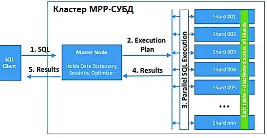

## OLAP хранилища

### 1. Предпосылки

Postgres разрабатывался с оглядки на сценарии частых небольших ставок данных и множества точечных чтений (несколько строк из таблиц). 
Такой сценарий использования называется **OLTP** (**O**n**L**ine **T**ransactional **P**rocessing). 

С другой стороны, могут возникнуть задачи построения отчетности за большой период с агрегациями и соединениями десятков, 
сотен и даже тысяч таблиц. Такие сценарии использования называются **OLAP** (**O**n**L**ine **A**nalytical **P**rocessing).
Для них существуют свои хранилища.

---

Стандарты де-факто в индустрии ныне:
 * Greenplum
 * ClickHouse
 * Vertica (проприетарная, не рассматриваем)

### 2. MPP системы

MPP (massive parallel processing) – массивно-параллельная архитектура. Главная особенность такой архитектуры состоит в 
том, что память физически разделена. Грубо говоря, данные бъются по кусочкам, хранятся и обрабатываются на разных машинах, 
при необходимости обмениваются между собой данными.

Greenplum и ClickHouse это MPP–системы.

---

### 3. Greenplum

 * [Официальный сайт](https://greenplum.org/)
 * [Исходники](https://github.com/greenplum-db/gpdb)
 * [Документация](https://gpdb.docs.pivotal.io/6-9/admin_guide/intro/partI.html)
 * [Краткий референс](https://github.com/syuja/GreenPlumSetup/tree/master/tutorial)
 * [Туториал по сборке кластера локально](https://github.com/bbotev01/gpdb5)

---

### 4. Clickhouse

 * [Официальный сайт](https://clickhouse.com/)
 * [Исходники](https://github.com/ClickHouse/ClickHouse)
 * [Документация](https://clickhouse.com/docs/en/quick-start)
 * [Пописать запросы онлайн](https://clickhouse.com/blog/clickhouse-fiddle-sql-playground)
 * [Краткий референс](https://webdevblog.ru/osnovy-clickhouse-dlya-veb-razrabotchika/)
 * [Туториал по сборке кластера локально](https://github.com/jneo8/clickhouse-setup)
