# Семинар 8
## Содержание:

1. [Оптимизация. Индексы](#INDEX)
2. [Партиционирование. Вертикальная и горизонтальная масштабируемость.](#SCALABILITY)
3. [Горизонтальное масштабирование, хранение на разных машинах](#HORIZONTAL_SCALABILITY)
4. [OLAP - Online Analytical Processing](#OLAP)
5. [ETL - Extract Transform Load](#ETL)

<a name="INDEX"></a>


## Оптимизация. Индексы

### 1. Оптимизация

### 1.1. Жизненный цикл запроса, план запроса.

#### 1.1.1. Жизненный цикл запроса.

*Мы написали запрос, что происходит дальше?*

1. Создается **подключение к СУБД**. В СУБД отправляется запрос в виде обычного текста.
2. Парсер **проверяет корректность синтаксиса** запроса и создает **дерево запроса**.
3. Система переписывания запросов преобразует запрос – получаем обновленное дерево запроса; используется [система правил](https://translated.turbopages.org/proxy_u/en-ru.ru.fff4fecf-62668e84-a3814da0-74722d776562/https/www.postgresql.org/docs/8/rules.html))
4. Планировщик / оптимизатор создает **план запроса**.
5. Обработчик рекурсивно обходит план запроса и получает результирующий набор строк.

**Дерево запроса** — специальное внутреннее представление SQL-запросов с полным его разбором по ключевым параметрам:
* Тип команды (`SELECT, UPDATE, DELETE, INSERT`);
* Список используемых отношений;
* Целевое отношение, в которое будет записан результат;
* Список полей (`*` преобразуется в полный список всех полей);
* Список ограничений (которые указаны в `WHERE`);
* и т.д.

#### 1.1.2. План запроса. Как читать, на что обращать внимание. Операторы EXPLAIN и ANALYZE.

**Планировщик (planner)** – компонент PostgreSQL, пытающийся выработать наиболее эффективный способ выполнения запроса SQL.

В плане выполнения содержится информация о том, как будет организован просмотр таблиц, задействованных в запросе, сервером базы данных.

Оператор [EXPLAIN](https://postgrespro.com/docs/postgresql/9.6/sql-explain):

**Функции:**
* Выводит план выполнения, генерируемый планировщиком PostgreSQL для заданного оператора.
* Показывает, как будут сканироваться таблицы, затрагиваемые оператором — просто последовательно, по индексу и т.д.
* Показывает, какой алгоритм соединения будет выбран для объединения считанных из таблиц строк.
* Показывает ожидаемую *стоимость* (в условных единицах) выполнения запроса.
* ОТСУТСТВУЕТ в стандарте SQL.

**Синтаксис:**
```sql
EXPLAIN [ ( option [, ...] ) ] statement
EXPLAIN [ ANALYZE ] [ VERBOSE ] statement

where option can be one of:
ANALYZE [ boolean ]
VERBOSE [ boolean ]
COSTS [ boolean ]
BUFFERS [ boolean ]
TIMING [ boolean ]
FORMAT { TEXT | XML | JSON | YAML }
```

```sql
    INSERT INTO my_table ...;
    EXPLAIN SELECT * FROM my_table;
- - - -
QUERY PLAN
Seq Scan on my_table (cost=0.00..18334.00 rows=1000000 width=37)
```

**Что это значит?**
* Данные читаются методом Sed Scan (см. следующий вопрос)
* Данные читаются из таблицы my_table
* cost — затраты (в некоторых условных единицах) на получение первой строки..всех строк
* rows — приблизительное количество возвращаемых строк при выполнении операции Seq Scan (никакие строки не вычитываются, значение приблизительное)
* width — средний размер одной строки в байтах

При повторном вызове покажет старую статистику, необходимо вызвать команду ANALYZE для ее обновления.

Оператор [ANALYZE](https://postgrespro.ru/docs/postgresql/9.6/sql-analyze):

**Функции:**
* Собирает статистическую информацию о содержимом таблиц в базе данных и сохраняет результаты в системном каталоге `pg_statistic`;
* Без параметров анализирует все таблицы в текущей базе данных.
* Если в параметрах передано имя таблицы, обрабатывает только заданную таблицу.
* Если в параметрах передан список имен столбцов, то сбор статистики запустится только по этим столбцам.
* ОТСУТСТВУЕТ в стандарте SQL.

**Синтаксис:**
```sql
ANALYZE [ VERBOSE ] [ table_name [ ( column_name [, ...] ) ] ]
```

```sql
ANALYZE my_table;
EXPLAIN SELECT * FROM my_table;

EXPLAIN (ANALYZE) SELECT * FROM my_table;
- - - -
QUERY PLAN
Seq Scan on foo (cost=0.00..18334.10 rows=1000010 width=37)
(actual time=0.402..97.000 rows=1000010 loops=1)

Planning time: 0.042 ms
Execution time: 138.229 ms
```

Теперь запрос будет исполняться реально.
* actual time — реальное время в миллисекундах, затраченное для получения первой строки и всех строк соответственно.
* rows — реальное количество строк, полученных при Seq Scan.
* loops — сколько раз пришлось выполнить операцию Seq Scan.
* Planning time — время, потраченное планировщиком на построение плана запроса.
* Execution time — общее время выполнения запроса.

---

### 1.2. Индексы. Определение, условия использования, способы сканирования.

**Индекс** — специальный объект БД, хранящийся отдельно от таблиц и обеспечивающий быстрый доступ к данным. Это вспомогательные структуры: любой индекс можно удалить и восстановить заново по информации в таблице. Индексы служат также для поддержки некоторых ограничений целостности.

В PostgreSQL 9.6 встроены *шесть разных видов индексов*.

**Свойства:**
* Все индексы — вторичные, они отделены от таблицы. Вся информация о них содержится в системном каталоге.
* При добавлении/изменении данных, связанных с индексом, индекс каждый раз перестраивается (это замедляет выполнение запроса).
* Внутри могут лежать разные математические структуры (B-дерево, черно-красное дерево…)
* Индексы могут быть многоколоночными (поддержание условия на несколько полей).
* Индексы связывают ключи и TID (tuple id -  #page: #offset) — номер страницы и строки на ней.
* Обновление полей таблицы, по которым не создавались индексы, не приводит к перестроению индексов (Heap-Only Tuples, HOT).

*Оптимизация HOT:* при апдейте строки, если это возможно, Postgres поставит новую копию строки сразу после старой копии строки. Также в старой копии строки проставляется специальная метка, указывающая на то, что новая копия строки находится сразу после старой. Поэтому обновлять все индексы не нужно.

**Условия использования:**
* Совпадают оператор и типы аргументов.
* Индекс валиден.
* Важен порядок полей внутри многоколоночного индекса, чтобы накладывать условия, ожидая, что оптимизатор выберет индекс.
* План с его использованием — оптимален (минимальная стоимость).
* Всю информацию Postgres берет из системного каталога.


**Синтаксис:**
```sql
CREATE [UNIQUE] INDEX [CONCURRENTLY] [name] ON table_name [USING METHOD]...
CREATE INDEX ON my_table(column_2);
ALTER INDEX [IF EXISTS] name RENAME TO new_name
DROP INDEX [CONCURRENTLY] [IF EXISTS] name [, ...] [CASCADE|RESTRICT]

ALTER INDEX [IF EXISTS] name RENAME TO new_name
ALTER INDEX [IF EXISTS] name SET TABLESPACE tablespace_name
ALTER INDEX [IF EXISTS] name SET (storage_parameter = value [, ... ])
ALTER INDEX [IF EXISTS] name RESET (storage_parameter [, ... ])
DROP INDEX [CONCURRENTLY] [IF EXISTS] name [, ...] [CASCADE|RESTRICT]
```

**Общая информация**
* Индексы работают тем лучше, чем выше селективность условия, то есть чем меньше строк ему удовлетворяет. При увеличении выборки возрастают и накладные расходы на чтение страниц индекса.
* Ситуация усугубляется тем, что последовательное чтение выполняется быстрее, чем чтение страниц «вразнобой». Это особенно верно для жестких дисков, где механическая операция подведения головки к дорожке занимает существенно больше времени, чем само чтение данных; в случае дисков SSD этот эффект менее выражен.

### 1.3. Способы считывания данных

#### 1.3.1. Seq Scan

**Идея:** Последовательное, блок за блоком, чтение данных таблицы.

**Преимущества:** При большом объеме данных для одного значения индексного поля, работает эффективнее индексного сканирования, так как обычно оно работает с большими блоками данных, поэтому за одну операцию доступа потенциально может выбрать большее количество данных, чем индексное сканирование, соответственно, нужно меньше операций доступа, скорость выше.

**Недостатки:** Обычно выполняется гораздо медленнее индексного сканирования, так как считывает все данные таблицы.

#### 1.3.2. Index Scan

**Идея:** Используется индекс для условий `WHERE` (селективность условия), читает таблицу при отборе строк.

**Преимущества:** При селективности условия время N → lnN. (В результате выполнения запроса выбирается значительно меньше строк, чем их кол-во в странице)

**Недостатки:** Если будем собирать индекс по всем полям, он будет весить зачастую значительно больше, чем данные в таблице. При увеличении выборки возрастают шансы, что придется возвращаться к одной и той же табличной странице несколько раз. (В таком случае оптимизатор переключается на Bitmap Scan)

#### 1.3.3. Bitmap Index Scan

**Идея:** Сначала Index Scan, затем контроль выборки по таблице. В большей части работа со строками (индекс по строке, битовая карта страниц, последующий отбор)

**Преимущества:** Эффективно для большого количества строк.

**Недостатки:** Не ускоряет работу, если условие не является селективным. Выборка может оказаться слишком велика для объема оперативной памяти, тогда строится только битовая карта страниц — она занимает меньше места, но при чтении страницы приходится перепроверять условия для каждой хранящейся там строки.

* В случае почти упорядоченных данных построение битовой карты — лишний шаг, обычное индексное сканирование будет таким же.
* Создается битовая карта, где предполагаем, что в соответствии с собранной статистикой наши строки удовлетворяют нашему условию; в ней есть странички;
* Если условия наложены на несколько полей таблицы, и эти поля проиндексированы, сканирование битовой карты позволяет (если оптимизатор сочтет это выгодным) использовать несколько индексов одновременно. Для каждого индекса строятся битовые карты версий строк, которые затем побитово логически умножаются (если выражения соединены условием AND), либо логически складываются (если выражения соединены условием OR).

#### 1.3.4. Index Only Scan

**Идея:** Практически не обращаемся к таблице, все необходимые значения в индексе.

**Преимущества:** Очень быстрая операция.

**Недостатки:** Может применяться только тогда, когда индекс включает все необходимые для выборки поля, и дополнительный доступ к таблице не требуется.

*Если индекс уже содержит все необходимые для запроса данные, то индекс называется покрывающим.*


<a name="SCALABILITY"></a>

## Партицирование. Вертикальная и горизонтальная масштабируемость.

### 1. Масштабирование Postgres

#### 1.1. Partitioning (партицирование/секционирование)

#### 1.1.1. Общие сведения

Часто возникает проблема: одна из таблиц в базе данных сильно выросла и время выполнения запросов к этой таблице увеличилось. 
Одним из вариантов решения такой проблемы в PostgreSQL является партицирование. Партиции могут содержать разное количество 
строк, а значит и размер на диске будет разным. Таблица партицируется построчно. **Пример:**
```postgresql
CREATE TABLE people_partitioned (
    person_id       SERIAL        PRIMARY KEY,
    first_name      VARCHAR(128)  NOT NULL,
    last_name       VARCHAR(128)  NOT NULL,
    birthday        DATE          NOT NULL,
    ...
) PARTITION BY RANGE (birthday);


CREATE TABLE people_partitioned_birthdays_1800_to_1850 
    PARTITION OF people_partitioned
    FOR VALUES FROM ('1800-01-01') TO ('1849-12-31');

CREATE TABLE people_partitioned_birthdays_1850_to_1900
    PARTITION OF people_partitioned
    FOR VALUES FROM ('1850-01-01') TO ('1899-12-31');

CREATE TABLE people_partitioned_birthdays_1900_to_1950
    PARTITION OF people_partitioned
    FOR VALUES FROM ('1900-01-01') TO ('1949-12-31');

CREATE TABLE people_partitioned_birthdays_1950_to_2000
    PARTITION OF people_partitioned
    FOR VALUES FROM ('1950-01-01') TO ('1999-12-31');
```
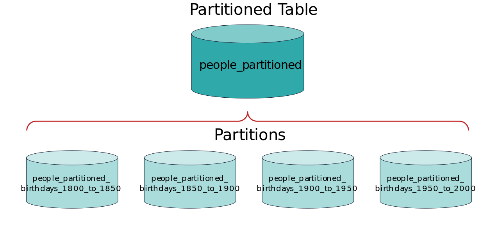

Таблицу, которую партицируют, называют **мастер-таблицей**. Партиция имеет связь с мастер-таблицей и представляет собой обычную таблицу, то есть к ней можно обращаться точно так же, как к самой обычной таблице: 
`SELECT`, `INSERT` (если не нарушает ограничений, накладываемых на партицию), `UPDATE`, `DELETE`.

**Какие проблемы может решить партицирование?**
 * ускорение выборки данных;
 * ускорение вставки данных;
 * упрощение удаления старых данных;
 * упрощение обслуживания таблицы.

*Следует помнить, что партицирование — не панацея*

**В каких случаях партицирование не поможет либо никак не повлияет?**
 * время создания бэкапа;
 * время восстановления из бэкапа;
 * место на диске.

*В первых двух случаях время практически не изменится, так как выполняется полный перебор данных. В последнем случае: был 1 млрд строк, после партицирования имеем тот же 1 млрд. То есть занимаемое место на диске будет практически тем же.*

**Некоторые ограничения и возможные проблемы по итогам партицирования**
 * партицируемая таблица должна быть достаточно большого размера; согласно документации, рекомендуется партицировать в случае, если таблица превосходит размер памяти;
 * на партицируемую таблицу нельзя ссылаться через FOREIGN KEYS (можно, начиная с PostgreSQL 12); при этом обратное (партицируемая таблица ссылается на другие) допустимо;
 * в некоторых случаях партицирование может ухудшить производительность на операциях чтения и записи;
 * в идеале запрос будет выполняться против одной партиции, но в худшем случае — затронет все партиции и, в зависимости от настроек PostgreSQL, увеличит время выполнения запроса, как в предыдущем пункте.


#### 1.1.2. Виды партицирования

##### 1.1.2.1. по диапазонам

Таблица секционируется по «диапазонам», определённым по ключевому столбцу или набору столбцов, и не пересекающимся друг 
с другом (см. пример выше).

##### 1.1.2.2. по списку
Таблица секционируется с помощью списка, явно указывающего, какие значения ключа должны относиться к каждой секции.
```postgresql
CREATE TABLE traffic_violations_p_list( 
    seq_id         TEXT,
    violation_type TEXT,
    ...
)
PARTITION BY LIST (violation_type);


CREATE TABLE traffic_violations_p_list_warning
    PARTITION OF traffic_violations_p_list
    FOR VALUES IN ('Warning');

CREATE TABLE traffic_violations_p_list_sero
    PARTITION OF traffic_violations_p_list
    FOR VALUES IN ('SERO');

CREATE TABLE traffic_violations_p_list_Citation
    PARTITION OF traffic_violations_p_list
    FOR VALUES IN ('Citation');

CREATE TABLE traffic_violations_p_list_ESERO
    PARTITION OF traffic_violations_p_list
    FOR VALUES IN ('ESERO');

CREATE TABLE traffic_violations_p_list_default
    PARTITION OF traffic_violations_p_list DEFAULT;  
```

*Postgres не создает "партицию по умолчанию" автоматически.
Подумайте какие подводные камни влечет за собой наличие "партицию по умолчанию".*

##### 1.1.2.3. по хешу
Таблица секционируется по определённым модулям и остаткам, которые указываются для каждой секции. Каждая секция содержит строки, для которых хеш-значение ключа разбиения, делённое на модуль, равняется заданному остатку.
```postgresql
CREATE TABLE traffic_violations_p_hash( 
    seqid     TEXT, 
    councils  SMALLINT,
    ...
)
PARTITION BY HASH (councils);


CREATE TABLE traffic_violations_p_hash_p1
    PARTITION OF traffic_violations_p_hash
    FOR VALUES WITH (MODULUS 5, REMAINDER 0);

CREATE TABLE traffic_violations_p_hash_p2
    PARTITION OF traffic_violations_p_hash
    FOR VALUES WITH (MODULUS 5, REMAINDER 1);

CREATE TABLE traffic_violations_p_hash_p3
    PARTITION OF traffic_violations_p_hash
    FOR VALUES WITH (MODULUS 5, REMAINDER 2);

CREATE TABLE traffic_violations_p_hash_p4
    PARTITION OF traffic_violations_p_hash
    FOR VALUES WITH (MODULUS 5, REMAINDER 3);

CREATE TABLE traffic_violations_p_hash_p5
    PARTITION OF traffic_violations_p_hash
    FOR VALUES WITH (MODULUS 5, REMAINDER 4);
```

##### 1.1.2.4. Замечания
 * Описанные выше виды партицирования обощающе называют **декларативное партицирование**.

 * Комбинирование видов партицирования или многоколоночное партицирование на уровне одной таблицы **невозможно**. С другой стороны, партицию можно уже партицировать по другому условию, т.к. партиция также является таблицей. Таким образом реализуется вложенное партицирование.
```postgresql
-- такое невозможно
CREATE TABLE measurement (
    city_id         INT NOT NULL,
    logdate         DATE NOT NULL,
    peaktemp        INT,
    unitsales       INT
) PARTITION 
    BY RANGE (logdate),
    BY RANGE (unitsales);
```

 * Хотя все секции должны иметь те же столбцы, что и секционированная родительская таблица, в каждой секции независимо от других могут быть определены свои индексы, ограничения и значения по умолчанию.

 * Все строки, вставляемые в секционированную таблицу, перенаправляются в соответствующие секции в зависимости от значений столбцов ключа разбиения. Если при изменении значений ключа разбиения в строке она перестаёт удовлетворять ограничениям исходной секции, эта строка перемещается в другую секцию.

 * Преобразовать обычную таблицу в секционированную и наоборот **нельзя**.

#### 1.1.3. Партицирование через наследование
Хотя встроенное декларативное секционирование полезно во многих часто возникающих ситуациях, бывают обстоятельства, требующие более гибкого подхода. В этом случае секционирование можно реализовать, применив механизм наследования таблиц, что даст ряд возможностей, неподдерживаемых при декларативном секционировании, например:
 * При декларативном секционировании все секции должны иметь в точности тот же набор столбцов, что и секционируемая таблица, тогда как обычное наследование таблиц допускает наличие в дочерних таблицах дополнительных столбцов, отсутствующих в родителе.
 * Механизм наследования таблиц поддерживает множественное наследование.
 * С декларативным секционированием поддерживается только разбиение по спискам, по диапазонам и по хешу, тогда как с наследованием таблиц данные можно разделять по любому критерию, выбранному пользователем.

**Пример**:
```postgresql
CREATE TABLE measurement(
    city_id    INT NOT NULL,
    logdate    DATE NOT NULL,
    peaktemp   INT,
    unitsales  INT
);


CREATE TABLE measurement_y2006m02(
    CHECK(logdate >= DATE '2006-02-01' AND logdate < DATE '2006-03-01')
) INHERITS (measurement);

CREATE TABLE measurement_y2006m03(
    CHECK(logdate >= DATE '2006-03-01' AND logdate < DATE '2006-04-01')
) INHERITS (measurement);

...

CREATE TABLE measurement_y2007m11(
    CHECK(logdate >= DATE '2007-11-01' AND logdate < DATE '2007-12-01')
) INHERITS (measurement);

CREATE TABLE measurement_y2007m12(
    CHECK(logdate >= DATE '2007-12-01' AND logdate < DATE '2008-01-01')
) INHERITS (measurement);

CREATE TABLE measurement_y2008m01(
    CHECK(logdate >= DATE '2008-01-01' AND logdate < DATE '2008-02-01')
) INHERITS (measurement);

...
    
CREATE TABLE measurement_city_id1(
    CHECK(city_id = 1)
) INHERITS (measurement);
```

Описанное выше это лишь малая часть того, что можно делать с партициями. Для большей информации стоит читать [документацию](https://www.postgresql.org/docs/current/ddl-partitioning.html).

#### 1.2. Репликация

Репликация (англ. replication) — механизм синхронизации содержимого нескольких копий объекта (например, содержимого базы данных). Репликация — это процесс, под которым понимается копирование данных из одного источника на другой (или на множество других) и наоборот.

**Когда может быть полезна репликация?**
 * **Отказоустойчивость**. Если у вас несколько реплик и один сервер вышел из строя, приложение/сервис/банк/всемирная финансовая инфраструктура/Google/whatever не обвалится с грохотом, а продолжит работать.
 * **Производительность**. Если один сервис будет будет обрабатывать 1000 запросов в секунду или 3 по 1000 — есть разница.

Обычно при репликации говорят о **master** и **slave**. 

В режиме master-slave репликации есть один master-сервер, 
обрабатывающий запросы на изменения данных, и несколько slave-серверов, обрабатывающих запросы на чтение. 
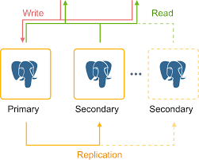

В случае выхода мастера из строя, один из слейвов становится мастером. В режиме master-master все сервера равноценны и
могут обрабатывать любые запросы. Но она сложнее и если один из серверов "умирает", вы можете получить повреждение данных (неконсистентность).
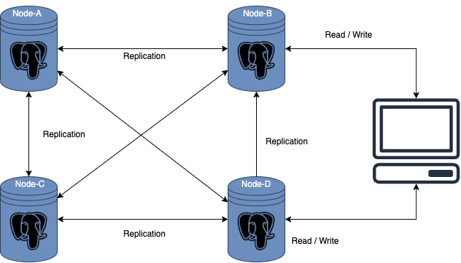

Про настраивание master-slave/master-master репликации для разных СУБД можно легко найти в сети.

<a name="HORIZONTAL_SCALABILITY"></a>

## Горизонтальное масштабирование, хранение на разных машинах

> [Оригинал на английском](https://pgdash.io/blog/horizontally-scaling-postgresql.html)

### Недостатки решения через партицирование

Партицирование купирует проблему работы с большими данными, но не решает ее полностью. Например, данных может быть настолько много, что
они не умещаются на одну машину. Или запросов на запись/чтение данных может быть очень много и сами запросы могут быть очень трудоемкими,
а вертикальное масштабирование имеет свои границы (расширение оперативной памяти, более вместительные диски, более мощный процессор).


### Доступ к таблицам на других серверах

Не все данные, распределенные по серверам, могут нуждаться в репликации или обновлении в режиме реального времени. Данные могут быть в основном статическими, предназначенными для справки, поиска или исторических данных и т. д. Доступ к таким данным можно получить с основных серверов OLTP/OLAP с использованием foreign data wrappers (FDW).

FDW позволяют работать с «чужими данными», которые могут находиться где угодно за пределами сервера Postgres. Возможность работы с данными с другого сервера Postgres реализована с помощью postgres_fdw — расширения, доступного в PostgreSQL.

### Postgres FDW
Вот как Postgres FDW выглядит на практике. Предположим, что есть исходная база данных с таблицей, например:

```sql
srcdb=# create table srct (a int primary key);
CREATE TABLE

srcdb=# insert into srct (a) select generate_series(1, 100);
INSERT 0 100
At a destination server, you can setup a foreign table srct, which acts a proxy table for the actual srct table that lives in our source database:

destdb=# create extension postgres_fdw;
CREATE EXTENSION

destdb=# create server src foreign data wrapper postgres_fdw options (host '/tmp', port '6000', dbname 'srcdb');
CREATE SERVER

destdb=# create user mapping for current_user server src;
CREATE USER MAPPING

destdb=# import foreign schema public limit to (srct) from server src into public;
IMPORT FOREIGN SCHEMA

destdb=# select count(*) from srct;
 count
-------
   100
(1 row)
```

Внешняя таблица не занимает места и не содержит данных — она просто служит оболочкой для ссылки на реальную таблицу, находящуюся где-то в другом месте. Расширение postgres_fdw целевого сервера Postgres установит и будет поддерживать соединение с исходным сервером Postgres, преобразуя каждый запрос, включающий внешнюю таблицу, в соответствующие сетевые вызовы.

Внешняя таблица может работать без проблем с обычными локальными таблицами, как в этом соединении:

```postgresql
destdb=# create table destt (b int primary key, c text);
CREATE TABLE

destdb=# insert into destt (b,c) values (10,'foo'), (20,'bar');
INSERT 0 2

destdb=# select a,b,c from srct join destt on srct.a = destt.b;
 a  | b  |  c
----+----+-----
 10 | 10 | foo
 20 | 20 | bar
(2 rows)
```

Основная задача FDW — максимально перенести работу на удаленный сервер и минимизировать объем данных, передаваемых туда и обратно между двумя серверами. Например, вы хотите, чтобы удаленный сервер обрабатывал ограничение на данные, а не извлекал все строки и затем применял ограничение на данные локально. Однако, учитывая сложность SQL, а также планировщика и исполнителя запросов PostgreSQL, это непростая задача. Эффективность продолжает улучшаться с каждой версией, но некоторые запросы могут занять слишком много времени или больше рабочей памяти, чем вы ожидаете.

### Materialized Views + Foreign Data Wrappers

В зависимости от вашего варианта использования объединение материализованных представлений с FDW может предложить разумный баланс между репликацией полной таблицы и ее полностью удаленным (внешним) доступом. Материализованное представление может эффективно функционировать как локальный кэш, который, в свою очередь, можно использовать вместе с локальными таблицами для обеспечения производительности локального уровня.

```sql
destdb=# create materialized view destmv as select a,b,c from srct join destt on srct.a = destt.b;
SELECT 2

destdb=# select * from destmv;
 a  | b  |  c
----+----+-----
 10 | 10 | foo
 20 | 20 | bar
(2 rows)
```

"Кэш” можно обновлять в любое время, периодически или иным образом, с помощью обычной команды “REFRESH MATERIALIZED VIEW”. В качестве бонуса в представлении можно определить (локальные) индексы для дальнейшего ускорения запросов.

### Распределение строк таблицы по серверам

Сегментирование (Sharding) строк одной таблицы на нескольких серверах с одновременным предоставлением SQL-клиентам унифицированного интерфейса обычной таблицы — пожалуй, наиболее востребованное решение для работы с большими таблицами. Такой подход упрощает приложения и заставляет администраторов баз данных работать усерднее!

Разделение таблиц на части, чтобы запросы работали только с соответствующими строками, желательно параллельно, является основным принципом сегментирования. В PostgreSQL v10 появилась функция секционирования, которая с тех пор претерпела множество улучшений и получила широкое распространение.

Вертикальное масштабирование с использованием секционирования предполагает создание разделов в разных табличных пространствах (на разных дисках). Горизонтальное масштабирование предполагает объединение секционирования и FDW.

### Partitioning + FDW
Going with the example from the Postgres documentation, let’s create the partition root table measurement having one local partition table and one foreign partition table:

Используя пример из документации Postgres, давайте создадим корневую секционированную таблицу measurement, имеющую одну локальную таблицу и одну внешнюю таблицу:

```postgresql
destdb=# CREATE TABLE measurement (
    city_id         int not null,
    logdate         date not null,
    peaktemp        int,
    unitsales       int
) PARTITION BY RANGE (logdate);
CREATE TABLE

destdb=# CREATE TABLE measurement_y2023
PARTITION OF measurement
FOR VALUES FROM ('2023-01-01') TO ('2024-01-01');
CREATE TABLE

destdb=# CREATE FOREIGN TABLE measurement_y2022
PARTITION OF measurement
FOR VALUES FROM ('2022-01-01') TO ('2023-01-01')
SERVER src;
CREATE FOREIGN TABLE
The foreign table is only a proxy, so the actual table itself must be present on the foreign server:

srcdb=# CREATE TABLE measurement_y2022 (
    city_id         int not null,
    logdate         date not null
        CHECK (logdate >= '2022-01-01' and logdate <= '2023-01-01'),
    peaktemp        int,
    unitsales       int
);
CREATE TABLE
```

Теперь мы можем вставлять строки в корневую таблицу и направлять их в соответствующий раздел. Вы можете видеть, что запрос SELECT выполняет как локальное, так и внешнее сканирование и объединяет результаты.

```postgresql
destdb=# insert into measurement (city_id, logdate, peaktemp, unitsales)
values (1, '2022-01-03', 66, 100), (1, '2023-01-03', 67, 300);
INSERT 0 2

destdb=# select * from measurement;
 city_id |  logdate   | peaktemp | unitsales
---------+------------+----------+-----------
       1 | 2022-01-03 |       66 |       100
       1 | 2023-01-03 |       67 |       300
(2 rows)

destdb=# explain select * from measurement;
                                           QUERY PLAN
-------------------------------------------------------------------------------------------------
 Append  (cost=100.00..219.43 rows=3898 width=16)
   ->  Foreign Scan on measurement_y2022 measurement_1  (cost=100.00..171.44 rows=2048 width=16)
   ->  Seq Scan on measurement_y2023 measurement_2  (cost=0.00..28.50 rows=1850 width=16)
(3 rows)
```
Однако как секционирование, так и внешние таблицы по-прежнему имеют ограничения реализации в PostgreSQL, а это означает, что этот способ работает удовлетворительно только для простых таблиц и базовых запросов.


<a name="OLAP"></a>

## OLAP хранилища

### 1. Предпосылки

Postgres разрабатывался с оглядки на сценарии частых небольших ставок данных и множества точечных чтений (несколько строк из таблиц). 
Такой сценарий использования называется **OLTP** (**O**n**L**ine **T**ransactional **P**rocessing). 

С другой стороны, могут возникнуть задачи построения отчетности за большой период с агрегациями и соединениями десятков, 
сотен и даже тысяч таблиц. Такие сценарии использования называются **OLAP** (**O**n**L**ine **A**nalytical **P**rocessing).
Для них существуют свои хранилища.

---

Стандарты де-факто в индустрии ныне:
 * Greenplum
 * ClickHouse
 * Vertica (проприетарная, не рассматриваем)

### 2. MPP системы

MPP (massive parallel processing) – массивно-параллельная архитектура. Главная особенность такой архитектуры состоит в 
том, что память физически разделена. Грубо говоря, данные бъются по кусочкам, хранятся и обрабатываются на разных машинах, 
при необходимости обмениваются между собой данными.

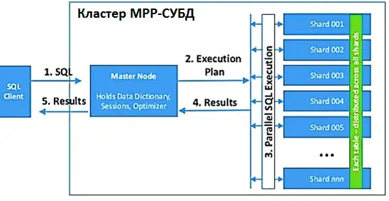

Greenplum и ClickHouse это MPP–системы.

---

### 3. Greenplum


 * [Официальный сайт](https://greenplum.org/)
 * [Исходники](https://github.com/greenplum-db/gpdb)
 * [Документация](https://gpdb.docs.pivotal.io/6-9/admin_guide/intro/partI.html)
 * [Краткий референс](https://github.com/syuja/GreenPlumSetup/tree/master/tutorial)
 * [Туториал по сборке кластера локально](https://github.com/bbotev01/gpdb5)

---

### 4. Clickhouse


 * [Официальный сайт](https://clickhouse.com/)
 * [Исходники](https://github.com/ClickHouse/ClickHouse)
 * [Документация](https://clickhouse.com/docs/en/quick-start)
 * [Пописать запросы онлайн](https://clickhouse.com/blog/clickhouse-fiddle-sql-playground)
 * [Краткий референс](https://webdevblog.ru/osnovy-clickhouse-dlya-veb-razrabotchika/)
 * [Туториал по сборке кластера локально](https://github.com/jneo8/clickhouse-setup)

\<a name="ETL"></a>

## ETL

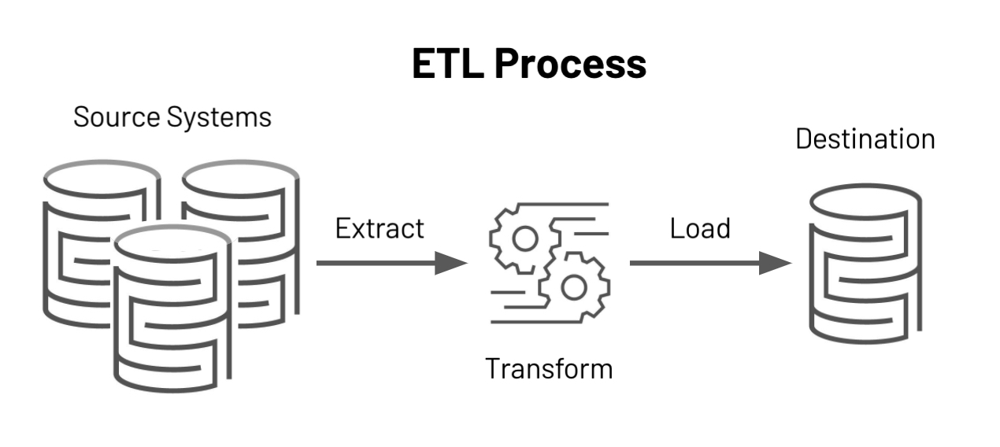

### 1. Базовые концепции

**ETL** (Extract Transform Load) - это извлечение, преобразование и загрузка. ETL является
традиционно принятым для организаций способом объединения данных из нескольких систем в единую базу данных, хранилище
данных(DWH) или озеро данных(data lake). ETL можно использовать для хранения устаревших данных или, что более
характерно сегодня, для агрегирования данных и последующего их анализа и принятия бизнес-решений.

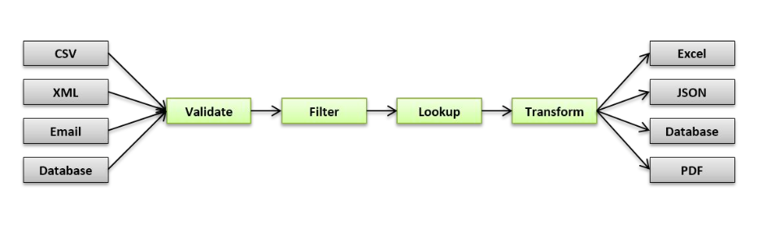

Как это было раньше?

- кастомные скрипты/процедуры/вьюхи
- ручной деплой
- **cron** для регулярного запуска задач

Какие были проблемы?

- задачи растут как снежный ком
- зависимости между задачами
- отсутствие мониторинга
- отсутствие механизма повторного запуска
- fault tolerance (отказоустойчивость)


### 2. Обзор решений


### 3. Apache Airflow

**Airflow** – это платформа для создания, мониторинга и оркестрации пайплайнов.


Этот open source проект, написанный на Python, был создан в 2014 году в компании Airbnb. В 2016 году Airflow ушел под
Apache Software Foundation, прошел через инкубатор и в начале 2019 года перешел в статус top-level проекта Apache.
Open-source.

В мире обработки данных некоторые называют его ETL-инструментом, но это не совсем ETL в классическом его понимании, как,
например, Pentaho, Informatica PowerCenter, Talend и иже с ними.

Airflow – это оркестратор, “cron на батарейках”: он сам **НЕ** выполняет тяжелую работу по перекладке и обработке
данных, а говорит другим системам и фреймворкам, что и в какое время надо делать, и следит за статусом выполнения.

#### 3.1 Основные сущности

- Направленные ациклические графы (DAG`s)
- Задачи (Tasks)
- Операторы (Operators)
- Сенсоры (Sensor)
- Хуки (Hooks)

#### 3.1 DAG

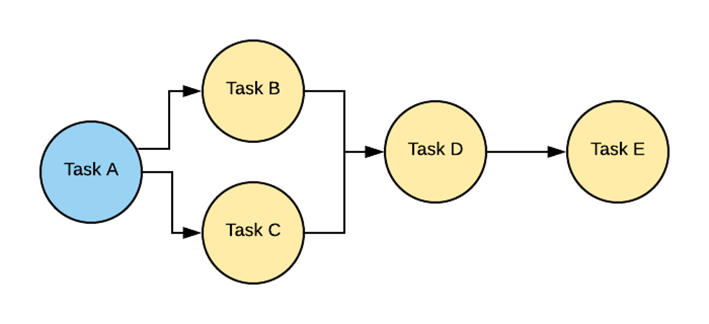

**DAG** — или направленный ациклический граф (Directed Acyclic Graph) — это набор всех задач, которые вы хотите
запустить, организованный таким образом, чтобы отражать их отношения и зависимости.

**DAG** — файл конфигурации, описывающий набор задач, которые необходимо выполнить в строго определенной
последовательности по определенному расписанию. Он задается функцией или декоратором. Разработчик, проектируя DAG,
закладывает набор операторов, на которых будут построены задачи внутри DAG’а.

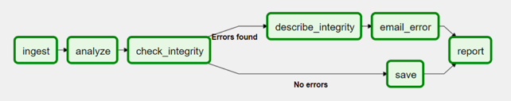

На уровне объекта DAG задаются настройки, например:

- Время начала выполнения пайплайна (`start_date`)
- Периодичность запуска (`schedule_interval`)
- Информация о владельце DAG (`owner`)
- Количество повторений в случае неудач (`retries`)
- Пауза между повторами (`retry_delay`)

Пример описания DAG`а на Python:

```python
import datetime
import pendulum

import requests
from airflow.decorators import dag, task
from airflow.providers.postgres.hooks.postgres import PostgresHook


@dag(
    schedule_interval="0 0 * * *",
    start_date=pendulum.datetime(2021, 1, 1, tz="UTC"),
    catchup=False,
    dagrun_timeout=datetime.timedelta(minutes=60),
    default_args=dict(retries=3, retry_delay=timedelta(minutes=5)),
)
def Etl():
    @task
    def get_data():
        data_path = "/opt/airflow/dags/files/employees.csv"

        url = "https://raw.githubusercontent.com/apache/airflow/main/docs/apache-airflow/pipeline_example.csv"

        response = requests.request("GET", url)

        with open(data_path, "w") as file:
            file.write(response.text)

        postgres_hook = PostgresHook(postgres_conn_id="postgres_default")
        conn = postgres_hook.get_conn()
        cur = conn.cursor()
        with open(data_path, "r") as file:
            cur.copy_expert(
                "COPY EMPLOYEES_TEMP FROM STDIN WITH CSV HEADER DELIMITER AS ',' QUOTE '\"'",
                file,
            )
        conn.commit()

    @task
    def merge_data():
        query = """
                DELETE FROM EMPLOYEES e
                USING EMPLOYEES_TEMP et
                WHERE e."Serial Number" = et."Serial Number";

                INSERT INTO EMPLOYEES
                SELECT *
                FROM EMPLOYEES_TEMP;
                """
        try:
            postgres_hook = PostgresHook(postgres_conn_id="postgres_default")
            conn = postgres_hook.get_conn()
            cur = conn.cursor()
            cur.execute(query)
            conn.commit()
            return 0
        except Exception as e:
            return 1

    get_data() >> merge_data()


dag = Etl()
```

Пример сложного DAG`а:

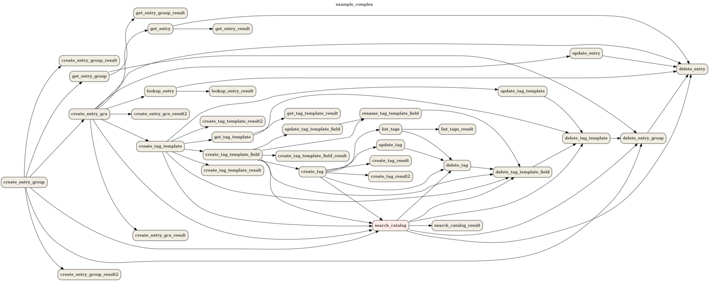

#### 3.2 Task

**Task** (задача) — со стороны Airflow все задачи делятся на пулы. Пулы создаются вручную. Как правило, их цель —
ограничить нагрузку на работу с источником или типизировать задачи внутри DWH. Пул, заданный на уровне DAG-а, можно
переопределить на уровне задачи.

Прежде чем попасть на исполнение, задача проходит следующие этапы:

- В DAG-е выполнены все предыдущие задачи, так что можно поставить новую на очередь
- Очередь сортируется в зависимости от приоритета задач (приоритетами тоже можно управлять), и, если в пуле есть
  свободный слот, задачу можно взять в работу
- Если есть свободный worker celery, задача направляется в него

Такими этапами управляет планировщик и о нём мы поговорим чуть позже.

Пример описания task`ов на Python:

```python
t1 = BashOperator(
    task_id='print_date',
    bash_command='date',
)

t2 = BashOperator(
    task_id='sleep',
    depends_on_past=False,
    bash_command='sleep 5',
    retries=3,
)
```

Различные состояния task`а в Airflow:

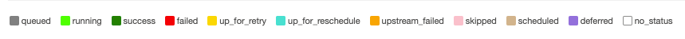

#### 3.3 Operator

**Оператор** - это сущность, на основании которой создаются экземпляры заданий, где описывается, что будет происходить
во время исполнения каждого экземпляра задания. Иными словами, это шаблон для предопределенной задачи, которая
декларативно задается внутри DAG`а.

- **PythonOperator** — оператор для исполнения python кода
- **BashOperator** — запуск bash скриптов/команд
- **PostgresOperator** — вызов SQL запросов в PostgreSQL БД
- **RedshiftToS3Transfer** — запуск UNLOAD команды из Redshift в S3
- **EmailOperator** — отправка электронных писем
- **HTTPOperator** — работа с http-запросами

> **Важно!**
>
> Операторы не могут принимать возвращаемые значения от выполнения предыдущих операторов в цепочке (как, например,
> цепочка из вызовов функций), т.к. могут исполняться в разном адресном пространстве и даже на разных физических
> машинах.

#### 3.4 Sensor

**Сенсор** - это разновидность Operator, его удобно использовать при реализации событийно ориентированных пайплайнов. В
Apache Airflow присутствуют следующие сенсоры:

- **PythonSensor** — ждём, когда функция вернёт True
- **S3Sensor** — проверяет наличие объекта по ключу в S3-бакете
- **RedisPubSubSensor** — проверяет наличие сообщения в pub-sub очереди
- **RedisKeySensor** — проверяет существует ли переданный ключ в Redis хранилище

Если успешность нашего пайплайна зависит от наступления события, например, появления файла на удалённом хосте или записи
в базе данных, то нам нужен сенсор.

#### 3.4 Hook

**Хуки** это внешние интерфейсы для работы с различными сервисами: базы данных, внешние API ресурсы, распределенные
хранилища типа S3, redis, memcached и т.д.

Хуки являются **строительными блоками операторов** и берут на себя всю логику по взаимодействию с хранилищем **конфигов
и доступов**.

Используя хуки можно забыть про головную боль с хранением секретной информации в коде (пароли к доступам, например).

### 4. Архитектура Airflow


Apache Airflow состоит из нескольких компонентов:

- **База метаданных** (Metadata DB): Airflow использует базу данных для хранения метаданных о запущенных конвейерах(
  pipelines) обработки данных. На диаграмме выше такая БД представлена как Postgres, которая чрезвычайно популярна в
  Airflow.
- **Веб-приложение** (Web Server): написано на Flask, с панелью управления, взаимодействует с БД.
- **Планировщик** (Scheduler): взаимодействует с БД, построен на Celery
- **Исполнитель** (Executor): на диаграмме показан отдельно, так как он обычно отдельно обсуждается в документации, но
  на самом деле это НЕ отдельный процесс, а запущенный в Планировщике.
- **Работник** (Worker(s)): это отдельные процессы, которые также взаимодействуют с другими компонентами архитектуры
  Airflow и хранилищем метаданных.
- **DAGs**: файлы, содержащие код Python, представляющий конвейеры данных, которые будут запускаться Airflow.
  Расположение этих файлов указано в файле конфигурации Airflow, они должны быть доступны для веб-сервера, планировщика
  и рабочих процессов.

#### 4.1 Webserver


Web-интерфейс Airflow предназначен в первую очередь для просмотра состояния наших задачек и логов. Помимо этого он
позволяет массово перезапускать таски, редактировать глобальные переменные, управлять доступами и многое другое.


#### 4.2 Executor

Executors отвечают за **исполнение задач**.

В Airflow есть несколько видов исполнителей:

- SequentialExecutor
- LocalExecutor
- CeleryExecutor
- KubernetesExecutor

В боевой среде чаще всего встречается CeleryExecutor, который, как можно догадаться, использует Celery.

Также существуют другие варианты, например Dask Executor или Debug Executor

**SequentialExecutor**

- установлен в качестве значения по умолчанию в `airflow.cfg` у параметра executor
- представляет из себя простой вид воркера, который не умеет запускать параллельные задачи

**LocalExecutor**

- умеет выполнять задачи параллельно путём порождения дочерних процессов
- просто и быстро, не требует настройки дополнительных сервисов
- имеет ряд проблем:
    - Ограничение при масштабировании
    - Отсутствие отказоустойчивости

**CeleryExecutor**

- под капотом использует всю магию таск-менеджера Celery
- чтобы использовать CeleryExecutor необходимо дополнительно настроить брокер сообщений
- легко масштабировать
- отказоустойчивость

**KubernetesExecutor**

- исполнение задач на кластере Kubernetes
- задачи исполняются как новые pod инстансы
- сложная настройка Kubernetes кластера

#### 4.3 Pools

**Pools** это механизм ограничения параллелизма задач.

Например у вас имеется даг с сотнями параллельных задач – значит есть риск сильно нагрузить ваш сервер, для этого
существуют пулы, их можно создать вручную и указать в настройках дага. Например можно создать пул на 10 потоков, тогда
за один раз не будет загружаться более 10 задач. По умолчанию этот показатель равен 128.

Пример описания пула в таске:

```python
aggregate_db_message_job = BashOperator(
    task_id="aggregate_db_message_job",
    execution_timeout=timedelta(hours=3),
    pool="ep_data_pipeline_db_msg_agg",
    bash_command=aggregate_db_message_job_cmd,
    dag=dag,
)
```

#### 4.4 Scheduler

За планировку всех задач в Airflow отвечает отдельный процесс — **Scheduler**

Scheduler занимается всей механикой постановки задач на исполнение.

Планировщик: построен на Celery (Python-библиотека, позволяющая организовать очередь, а также асинхронное и
распределенное исполнение задач).

Планировщик Airflow отслеживает все задачи и DAG, а затем запускает экземпляры задач после завершения их зависимостей.
За кулисами планировщик запускает подпроцесс, который отслеживает и синхронизирует все DAG-и в указанном каталоге DAGs.
По умолчанию один раз в минуту планировщик собирает результаты синтаксического анализа DAG и проверяет, можно ли
запустить какие-либо активные задачи.

Планировщик использует настроенный Executor для запуска готовых задач.

```python
dag = DAG(
    DAG_NAME,
    default_args=default_args,
    schedule_interval='@hourly'
)
```

### 5. Практика


#### 5.1 Пререквизиты

Уверен, что вы уже умеете программировать на Python и у вас есть определённый опыт разработки скриптов, умеете в SQL и
его диалекты или планируете получить все эти навыки.

Также пригодится опыт работы с командной строкой Linux и представление о том, что такое Docker и зачем его используют.

На практике мы будем рассматривать простые задачи, но если у вас нет определённой базы – эти простые задачи могут
показаться не такими уж и простыми =)


#### 5.2 План

- Установка
- Интерфейс
- Панель Администратора
- Напишем и запустим DAG


#### 5.3 Установка

Установить Airflow можно как минимум двумя способами:

1. Используя Docker и docker-compose
2. Руками, создавая виртуальное окружение Python и устанавливая туда все необходимые зависимости

Первый способ простой и не требует никаких усилий. Достаточно запустить команду `docker-compose up` и всё будет готово.
Файл `docker-compose.yml` можно найти [тут](ETL/examples/docker-compose.yml).

#### 5.4 Интерфейс

Давайте знакомиться с пользовательским интерфейсом.
В адресной строке браузере введите `http://127.0.0.1:8080` и авторизуемся с логином `airflow` и таким же паролем (
прописаны в compose-файле)

#### 5.4.1 Основные компоненты интерфейса:

- **Pause/Unpause DAG** — слева находится переключатель для включения/выключения DAG. По умолчанию все новые DAG будут
  остановлены. Чтобы запустить DAG его необходимо предварительно включить.
- Колонка **Owner** обозначает владельца/автора DAG. Эта опция задаётся в коде в атрибутах DAG.
- **Runs** — показывает состояние запусков DAG. Есть 3 состояния:
    1. Успешно выполнен
    2. Выполняется
    3. Есть ошибки при выполнении
- **Schedule** — показывает с какой периодичностью будет запускаться DAG. Если видим значение None, то запуска по
  расписанию
  не будет, но мы можем запустить такой DAG вручную.
- **Last Run** — дата и время последнего запуска DAG
- **Recent Tasks** — отражает текущее состояние последних запусков DAG (последний запуск DAG и его операторов)
- **Actions** — кнопки манипуляции с DAG. Можно запустить DAG вручную, обновить или удалить DAG.
- **Links** — список для быстрого доступа к просмотру кода DAG, деталей выполнения, просмотру в виде графа или диаграммы
  Ганта, анализ времени выполнения задач и т.д.

#### 5.4.2 Просмотр DAG

Если кликнуть на любой DAG из списка, то мы увидим детальную информацию по нему:

- **Tree View** — просмотр DAG и зависимостей между операторами в виде дерева, также справа находится статус выполнения
  всех
  операторов, входящих в DAG с легендой. На статусы можно кликать, чтобы посмотреть более детальную информацию.
- **Graph View** — фактически то же самое, что и Tree View, но в виде графа.
- **Task Duration** — график времени выполнения DAG и операторов.
- **Task Tries** — график повторных запусков операторов по периодам. Также в Airflow есть механизм повторных запусков в
  случае неудач.
- **Landing Times** — график показывает время (в зависимости от периодичности, это могут быть дни, минуты и т.д. по оси
  Y)
  прошедшее относительно периода запуска и непосредственным запуском (DagRun) планировщиком. Представьте что есть DAG со
  `schedule_interval=@daily` запуск с `execution_date=2020-01-01` должен быть запланирован на `2020-01-02T00:00:00`, но
  планировщик из-за нагрузки запускает его в `2020-01-02T11:00:00`, тогда Landing Time для него будет 11 часов или 0.46
  дней.
- **Gantt** — отображает историю выполнения DAG в виде Диаграммы Ганта. Очень удобно, когда в DAG входит множество
  операторов, которые могут выполняться параллельно.
- **Details** — детальная информация по DAG, включая названия операторов, автора, начальное время старта DAG и т.д.
- **Code** — просмотр кода DAG.

#### 5.4.3 Панель Администратора

В админке видим следующие сущности:

- Variables
- Configurations
- Connections
- Plugins
- Providers
- Pools
- XComs

**Variables**

В этом разделе можно управлять переменными, которые будут храниться в базе данных Airflow. Удобно для хранения различной
информации, например, адреса хостов удалённых сервисов.
Нежелательно в этом разделе хранить данные доступов, т.к. переменные хранятся в открытом виде и могут быть
скомпрометированы третьими лицами. Но если очень хочется, то можно – в значении ключа нужно добавить постфикс
**_secret**, тогда значение будет отображаться скрытно.

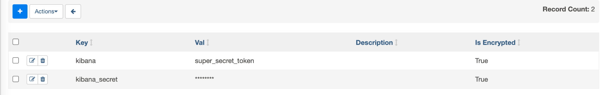

**Configurations**

Раздел позволяет редактировать настройки Airflow, используя графический интерфейс. По умолчанию опция отключена из
соображений безопасности.

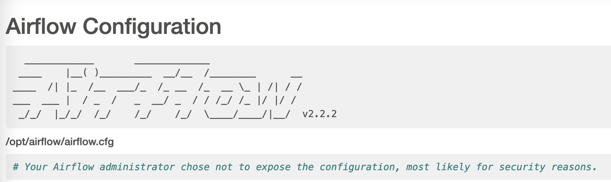

**Connections**

Раздел для хранения данных о доступе к различным сервисам: базам данных, облачным провайдерам, сторонним API сервисам и
т.д.
Не рекомендуется коде DAG`а хранить пароли и секретные ключи, а использовать для этого раздел Connections.
При использовании Connections в коде необходимо будет лишь передать значение **conn_id**.

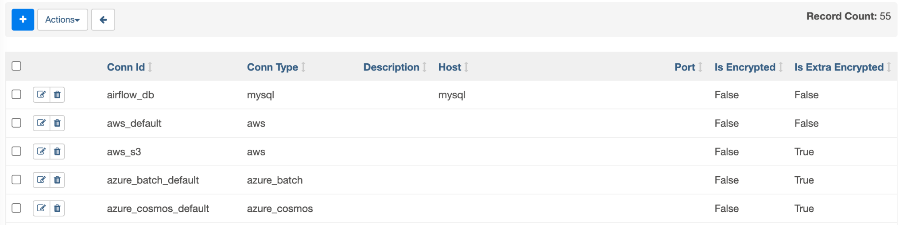

**Pools**

Возможность задать пул или другими словами некое ограничение на количество параллельно выполняющихся задач. Представим,
что мы хотим регулярно качать данные с внешнего сервиса. У сервиса есть ограничение на количество одновременных
соединений — 2. В этом случае мы создаём пул со значением 2 и присваиваем ему имя. Далее во всех операторах, отвечающих
за скачивание данных, передаём название этого пула.

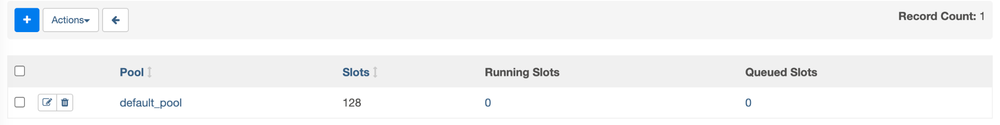

**XComs**

Это механизм обмена сообщениями между операторами. Т.к. задачи могут выполняться на разных компьютерах, то получить
возвращаемое значение одного оператора и передать другому привычным способом не получится (например, путём цепочек
вызовов или присвоением значения переменной).
Для таких ситуаций и создан XCom (cross-communication). Механизм работает через базу данных. По сути это аналог
key-value базы, один оператор записывает значение под определённым ключом, а другой оператор может получить это
значением, используя этот ключ. Не рекомендуется таким способом передавать большие сообщения, т.к. это требует
дополнительных накладных расходов.
В этом разделе можно увидеть все существующие сообщения, созданные операторами.

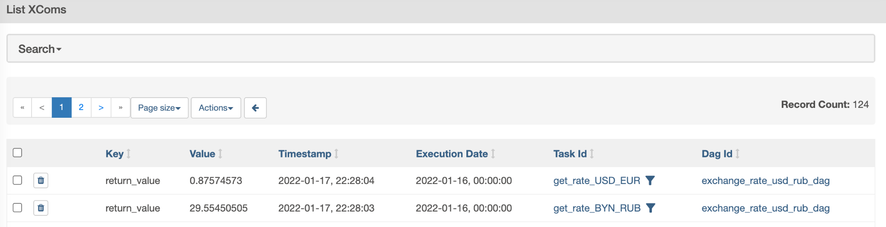

#### 5.4.4 Напишем и запустим DAG

У нас уже достаточно знаний об Airflow, чтобы попробовать создать свой первый DAG. Для начала создадим DAG лишь с одним
оператором, далее добавим ещё один и увидим как описывать зависимости. Таким образом у нас получится свой первый
небольшой пайплайн.
После этого попробуем забрать данные из внешнего API и записать их в БД.

Необходимо будет создать два объекта connections в интерфейсе:

Для таска `get_rate` мы напишем свой кастомный оператор, который будет тянуть данные из внешнего API. В качестве сервиса
будем использовать CurrencyScoop, у ребят есть бесплатный план по которому можно тянуть курсы валют. Ограничения
есть по количеству запросов в месяц и на некоторые методы API, но для нашего обучения это не критично.

Для работы с сервисом необходимо зарегистрироваться и получить API ключ. Ключ будет доступен сразу же после авторизации
на сайте:

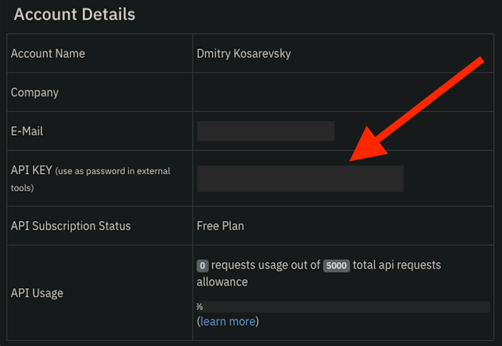

1. Для подключения к нашей БД
    1. Conn Id = `postgres_mipt_seminars`
    2. Conn Type = `Postgres`
    3. Host = `host.docker.internal`
    4. Schema (В Airflow это поле указывает на БД, а не схему!) = `pg_db`
    5. Login = `postgres`
    6. Password = `postgres`
    7. Port = `5432`
2. Для подключения к внешнему API
    1. Conn Id = `cur_scoop`
    2. Conn Type = `HTTP`
    3. Password = ваш API ключ сервиса CurrencyScoop

### 6. Полезные ссылки

[Apache Airflow Documentation](https://airflow.apache.org/docs/apache-airflow/stable/)

[Docker Documentation](https://docs.docker.com/)

[Apache Airflow и конвейеры обработки данных](https://dmkpress.com/catalog/computer/data/978-5-97060-970-5/)

[Crontab.guru](https://crontab.guru/)


---

### Полезные ссылки

* [обзор ETL](https://ru.wikipedia.org/wiki/ETL)
* [Источник обзора решений](https://www.datarevenue.com/en-blog/airflow-vs-luigi-vs-argo-vs-mlflow-vs-kubeflow)
* [Apache Airflow](https://airflow.apache.org/)
* [docker-compose файл](https://airflow.apache.org/docs/apache-airflow/stable/docker-compose.yaml)
* [Интересные ad-hoc etl инструмент](https://github.com/mage-ai/mage-ai)